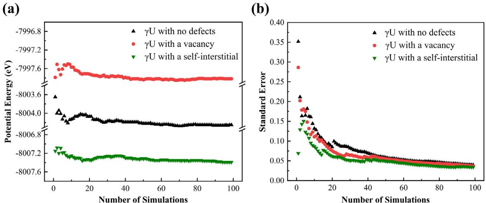
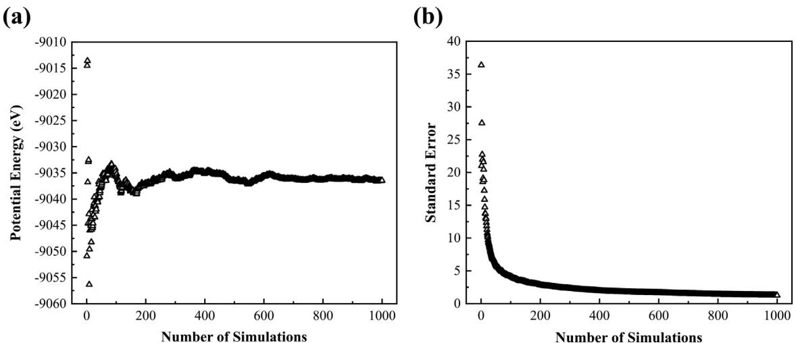
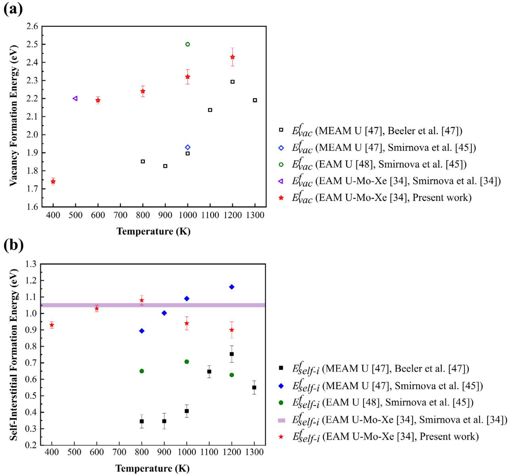
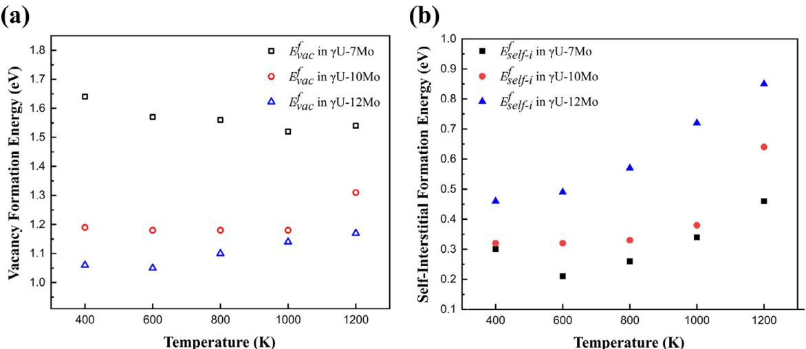
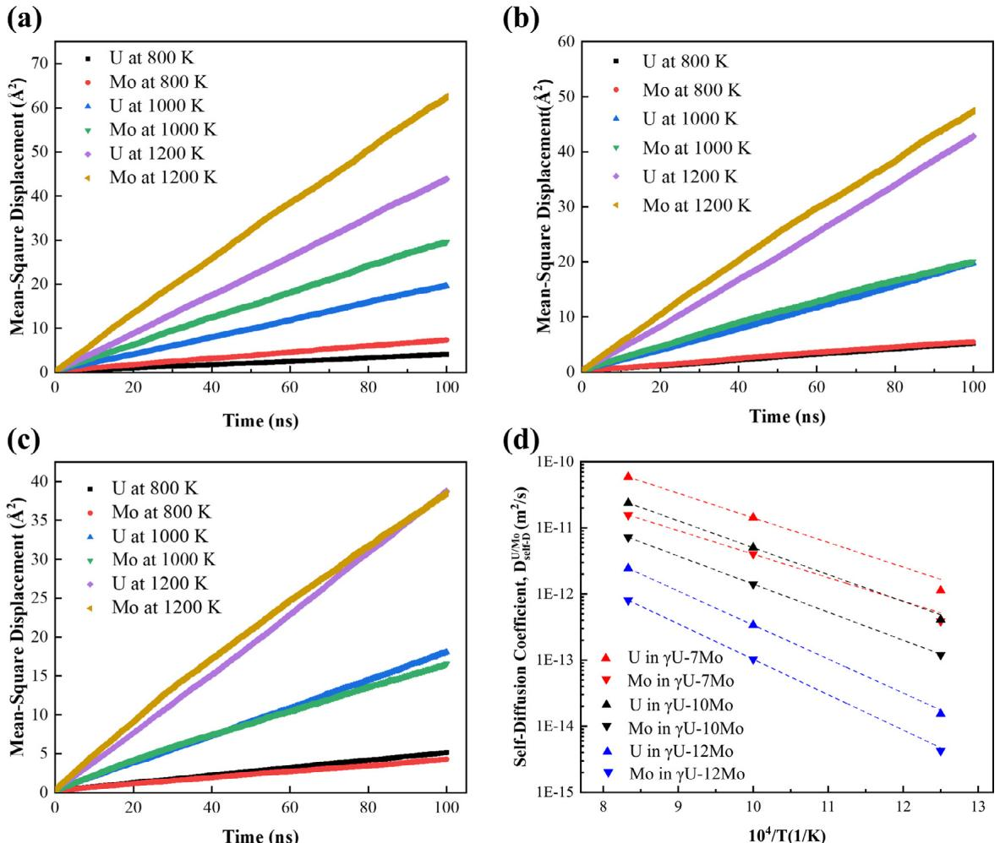
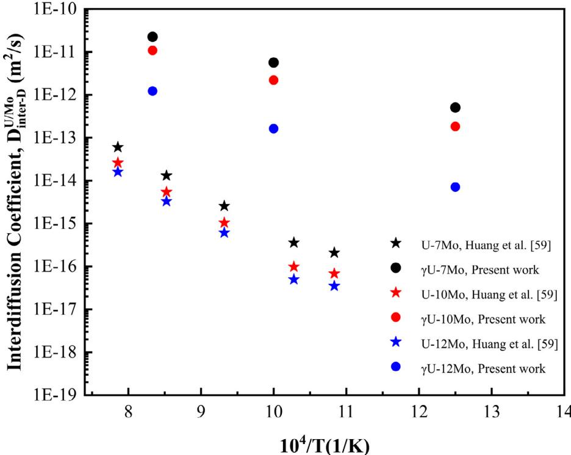

# An atomistic study of defect energetics and diffusion with respect to composition and temperature in $\gamma \mathrm { U }$ and γ U-Mo alloys

Gyuchul Park a , Benjamin Beeler b,c , Maria A. Okuniewski a,∗

a School of Materials Engineering, Purdue University, West Lafayette, IN 47907, United States b Department of Nuclear Engineering, North Carolina State University, Raleigh, NC 27607, United States c Idaho National Laboratory, Idaho Falls, ID 83415, United States

# a r t i c l e i n f o

# a b s t r a c t

Article history:   
Received 19 June 2020   
Revised 14 February 2021   
Accepted 25 March 2021   
Available online 2 April 2021

Keywords:   
Uranium   
Uranium-molybdenum (U-Mo) alloys   
Defect energetics diffusion   
Self-diffusion coefficients   
Interdiffusion coefficients   
Molecular dynamics

Uranium-molybdenum (U-Mo) alloys are promising candidates for high-performance research and test reactors, as well as fast reactors. The metastable $\gamma$ phase, which shows acceptable irradiation performance, is retained by alloying U with Mo with specific quenching conditions. Point defects contribute to the atomic diffusion process, defect clustering, creep, irradiation hardening, and swelling of nuclear fuels, all of which play a role in fuel performance. In this work, properties of point defects in $\gamma \mathrm { { U } }$ and $\gamma \mathbf { { U } } \cdot$ -xMo $x$ $= 7 ,$ 10, 12 wt.%) were investigated. Vacancy and self-interstitial formation energies in $\gamma \mathrm { { U } }$ and $\gamma \mathrm { U } \mathrm { - } x \mathrm { M } \mathbf { 0 }$ were calculated with molecular dynamics (MD) simulations using an embedded atom method interatomic potential for the U-Mo system. Formation energies of point defects were calculated in the temperature range between $4 0 0 ~ \mathrm { K }$ and $1 2 0 0 ~ \mathrm { K } .$ The vacancy formation energy was higher than the self-interstitial formation energy in both $\gamma \mathrm { { U } }$ and $\gamma \mathrm { U } \mathrm { - } x \mathrm { M } \mathbf { 0 }$ in the evaluated temperature range, which supports the previous results obtained via first-principles calculations and MD simulations. In $\gamma \mathbf { { U } } \cdot$ -xMo, the vacancy formation energy decreased with increasing Mo content, whereas the self-interstitial formation energy increased with increasing Mo content in the temperature range of $4 0 0 ~ \mathrm { K }$ to $1 2 0 0 ~ \mathrm { K } .$ The self-diffusion and interdiffusion coefficients were also determined in $\gamma \mathrm { U } \mathrm { - } x \mathrm { M } \mathbf { 0 }$ as a function of temperature. Diffusion of U and Mo atoms in $\gamma \mathrm { U } \mathrm { - } x \mathrm { M }$ o were negligible below $8 0 0 ~ \mathrm { K } .$ The self-diffusion and interdiffusion coefficients decreased with increasing Mo concentration, which qualitatively agreed with the previous experimental observations. Point defect formation energies, self-diffusion coefficients, and interdiffusion coefficients in γ U-xMo calculated in the present work can be used as input parameters in mesoscale and engineering scale fuel performance modeling.

$©$ 2021 Elsevier B.V. All rights reserved.

# 1. Introduction

Uranium-molybdenum (U-Mo) alloys are considered as one possible candidate for nuclear fuels for future fast reactors, as well as high-performance research and test reactors (HPRRs) $[ 1 -$ 3]. For example, HPRRs such as the Advanced Test Reactor at Idaho National Laboratory and the High-Flux Isotope Reactor at Oak Ridge National Laboratory, require a higher uranium density $\mathrm { ~ ( > ~ 6 . 5 ~ g / c c ) ~ }$ due to flux requirements, as compared to other research reactors. Pure uranium contains three allotropes according to the phase diagram: αU (orthorhombic crystal structure, below $6 6 8 ~ ^ { \circ } \mathrm { C } )$ , $_ { \beta \mathrm { U } }$ (tetragonal crystal structure, between $6 6 8 ~ ^ { \circ } \mathrm { C }$ and $7 7 6 ~ ^ { \circ } C )$ , and $\gamma \mathrm { U }$ (body-centered cubic crystal structure (bcc), between $7 7 6 ~ ^ { \circ } \mathrm { C }$ and $1 1 3 5 ~ ^ { \circ } \mathrm { C } )$ [4]. During reactor operation, pure αU fuel exhibits anisotropic growth and anisotropic swelling under irradiation, which has historically limited the usage of unalloyed $\alpha \mathrm { U }$ [5,6]. On the other hand, $\gamma \mathrm { { U } }$ exhibits isotropic swelling behavior, and therefore displays comparatively better irradiation performance than αU [6,7]. Thus, metastable $\gamma \mathrm { { U } , }$ obtained by alloying Mo with U followed by rapid cooling, has been utilized as nuclear fuel. U-Mo alloys containing less than 6 wt.% Mo yield a high fraction of undesirable decomposed phases ( $\alpha \mathrm { U }$ and $\gamma ^ { \prime } \mathrm { U } )$ ); therefore, U-Mo alloys with a concentration of 7–12 wt $\%$ Mo are of primary interest since the $\gamma \mathrm { { U } }$ phase is stabilized [8–11]

Point defects exist in metals and alloys at thermal equilibrium, but they are also produced in great quantities under irradiation during nuclear reactor operations. Point defects are critical to fuel behavior since they play a key role in the atomic diffusion process, which affects the nucleation of extended defects, such as dislocations, dislocation loops, voids, and fission gas bubbles. Thus, point defects can affect the macroscopic properties of the nuclear fuel, including creep, irradiation hardening, and swelling [12–14]. Additionally, point defects and their diffusion are critical parametric inputs into mesoscale and engineering scale simulations. Therefore, the incorporation of accurate defect energetics and diffusion coefficients will increase the fidelity of these modeling tools.

Table 1 Vacancy $( E _ { v a c } ^ { f } )$ and self-interstitial $( E _ { s e l f - i } ^ { f } )$ formation energies in $\gamma \mathrm { { U } }$ obtained by PAS and ab initio methods.   

<table><tr><td>Method</td><td>EVva (eV)</td><td></td><td>References</td></tr><tr><td>PAS</td><td>1.17</td><td></td><td>[15]</td></tr><tr><td></td><td>1.2 ± 0.25</td><td></td><td>[16]</td></tr><tr><td></td><td>0.3</td><td></td><td>[17]</td></tr><tr><td></td><td>1.6 ± 0.2</td><td></td><td>[18,19]</td></tr><tr><td>ab</td><td>1.08 (PW91)</td><td></td><td>[20]</td></tr><tr><td>initio</td><td>1.32 (PW91), 1.38 (PBE)</td><td>0.50-1.54</td><td>[21]</td></tr></table>

The formation energy of point defects in $\gamma \mathrm { { U } }$ has been determined via both experimental and computational simulation techniques. The historical results obtained via positron annihilation spectroscopy (PAS) and ab initio methods are represented in Table 1. The authors are not aware of any experimental data that exists for self-interstitial formation energy in $\gamma \mathrm { { U } . }$ . Vacancy formation energy, experimentally calculated by PAS, ranged between $0 . 3 \ \mathrm { e V }$ and $1 . 6 \ \mathrm { e V }$ [15–19]. Lund et al. [18,19] attributed the wide variation in the experimentally determined vacancy formation energies to differing specimen geometries, which contained varying oxygen (O) impurity concentrations. This was further supported by first-principles calculations in $\alpha \mathrm { U }$ , which showed that O defects reduced vacancy formation energies [19]. It should be noted that the vacancy formation energy calculated by Lund et al. $( 1 . 6 \pm 0 . 2 \ \mathrm { e V } )$ is the average value over the temperature range from $3 0 0 \mathrm { ~ K ~ }$ to $1 2 0 0 \ \mathrm { K } ,$ indicating that the calculated vacancy formation energy is an average value of the $\alpha$ , $\beta$ , and $\gamma \mathrm { U }$ phases [18,19]. On the other hand, the vacancy formation energy in $\gamma \mathrm { { U } }$ calculated by ab initio methods ranged between $1 . 0 8 \ \mathrm { e V }$ and 1.38 eV [20,21] using the Perdew-Wang 91 (PW 91) and the Perdew-Burke-Ernzerhof (PBE) generalized gradient approximation functionals [22,23]. The discrepancy of $0 . 3 \ \mathrm { { \ e V } }$ can be attributed to the use of different exchange-correlation functionals, as well as different methodologies.

The self-interstitial formation energy, calculated via ab initio methods, shown in Table 1, was found to be strongly contingent on the configuration of the self-interstitial [21]. The $< 1 0 0 >$ dumbbell and tetrahedral sites were found to be the most and least stable configurations, respectively [21]. In addition, an anomalously high self-diffusion coefficient was observed in $\gamma \mathrm { { U } }$ when compared to other bcc metals, which can be attributed to the dominance of self-interstitials in the diffusion process [24–27].

In $\gamma \mathrm { U } \mathrm { - } \mathrm { M } \mathrm { o }$ , there is a lack of data for point defect energetics. To the best of the authors’ knowledge, experimental data does not exist, and the only investigations of point defects energetics in $\gamma \mathrm { U }$ -Mo utilized molecular dynamics (MD) in γ U-9Mo at $1 0 0 0 \mathrm { ~ K ~ }$ [26] and $\gamma \mathrm { U } { - } 1 0 \mathrm { M } 0$ at $4 0 0 ~ \mathrm { K }$ [28] at zero pressure. Thus, this lack of data has motivated the current study investigating the defect energetics of both $\gamma \mathrm { U }$ and $\gamma \mathrm { U } \mathrm { - } \mathrm { M } \mathrm { o }$ as a function of temperature and composition using MD simulations. Using the point defect energetics, the self-diffusion coefficients and interdiffusion coefficients in γ U-xMo $x = 7 ,$ 10, 12 wt.%) are also calculated with respect to temperature, and compared to experimental results.

# 2. Computational details

# 2.1. Simulation parameters and interatomic potential

MD simulations were conducted to calculate defect formation energies in $\gamma \mathrm { U }$ and γ U-xMo as a function of temperature, as well as the self-diffusion and interdiffusion coefficients in $\gamma \mathrm { { U } }$ -xMo, using the LAMMPS software package [29]. The accuracy of MD simulations greatly depends on the accuracy of the interatomic potential used. Embedded atom method (EAM) interatomic potentials have been used extensively in the study of defect properties in metals and alloys [30–35]. The success of EAM potentials to describe metallic systems is derived from its formalism in describing many body interactions, which pair-wise potentials are unable to do.

A general form of the EAM potential is described as follows [30,36]:

$$
E _ { t o t a l } = \frac { 1 } { 2 } \sum _ { i < j } \phi _ { i j } ( r _ { i j } ) + \sum _ { i } F ( \sum _ { j \neq i } \rho _ { i } ( r _ { i j } ) ) ,
$$

where $E _ { t o t a l }$ is the total energy of the system, $\phi _ { i j }$ is the pair-wise energy term, which depends on the distance $( { \dot { r } } _ { i j } )$ between two given atoms i and $j .$ . The term $F ( \sum _ { j \neq i } \rho _ { i } ( r _ { i j } ) )$ is the embedding energy of atom i, which defines the many-body interatomic interactions, depending on the background electron density $( \rho _ { i } )$ at the location of atom i. The total energy from the pair-wise energy term is divided by two to avoid double counting. In this study, the EAM potential for the ternary U-Mo-Xe system, developed by Smirnova et al. [37], was utilized. This potential was selected since it has successfully reproduced characteristic material properties, such as lattice parameter, Young’s modulus, room-temperature density and melting temperature of U-10Mo alloys [37]. Moreover, this potential is the only interatomic potential capable of describing the ternary U-Mo-Xe system. This work complements recent atomistic investigations on fundamental void and Xe bubble properties in $\gamma \mathrm { { U } }$ and $\gamma \mathrm { { U } }$ -Mo systems [21,28,38–42].

A $1 0 \mathrm { ~ x ~ } 1 0 \mathrm { ~ x ~ } 1 0$ simulation cell (2000 atoms) of $\gamma \mathrm { { U } }$ was created with periodic boundary conditions. A large system was utilized to approximate the random substitutional solid solution alloys and also to avoid the interaction of the point defects across periodic boundary conditions. For the alloy systems, a fraction of U atoms were changed to Mo atoms, corresponding to a given weight percent (7, 10, and 12 wt.%) to reflect typical fuel alloy concentrations. The U atoms were replaced with Mo atoms at randomly distributed lattice sites, generating a solid substitutional alloy. The system was relaxed for 200 ps with a timestep of 0.002 ps in an NPT ensemble with a Langevin thermostat in the Gronbech-Jenson-Farago formalism [43,44]. The evaluated temperatures ranged between $4 0 0 ~ \mathrm { K }$ and $1 2 0 0 ~ \mathrm { K }$ in increments of $2 0 0 ~ \mathrm { K }$ at zero pressure. The low and high temperature ranges correspond to the operating temperatures for research reactors and fast reactors, respectively. The $\gamma \mathrm { U }$ phase was the only phase observed in the evaluated temperatures using the Adaptive Common Neighbor Analysis in the OVITO software [45–47]. Once the system reached equilibrium, a point defect (a vacancy or a self-interstitial) was created. Equilibrium of the system was confirmed by investigating the potential energy of the system as a function of time. The potential energy stayed nearly constant after 10 ps, indicating that the system reached equilibrium at this time. The Wigner–Seitz defect analysis in the OVITO software was used to ensure that only a single point defect (vacancy or selfinterstitial) was created during the simulations. It is noteworthy that both U and Mo atoms were separately removed from the system to calculate the vacancy formation energy, and added to the system to calculate the self-interstitial formation energy. Thus, this study does not represent the defect properties of a single element in the alloy, but rather the average defect properties of the alloy. One hundred unique simulations were conducted in $\gamma \mathrm { { U } }$ at each temperature. More than 400 unique simulations in $\gamma \mathrm { U } \mathrm { - } x \mathrm { M } \mathrm { o }$ , with random Mo positions at each temperature and composition were performed to ensure the statistical significance of the dataset.

# 2.2. Defect energetics

Vacancy $( E _ { \nu a c , \gamma U } ^ { f } )$ and self-interstitial $( E _ { s e l f - i , \gamma U } ^ { f } )$ formation energies in $\gamma \mathrm { { U } }$ were calculated as described below:

$$
E _ { \nu a c , \gamma U } ^ { f } = E _ { \nu a c } - \frac { ( N - 1 ) } { N } E _ { i d e a l } ,
$$

$$
E _ { s e l f - i , \gamma U } ^ { f } = E _ { s e l f - i } - \frac { ( N + 1 ) } { N } E _ { i d e a l } ,
$$

where $N$ is the number of atoms in the system without defects, $E _ { i d e a l }$ is the potential energy of the system without defects, $E _ { v a c }$ is the potential energy of the system containing a vacancy, and $E _ { s e l f - i }$ is the potential energy of the system containing a self-interstitial. In addition, vacancy $\dot { ( E _ { \nu a c , \gamma U - M o } ^ { f } ) }$ and self-interstitial $( E _ { s e l f - i , \gamma U - M o } ^ { f } )$ formation energies in $\gamma \mathrm { { U } }$ -xMo were calculated as described below:

$$
E _ { \nu a c , \gamma U - M o } ^ { f } = E _ { F E ( \nu a c ) } - \frac { ( N - 1 ) } { N } E _ { F E ( i d e a l ) } ,
$$

$$
E _ { s e l f - i , \gamma U - M o } ^ { f } = E _ { F E ( s e l f - i ) } - \frac { ( N + 1 ) } { N } E _ { F E ( i d e a l ) } ,
$$

where $E _ { F E ( i d e a l ) }$ is the formation energy of the system without defects, $E _ { F E ( \nu a c ) }$ is the formation energy of the system containing a vacancy, and $E _ { F E ( s e l f - i ) }$ is the formation energy of the system containing a self-interstitial. The formation energy of the system without defects was calculated as follows:

$$
E _ { F E ( i d e a l ) } = E _ { i d e a l } - ( E _ { U } N _ { U } + E _ { M o } N _ { M o } )
$$

where $N _ { U }$ is the number of $\mathrm { U }$ atoms, $N _ { M o }$ is the number of Mo atoms, $E _ { U }$ is the potential energy per atom in $\gamma \mathrm { { U } , }$ and $E _ { M o }$ is the potential energy per atom in Mo. Note that the crystal structure of Mo is also bcc. In the same way, the formation energies of the system containing a vacancy and a self-interstitial were calculated as follows:

$$
E _ { F E ( \nu a c ) } = E _ { \nu a c } - ( E _ { U } N _ { U } + E _ { M o } N _ { M o } )
$$

$$
E _ { F E ( s e l f - i ) } = E _ { s e l f - i } - ( E _ { U } N _ { U } + E _ { M o } N _ { M o } )
$$

It should be noted that, in the case of $\gamma \mathrm { { U } }$ where $N _ { M o } = \mathrm { ~ 0 ~ }$ Eqs. (4) and (5) are simplified into Eqs. (2) and (3), respectively. The energies $( E _ { i d e a l } , \ E _ { v a c } , \ E _ { s e l f - i } , \ E _ { U } ,$ , and $E _ { M o }$ ), calculated at each timestep, were averaged over the last 100 ps of a 200 ps simulation. Since a vacancy and a self-interstitial diffuse in the system during the simulation, the calculated vacancy and self-interstitial formation energy is an average over various defect configurations.

# 2.3. Self-diffusion and interdiffusion coefficients

Self-diffusion coefficients of U DUsel f -D) and Mo atoms $( D _ { s e l f - D } ^ { M o } )$ in $\gamma$ U-Mo were calculated using the following equations:

$$
D _ { s e l f - D } ^ { U } = c _ { \nu a c } D _ { \nu a c } ^ { U } + c _ { s e l f - i } D _ { s e l f - i } ^ { U } ,
$$

$$
D _ { s e l f - D } ^ { M o } = c _ { \nu a c } D _ { \nu a c } ^ { M o } + c _ { s e l f - i } D _ { s e l f - i } ^ { M o } ,
$$

where $D _ { \nu a c } ^ { U }$ is the diffusivity of $\mathrm { U }$ atoms in $\gamma \mathrm { U } \mathrm { - } \mathrm { M } \mathbf { 0 }$ containing a vacancy, $D _ { \nu a c } ^ { M o }$ is the diffusivity of Mo atoms in $\gamma$ U-Mo containing a vacancy, $D _ { s e l f - i } ^ { U }$ is the diffusivity of $\mathrm { U }$ atoms in $\gamma \mathrm { { U - M o } }$ containing a self-interstitial, $D _ { s e l f - i } ^ { M o }$ is the diffusivity of Mo atoms in γ U-Mo containing a self-interstitial, $c _ { \nu a c }$ is the concentration of vacancies at equilibrium, and $c _ { s e l f - i }$ is the concentration of self-interstitials at equilibrium. $c _ { \nu a c }$ and $c _ { s e l f - i }$ are expressed as follows:

$$
c _ { \nu a c } = e x p \Bigg ( \frac { \Delta S _ { \nu a c } ^ { f } } { k _ { B } } \Bigg ) e x p \Bigg ( \frac { - E _ { \nu a c } ^ { f } } { k _ { B } T } \Bigg )
$$

$$
c _ { s e l f - i } = e x p \left( \frac { \Delta S _ { s e l f - i } ^ { f } } { k _ { B } } \right) e x p \left( \frac { - E _ { s e l f - i } ^ { f } } { k _ { B } T } \right)
$$

where $\Delta S _ { \nu a c / s e l f - i } ^ { f }$ is the change in entropy by creating a vacancy or self-interstitial, $k _ { B }$ is the Boltzmann constant, and $T$ is the temperature in Kelvin. In this work, similar to Smirnova et al. [27], it is assumed that the entropy does not affect the concentration of the point defects. $D _ { \nu a c } ^ { U / M o }$ and DU/Mo b can be obtained by the following equation:

$$
D _ { \nu a c / s e l f - i } ^ { U / M o } = \frac { \sum _ { i = 1 } ^ { N } \Delta r _ { i } ^ { 2 } } { 6 t }
$$

where $\Delta r _ { i } ^ { 2 }$ is the mean-square displacement of the ith atom, and t is the simulation time. Once the system reached equilibrium, the mean-square displacements of both $\mathrm { U }$ and Mo atoms were obtained over 100 ns. Twenty unique simulations were conducted at each composition and temperature. Following this, the meansquare displacements were averaged. The interdiffusion coefficients $( D _ { i n t e r - D } ^ { U - { x M o } } )$ in ith $\gamma \mathrm { U }$ -xMo were calculated using the self-diffusion coeffi-Darken equation [48] to compare with experimental results:

$$
D _ { i n t e r - D } ^ { U - x M o } = X _ { U } D _ { s e l f - D } ^ { M o } + X _ { M o } D _ { s e l f - D } ^ { U }
$$

where $X _ { U }$ and $X _ { M o }$ are the atomic fractions of $\mathrm { U }$ and Mo atoms in the alloy, respectively.

# 3. Results

# 3.1. Convergence tests

Numerous simulations were carried out to obtain the converged average potential energy of the systems for defect formation energy calculations. The convergence of the potential energy was verified by calculating the cumulative moving average of the potential energy as a function of the number of simulations. Fig. 1 represents the cumulative moving average of potential energies and the standard errors of the system without defects, with a vacancy, and with a self-interstitial in $\gamma \mathrm { U }$ at $1 2 0 0 \mathrm { ~ K ~ }$ with respect to the number of simulations, as an example. The cumulative moving averages of the potential energy plateaued after approximately $5 0 \mathrm { - }$ 60 simulations, which illustrated convergence. Another set of 100 simulations for the system without defects was conducted in $\gamma \mathrm { { U } }$ at $1 2 0 0 ~ \mathrm { K } .$ . The variance from 100 simulations to 200 simulations was only $0 . 0 5 \ \mathrm { e V } ,$ , which further illustrated the convergence of the potential energy. The potential energy was different in each simulation (e.g. Fig. 1(a)), caused by random number seeds resulting in a different distribution of initial atom velocities. However, the variance was very small, as indicated by the standard errors in $\gamma \mathrm { U }$ without defects, with a vacancy, and with a self-interstitial, shown in Fig. 1(b). The standard errors of the three systems mentioned above continued to decrease as a function of the number of simulations. Therefore, it was determined that 100 independent simulations were sufficient to obtain converged potential energies in $\gamma \mathrm { { U } }$ for all three systems.

A similar convergence procedure was carried out for $\gamma \mathrm { U } \mathrm { - } x \mathrm { M } \mathrm { o }$ . The cumulative moving average of the potential energy and the standard error in $\gamma \mathrm { U } { - } 1 2 \mathrm { M } 0$ at $1 2 0 0 ~ \mathrm { K }$ are shown as a function of the number of simulations in Fig. 2, as an example. The concentration of Mo in $\gamma \mathrm { { U } }$ -xMo was slightly different in each simulation. A given fraction of U atoms, $x \mathrm { \ w t . \% }$ within the range of $\pm \nobreakspace 1 \nobreakspace$ wt. $\%$ , was changed to Mo atoms in each simulation. Following the completion of all simulations, the overall averages of the Mo concentrations were 7, 10, and 12 wt.%. In the alloy systems, the cumulative moving averages of the potential energy were consistent after approximately 500 simulations, which demonstrated the convergence of the potential energy. The difference between the overall average potential energy from 500 simulations to 1,000 simulations was very slight $( 0 . 1 0 ~ \mathrm { e V } )$ , which further demonstrated the convergence of the potential energy. Due to the variation of potential energy in $\gamma \mathrm { U } \mathrm { - } x \mathrm { M } \mathbf { 0 }$ , mostly resulting from the variability in the Mo concentration, a greater number of simulations was required to reach acceptable levels of error, and to obtain the converged potential energies.

  
Fig. 1. (a) The cumulative moving average of the potential energy at $1 2 0 0 ~ \mathrm { K }$ in $\gamma \mathrm { { U } }$ without defects, with a vacancy, and with a self-interstitial. Note the discontinuities i the y axis used for visualization purposes. (b) Standard errors for the cumulative moving average of the potential energy in $\gamma \mathrm { { U } }$ without defects, with a vacancy, and with self-interstitial. The standard error is defined as the standard deviations divided by the square root of the number of simulations.

  
Fig. 2. (a) The cumulative moving average of the potential energy in $\gamma \mathbf { { U } } .$ -12Mo without defects at $1 2 0 0 ~ \mathrm { K } .$ (b) Standard errors for the cumulative moving average of the potential energy in $\gamma \mathbf { { U } } .$ -12Mo without defects. The standard error is defined by the standard deviations divided by the square root of the number of simulations.

# 3.2. Defect energetics in $\gamma U$

The historical results of vacancy and self-interstitial formation energies in $\gamma \mathrm { { U } , }$ , calculated using MD simulations [27,37,49,50] are shown in Fig. 3 along with the present work. Standard errors were calculated by summing the standard error of potential energy of the perfect system and the standard error of potential energy of the system containing a vacancy/self-interstitial. The vacancy formation energies, determined using the EAM U-Mo-Xe potential calculated at $5 0 0 ~ \mathrm { K }$ by Smirnova et al. [37] and at $6 0 0 ~ \mathrm { K }$ in the current work, were nearly equivalent at $2 . 2 \ \mathrm { e V } .$ . In this work, the vacancy formation energy increased from $1 . 7 4 ~ \mathrm { e V }$ to $2 . 4 3 \ \mathrm { e V }$ as the temperature increased from $4 0 0 ~ \mathrm { K }$ to $1 2 0 0 ~ \mathrm { K } ,$ respectively. The vacancy formation energies, calculated with the EAM U-Mo-Xe potential in this work, were greater than those from the modified EAM (MEAM) U potential [49] from $8 0 0 \mathrm { ~ K ~ }$ to $1 2 0 0 \ \mathrm { K } ,$ , but the trends were in qualitative agreement, increasing with temperature. An increase in vacancy formation energy as a function of temperature was also observed in other pure metals, such as Al, Fe, and Zr [51–53]. The vacancy formation energies in $\gamma \mathrm { { U } }$ at $1 0 0 0 ~ \mathrm { K } ,$ calculated by Smirnova et al. [50] and Beeler et al. [49] with the MEAM potential, were consistent with one another. On the other hand, the vacancy formation energy at $1 0 0 0 ~ \mathrm { K }$ calculated with the EAM U potential [50] was $2 . 5 \ \mathrm { e V } ,$ higher than the vacancy formation energies calculated with the MEAM U and EAM U-Mo-Xe potentials.

The self-interstitial formation energy in $\gamma \mathrm { { U } , }$ calculated by Smirnova et al. [50] with the MEAM U potential, was greater than that calculated by Beeler et al. [49] with the same potential. However, both historical results indicated that the self-interstitial formation energy increased as the temperature increased. On the other hand, this work shows that there was little temperature dependency on the self-interstitial formation energy in the evaluated temperature range. The lower and upper limits of the selfinterstitial formation energy were $0 . 9 0 \ \mathrm { e V }$ and $1 . 0 8 \ \mathrm { e V } ,$ , respectively. These results agree with the self-interstitial formation energy calculated by Smirnova et al. [37] with the identical potential for $\gamma \mathrm { { U } }$ indicating the self-interstitial formation energy in $\gamma \mathrm { { U } }$ was approximately $1 . 0 5 \ \mathrm { e V } ,$ , independent of the temperature [37]. The self-interstitial formation energy, calculated by Smirnova et al. [27] with the EAM U potential, was also temperature-independent in the range between $8 0 0 ~ \mathrm { K }$ and $1 2 0 0 ~ \mathrm { K }$ .

  
Fig. 3. (a) Vacancy formation energy and (b) self-interstitial formation energy in $\gamma \mathrm { { U } }$ with respect to the temperature, comparing previous work using different interatomic potentials and the current work [27,37,49,50]. Error bars indicated are standard errors.

Both the vacancy and self-interstitial formation energies, obtained with the MEAM U potential, decreased at $1 3 0 0 \mathrm { ~ K ~ }$ due to the spontaneous formation of Frenkel pairs in close proximity to the melting point (approximately $1 4 0 0 ~ \mathrm { K } ~ ,$ [49]. The vacancy formation energy was greater than the self-interstitial formation energy at temperatures ranging from $4 0 0 \mathrm { ~ K ~ }$ to $1 2 0 0 \mathrm { ~ K ~ }$ in $\gamma \mathrm { { U } . }$ This is notable since creating a self-interstitial requires additional energy as compared to creating a vacancy in most metals [54–58]. However, these results agree with previous density functional theory work [21]. Although different interatomic potentials produce varying results for vacancy and self-interstitial formation energies in $\gamma \mathrm { { U } }$ , the current work compares well with previously published results [27,37,49,50]. Since each interatomic potential has different parameters that are more or less accurate compared to the experimental data and the different range of applicability, the entire scope of data for different potentials was included.

# 3.3. Defect energetics in γ U-Mo

Fig. 4 shows the results of the vacancy and self-interstitial formation energy calculations in $\gamma \mathrm { U } \mathrm { - } x \mathrm { M } \mathrm { o }$ as a function of temperature. A strong temperature dependence was not evident for the vacancy formation energy. On the other hand, the self-interstitial formation energy tended to increase at temperatures greater than or equal to $6 0 0 ~ \mathrm { K } .$ The vacancy formation energy decreased with increasing Mo content in $\gamma \mathrm { U } \mathrm { - } x \mathrm { M } \mathbf { 0 }$ for equivalent temperatures ranging from $4 0 0 \mathrm { ~ K ~ }$ to $1 2 0 0 \mathrm { ~ K ~ }$ . Whereas, the self-interstitial formation energy increased with increasing Mo content in $\gamma \mathrm { U } \mathrm { - } x \mathrm { M } \mathrm { o }$ in the equivalent temperature range. Consequently, the difference between the vacancy and self-interstitial formation energy decreased with increasing Mo concentration at equivalent temperatures. As in $\gamma \mathrm { U }$ , the vacancy formation energy for each alloy was higher than the self-interstitial formation energy at the equivalent temperatures. These results qualitatively agree with the previous MD point defect studies in $\gamma \mathrm { U } \mathrm { - } \mathrm { M } \mathrm { o }$ [26,28]. For example, the vacancy and self-interstitial formation energies calculated with the U-Mo-Xe potential were $1 . 4 \ \mathrm { e V }$ and $0 . 3 \ \mathrm { e V } ,$ respectively, in $\gamma \mathrm { U } { - } 9 \mathrm { M } \mathrm { 0 }$ at

  
Fig. 4. (a) Vacancy formation energy and (b) self-interstitial formation energy in γ U-xMo as a function of temperature. The standard errors for vacancy and self-interstitial formation energies were less than $0 . 3 ~ \mathrm { e V }$ at each temperature and composition.

1000 K [26]. Using the same interatomic potential, the vacancy and self-interstitial formation energies were $1 . 6 \ \mathrm { e V }$ and 1.1 eV, respectively, in $\gamma \mathrm { U } { - } 1 0 \mathrm { M } 0$ at $4 0 0 \mathrm { ~ K ~ }$ [28]. A discrepancy in the self-interstitial formation energy between the present work and Beeler’s work [28] could potentially originate from the different methodology utilized. Specifically, in Beeler et al. [28], the number of simulations that a U atom was introduced was proportional to the concentration of U atoms in $\gamma \mathrm { { U } } .$ -xMo. On the other hand, in the present work, the number of simulations that a U atom was introduced as the defect was the same as the number of simulations that a Mo atom was introduced.

# 3.4. Self-diffusion and interdiffusion coefficients in γ U-Mo

Fig. 5(a)–(c) represent the mean-square displacements of U and Mo (per atom) in $\gamma \mathrm { U } \mathrm { - } x \mathrm { M } \mathbf { 0 }$ containing a self-interstitial with respect to time. The mean-square displacements of U and Mo below $8 0 0 ~ \mathrm { K }$ are not represented due to their insignificant diffusion within these time scales. The results of the mean-square displacements of U and Mo in $\gamma \mathrm { { U } }$ -xMo containing a vacancy are also not shown since they were negligible within the temperature ranges of $4 0 0 \mathrm { ~ K ~ }$ to $1 2 0 0 ~ \mathrm { K } .$ In $\gamma \mathrm { U } { - } 7 \mathrm { M } 0$ , the mean-square displacement of Mo was consistently greater than that of U in the temperature range between $8 0 0 ~ \mathrm { K }$ and $1 2 0 0 ~ \mathrm { K } .$ . The mean-square displacement of Mo was also higher than that of U in $\gamma \mathrm { U } { - } 1 0 \mathrm { M } 0$ at all simulation temperatures, but the magnitude of their differences decreased in comparison to $\gamma \mathrm { U } { - } 7 \mathrm { M } 0$ . In $\gamma \mathrm { U } { - } 1 2 \mathrm { M } 0$ , the mean-square displacement of U was slightly greater than that of Mo at equivalent temperatures at the end of the 100 ns simulation time. However, in $\gamma \mathrm { U } { - } 1 2 \mathrm { M } 0$ at $1 0 0 0 \mathrm { ~ K ~ }$ and $1 2 0 0 ~ \mathrm { K }$ at the beginning of the simulation, the diffusion of U was slower than that of Mo.

Utilizing the point defect formation energies from Section 3.3, the equilibrium defect concentrations were calculated, which allowed for the determination of self-diffusion coefficients using Eqs. (9) and (10). The equilibrium concentrations of vacancies and self-interstitials were found to be $2 . 4 \times 1 0 ^ { - 5 }$ and $2 . 5 ~ \times ~ 1 0 ^ { - 3 }$ in γ U-12Mo at $1 2 0 0 \ \mathrm { ~ K ~ } ,$ , respectively, as an example. Fig. 5(d) and Table 2 represent the self-diffusion coefficients as a function of temperature in $\gamma \mathrm { U } \mathrm { - } x \mathrm { M } \mathbf { 0 }$ . To highlight the differences in the selfdiffusion coefficients of U and Mo atoms, the tabular form is also provided (Table 2). The self-diffusion coefficients of both U and Mo atoms decreased as the concentration of Mo increased, which are in qualitative agreement with previous experimental investigations [59]. In addition, the self-diffusion coefficients of U atoms were higher than the self-diffusion coefficients of Mo atoms at the investigated compositions and temperatures. The ratios of the selfdiffusion coefficient of U atoms to that of Mo atoms were 3–4 in the temperature range of $8 0 0 ~ \mathrm { K }$ to $1 2 0 0 \mathrm { ~ K ~ }$ in $\gamma \mathrm { U - x M o }$ , which is also in qualitative agreement with the experimental results [59]. The experimental results indicated that intrinsic diffusion coefficients of U atoms were greater than that of Mo atoms by a factor of 5–7 at the annealing temperatures of 1073 K, 1173 K, and $1 2 7 3 \ \mathrm { K }$ [59]. Similarly, a previous MD study in γ U-9Mo showed that the self-diffusion coefficients of U atoms were greater than those of Mo atoms by a factor of 4–12 in the temperature range $8 0 0 ~ \mathrm { K }$ to $1 4 0 0 ~ \mathrm { K }$ using the U-Mo-Xe potential [26].

The interdiffusion coefficients in γ U-xMo are represented with respect to temperature in Fig. 6 along with the experimental results in the equivalent composition ranges. The interdiffusion coefficients in the U-Mo alloys were calculated using the fitted Mo concentration profiles from a U-Mo diffusion couple via the Boltzmann-Matano analysis [60]. The interdiffusion coefficients, calculated from both the experiment and this work, decreased with increasing Mo concentration. The pre-exponential factors $( D _ { 0 , i n t e r - D } )$ and activation energies $( Q _ { i n t e r - D } )$ , calculated from the Arrhenius plot of the interdiffusion coefficients, were compared to the experimental results, as shown in Tables 3 and 4, respectively. The interdiffusion activation energies increased with Mo concentration and were in qualitative agreement with experimental observations [59]. However, the interdiffusion activation energies in the experimental results were 1.8–2.4 times greater than the current work [59]. The discrepancy between experimental results and computational results could be due to a number of factors, including the interatomic potential and the comparatatively short time scale of MD simulations. In addition, experimental results could be affected by defects, impurities, and other microstructural features (e.g. grain boundaries and phase decomposition) present in the alloys, while the simulation results are not affected by these features since the simulations represented an ideal and perfect alloy system.

# 4. Discussion

The vacancy formation energy in γ U-xMo was found to decrease with increasing Mo concentration. These results can be compared to the vacancy formation energies in pure Mo, obtained via PAS and first-principles calculations, which ranged from $1 . 6 \ \mathrm { e V }$ to $3 . 6 \ \mathrm { e V } ,$ , and tended to be greater than that of $\gamma \mathrm { { U } }$ [61–66]. This seems to indicate that the bond energy between U and Mo atoms is lower than the bond energy between U and U atoms. Thus, it might be easier to create a vacancy if more Mo neighbors exist in the alloy. Previous studies have shown that vacancy formation energies in alloys are dependent on the types of atoms present and their concentrations surrounding a vacancy [67–71]. The mixing enthalpy previously calculated both experimentally and computationally supports this proposed hypothesis [72,73]. The mixing enthalpy in $\gamma \mathrm { { U } } .$ -Mo was found to be positive over the whole composition range at $1 0 0 0 ~ \mathrm { K }$ using MD simulations [72]. The positive mixing enthalpy in $\gamma \mathrm { { U } } .$ -Mo was also experimentally observed when the concentration of Mo was greater than $7 \ \mathrm { w t } . \%$ at $1 1 0 0 ~ \mathrm { K }$ [73]. The mixing enthalpy is positive when the internal energy following mixing is greater than the internal energy prior to the mixing. This indicates that the U-Mo bond is weaker than the U-U bond, and the U-Mo bond is not favorable. Therefore, the vacancy formation energy decreased as the number of U-Mo bonds increased in $\gamma \mathrm { U } \mathrm { - } x \mathrm { M } \mathrm { c }$ .

  
Fig. 5. The mean-square displacements of U and Mo atoms with respect to time in (a) γ U-7Mo, (b) γ U-10Mo, and (c) $\gamma \mathbf { { U } } .$ -12Mo containing a self-interstitial. Note the differences in $\mathbf { y }$ -scales. (d) The self-diffusion coefficients of U and Mo atoms in $\gamma \mathrm { { U } }$ -Mo with respect to temperature and composition. The self-diffusion coefficients in each composition were fitted to the Arrhenius equation.

Table 2 Self-diffusion coefficients $( D _ { s e l f - D } ^ { U / M o } )$ of U and Mo atoms in $\gamma \mathrm { U } \mathrm { - } x \mathrm { M } \mathbf { 0 } .$   

<table><tr><td>Composition</td><td>Temperature (K)</td><td>sel-D (m²2/s)</td><td>D (m{2/s)</td><td>/DMo sel f-D</td></tr><tr><td rowspan="3">γU-7Mo</td><td>800</td><td>1.13 × 10-12</td><td>3.88 × 10-13</td><td>2.91</td></tr><tr><td>1000</td><td>1.43 × 10-11</td><td>4.04 × 10-12</td><td>3.53</td></tr><tr><td>1200</td><td>5.89 × 10-11</td><td>1.56 × 10-11</td><td>3.78</td></tr><tr><td rowspan="3">γU-10Mo</td><td>800</td><td>4.13 × 10-13</td><td>1.20 × 10-13</td><td>3.44</td></tr><tr><td>1000</td><td>5.03 × 10-12</td><td>1.41 × 10-12</td><td>3.57</td></tr><tr><td>1200</td><td>2.38 × 10-11</td><td>7.18 × 10-12</td><td>3.31</td></tr><tr><td rowspan="3">γU-12Mo</td><td>800</td><td>1.54 × 10-14</td><td>4.24 × 10-15</td><td>3.63</td></tr><tr><td>1000</td><td>3.39 × 10-13</td><td>1.03 × 10-13</td><td>3.29</td></tr><tr><td>1200</td><td>2.44 × 10-12</td><td>8.05 × 10-13</td><td>3.05</td></tr></table>

Table 3 Comparison of pre-exponential factors $( D _ { 0 } )$ in γ U-xMo. Units are $\mathrm { m } ^ { 2 } / \mathsf { s } .$ .   

<table><tr><td>Composition</td><td>D,sel-D a</td><td>D.elf-D a</td><td>,inter-D b</td><td>C</td></tr><tr><td>γU-7Mo</td><td>1.78 × 10-7</td><td>2.74 × 10-8</td><td>4.83 × 10-8</td><td>1.32 × 10-6</td></tr><tr><td>γU-10Mo</td><td>8.40 × 10-8</td><td>2.59 × 10-8</td><td>3.85 × 10-8</td><td>7.70 × 10-7</td></tr><tr><td>γU-12Mo</td><td>6.34 × 10-8</td><td>2.98 × 10-8</td><td>3.72 × 10-8</td><td>5.70 × 10-7</td></tr></table>

a $D _ { 0 }$ of U and Mo self-diffusion in γ U-xMo, respectively. b $D _ { 0 }$ of interdiffusion in $\gamma \mathrm { U } \mathrm { - } x \mathrm { M } \mathbf { 0 }$ from the current work. c $D _ { 0 }$ of interdiffusion in γ U-xMo from experiments [59].

Table 4 Comparison of activation energies (Q) in $\gamma \mathrm { U } \mathrm { - } x \mathrm { M } \mathbf { 0 } .$ . Units are eV.   

<table><tr><td>Composition</td><td>Qself- a</td><td>QM-D a</td><td>Qinter-D b</td><td>Qi inter-D C</td></tr><tr><td>γU-7Mo</td><td>0.82</td><td>0.77</td><td>0.79</td><td>1.86</td></tr><tr><td>γU-10Mo</td><td>0.84</td><td>0.85</td><td>0.84</td><td>1.89</td></tr><tr><td>γU-12Mo</td><td>1.05</td><td>1.09</td><td>1.07</td><td>1.91</td></tr></table>

a Self-diffusion activation energy of U and Mo, respectively. b Interdiffusion activation energy in γ U-xMo. c Interdiffusion activation energy in γ U-xMo from experiments [59].

  
Fig. 6. The interdiffusion coefficients in $\gamma$ U-xMo with respect to temperature and composition compared to experimental results

The self-interstitial formation energy increased as the Mo concentration increased at the investigated temperatures since the self-interstitial formation energy in Mo [56,74] is greater than that of $\gamma \mathrm { { U } , }$ , irrespective of the self-interstitial atomic configuration. Thus, the creation of a self-interstitial requires more energy as the concentration of Mo is increased.

Since the vacancy formation energy was found to be greater than the self-interstitial formation energy in both $\gamma \mathrm { U }$ and $\gamma \mathrm { { U } } .$ -xMo at temperatures from $4 0 0 ~ \mathrm { K }$ to $1 2 0 0 ~ \mathrm { K } ,$ , the concentration of selfinterstitials will be higher than the vacancy concentration at equilibrium. This further confirms that self-diffusion is dominated by self-interstitials in both $\gamma \mathrm { { U } }$ and $\gamma \mathrm { U } \mathrm { - } x \mathrm { M } \mathbf { 0 }$ , as previously suggested [26]. The self-interstitial dominated diffusion was also supported by the mean-square displacement calculations in γ U-xMo containing a self-interstitial atom, which were higher than those containing a vacancy.

The self-diffusion and interdiffusion coefficients in $\gamma \mathrm { U }$ -xMo were found to decrease with increasing Mo concentration. The selfdiffusion coefficient is composed of the diffusion of a vacancy/selfinterstitial and concentration of vacancies/self-interstitials. Since the self-interstitial formation energies were lower than the vacancy formation energies, and the mean-square displacements of U and Mo atoms containing a self-interstitial were higher than those containing a vacancy in $\gamma \mathrm { { U } }$ -xMo at the investigated temperatures, the interstitial contribution to self-diffusion dominated over the vacancy contribution. Both the diffusion of a self-interstitial and the concentration of self-interstitials decreased in $\gamma \mathrm { { U } } .$ -xMo as the Mo concentration increased. However, the concentration of selfinterstitials dominated since they decreased exponentially with increasing Mo concentration. An exponentially decreasing equilibrium concentration of self-interstitials, which is primarily attributed to increasing self-interstitial formation energies, resulted in a decrease in self-diffusion and interdiffusion coefficients with increasing Mo concentration. The interdiffusion coefficients in $\gamma \mathrm { U } -$ xMo, calculated using the self-diffusion coefficients in this work, compare well to previous experimental observations as shown in Fig. 6 [59].

# 5. Conclusions

In the present work, vacancy and self-interstitial formation energies in $\gamma \mathrm { U }$ and $\gamma \mathrm { { U } } .$ -xMo as well as the selfdiffusion/interdiffusion coefficients in $\gamma \mathrm { U } \mathrm { - } x \mathrm { M } \mathbf { 0 }$ were calculated with MD simulations using the EAM U-Mo-Xe potential [37]. In $\gamma \mathrm { U }$ , the vacancy formation energy increased with increasing temperature, ranging between $1 . 7 4 \ \mathrm { e V }$ and $2 . 4 3 \ \mathrm { e V } .$ However, there was little temperature dependency on the self-interstitial formation energy. The lower and upper limits of the self-interstitial formation energy were $0 . 9 0 ~ \mathrm { e V }$ and $1 . 0 8 \ \mathrm { e V } ,$ respectively. In $\gamma \mathrm { U } -$ xMo, the vacancy formation energy decreased with increasing Mo content, while the self-interstitial formation energy increased with increasing Mo content in the temperature range between $4 0 0 \mathrm { ~ K ~ }$ and $1 2 0 0 ~ \mathrm { K } .$ The self-interstitial formation energy was lower than the vacancy formation energy in both $\gamma \mathrm { U }$ and γ U-xMo at the investigated temperature range, which agrees with the previous studies that utilized first principles calculations and MD simulations with various interatomic potentials [21,26–28,37,49,50]. These results indicate that diffusion occurs primarily via self-interstitials in $\gamma \mathrm { U }$ and $\gamma \mathrm { U } \mathrm { - } x \mathrm { M } \mathbf { 0 }$ .

The calculated formation energies of vacancies and selfinterstitials were utilized to determine the self-diffusion and interdiffusion coefficients in $\gamma \mathrm { U } \mathrm { - } x \mathrm { M } \mathbf { 0 }$ in the temperature range from $8 0 0 \mathrm { ~ K ~ }$ to $1 2 0 0 \ \mathrm { K } .$ As the Mo concentration increased, the selfdiffusion/interdiffusion coefficients decreased and their diffusion activation energies increased, which are qualitatively consistent with the previous experimental results [59]. The point defect formation energies, self-diffusion coefficients, and interdiffusion coefficients, obtained from the current MD simulations, can be used as input parameters in mesoscale engineering scale nuclear fuel models, such as kinetic Monte Carlo, phase-field, cluster dynamics and finite element analysis simulation techniques. These newly calculated parameters will help to more accurately simulate the microstructural evolution under irradiation, including fission gas swelling and recrystallization. Furthermore, they can be directly integrated into engineering scale fuel performance models.

# Declaration of Competing Interest

The authors declare that they have no known competing financial interests or personal relationships that could have appeared to influence the work reported in this paper.

# CRediT authorship contribution statement

Gyuchul Park: Conceptualization, Formal analysis, Investigation, Methodology, Visualization, Writing - original draft. Benjamin Beeler: Conceptualization, Funding acquisition, Methodology, Project administration, Resources, Supervision, Writing - review & editing. Maria A. Okuniewski: Conceptualization, Funding acquisition, Methodology, Project administration, Resources, Supervision, Writing - review & editing.

# Acknowledgments

This work was supported by the U.S. Department of Energy, Office of Material Management and Minimization, National Nuclear Security Administration, under DOE-NE Idaho Operations Office Contract DE-AC07-05ID14517. This research made use of the High Performance Computing Center at Idaho National Laboratory, which is supported by the Office of Nuclear Energy of the U.S. Department of Energy and the Nuclear Science User Facilities.

# Supplementary material

Supplementary material associated with this article can be found, in the online version, at 10.1016/j.jnucmat.2021.152970

# References

[1] J. Kittel, B. Frost, J. Mustelier, K. Bagley, G. Crittenden, J. Van Dievoet, History of fast reactor fuel development, J. Nucl. Mater. 204 (1993) 1–13.   
[2] J. Snelgrove, G. Hofman, M. Meyer, C. Trybus, T. Wiencek, Development of very-high-density low-enriched-uranium fuels, Nucl. Eng. Des. 178 (1) (1997) 119–126.   
[3] R. Prabhakaran, U-Mo monolithic fuel for nuclear research and test reactors, JOM 69 (12) (2017) 2529–2531.   
[4] J. Rest, Y.S. Kim, G.L. Hofman, M.K. Meyer, S.L. Hayes, U-Mo Fuels Handbook. Version 1.0 (No. ANL-09/31), Technical Report, Argonne National Lab.(ANL), Argonne, IL (United States), 2006.   
[5] G. Lander, E. Fisher, S. Bader, The solid-state properties of uranium a historical perspective and review, Adv. Phys. 43 (1) (1994) 1–111.   
[6] M. Meyer, J. Gan, J. Jue, D. Keiser, E. Perez, A. Robinson, D. Wachs, N. Woolstenhulme, G. Hofman, Y. Kim, Irradiation performance of U-Mo monolithic fuel, Nucl. Eng. Technol. 46 (2) (2014) 169–182.   
[7] S. Neogy, M. Saify, S. Jha, D. Srivastava, M. Hussain, G. Dey, R. Singh, Microstructural study of gamma phase stability in U–9 wt.%Mo alloy, J. Nucl. Mater. 422 (1–3) (2012) 77–85.   
[8] R. Hills, B. Howlett, B. Butcher, Further studies on the decomposition of the $\gamma$ phase in uranium-low molybdenum alloys, J. Less Common Metals 5 (5) (1963) 369–373.   
[9] K.H. Kim, D.B. Lee, C.K. Kim, G.E. Hofman, K.W. Paik, Characterization of U-2 wt.% Mo and U-10 wt.% Mo alloy powders prepared by centrifugal atomization, J. Nucl. Mater. 245 (2–3) (1997) 179–184.   
[10] V. Sinha, P. Hegde, G. Prasad, G. Dey, H. Kamath, Effect of molybdenum addition on metastability of cubic γ -uranium, J. Alloys Compd. 491 (1-2) (2010) 753–760.   
[11] V. Sinha, P. Hegde, G. Prasad, G. Dey, H. Kamath, Phase transformation of metastable cubic γ -phase in U–Mo alloys, J. Alloys Compd. 506 (1) (2010) 253–262.   
[12] L. Mansur, Effects of point defect trapping and solute segregation on irradiation-induced swelling and creep, J. Nucl. Mater. 83 (1) (1979) 109–127.   
[13] L. Mansur, T. Reiley, Irradiation creep by dislocation glide enabled by preferred absorption of point defects-theory and experiment, J. Nucl. Mater. 90 (1-3) (1980) 60–67.   
[14] C. Pokor, Y. Brechet, P. Dubuisson, J.-P. Massoud, X. Averty, Irradiation damage in 304 and 316 stainless steels: experimental investigation and modeling. Part II: irradiation induced hardening, J. Nucl. Mater. 326 (1) (2004) 30–37.   
[15] N. Peterson, Diffusion in the anomalous bcc metals, Comments Solid State Phys. 8 (4) (1978) 93–106.   
[16] H. Matter, J. Winter, W. Triftshäuser, Investigation of vacancy formation and phase transformations in uranium by positron annihilation, J. Nucl. Mater. 88 (2-3) (1980) 273–278.   
[17] G. Kögel, P. Sperr, W. Triftshäuser, S. Rothman, Positron lifetime and doppler-broadening studies of vacancy formation and phase transformation in uranium, J. Nucl. Mater. 131 (2-3) (1985) 148–157.   
[18] K. Lund, K. Lynn, M. Weber, M. Okuniewski, Vacancy formation enthalpy in polycrystalline depleted uranium, J. Phys.: Conf. Ser. 443 (1) (2013) 012021.   
[19] K. Lund, K. Lynn, M. Weber, C. Macchi, A. Somoza, A. Juan, M. Okuniewski, Impurity migration and effects on vacancy formation enthalpy in polycrystalline depleted uranium, J. Nucl. Mater. 466 (2015) 343–350.   
[20] S. Xiang, H. Huang, L. Hsiung, Quantum mechanical calculations of uranium phases and niobium defects in γ -uranium, J. Nucl. Mater. 375 (1) (2008) 113–119.   
[21] B. Beeler, B. Good, S. Rashkeev, C. Deo, M. Baskes, M. Okuniewski, First principles calculations for defects in U, J. Phys.: Condens. Matter 22 (50) (2010) 505703.   
[22] J.P. Perdew, J.A. Chevary, S.H. Vosko, K.A. Jackson, M.R. Pederson, D.J. Singh, C. Fiolhais, Atoms, molecules, solids, and surfaces: applications of the generalized gradient approximation for exchange and correlation, Phys. Rev. B 46 (11) (1992) 6671.   
[23] J.P. Perdew, K. Burke, M. Ernzerhof, Generalized gradient approximation made simple, Phys. Rev. Lett. 77 (18) (1996) 3865.   
[24] S. Rothman, L. Lloyd, R. Weil, A. Harkness, Self-diffusion in Gamma Uranium, Technical Report, Argonne National Lab., Lemont, Ill., 1959.   
[25] S. Rothman, The diffusion of gold in gamma uranium, J. Nucl. Mater. 3 (1) (1961) 77–80.   
[26] D. Smirnova, A.Y. Kuksin, S. Starikov, V. Stegailov, Atomistic modeling of the self-diffusion in γ -U and $\gamma$ -U-Mo, Phys. Metals Metallogr. 116 (5) (2015) 445–455.   
[27] D. Smirnova, A.Y. Kuksin, S. Starikov, Investigation of point defects diffusion in bcc uranium and U–Mo alloys, J. Nucl. Mater. 458 (2015) 304–311.   
[28] B. Beeler, S. Hu, Y. Zhang, Y. Gao, A improved equation of state for Xe gas bubbles in γ U-Mo fuels, J. Nucl. Mater. 530 (2020) 151961.   
[29] S. Plimpton, Fast parallel algorithms for short-range molecular dynamics, J. Comput. Phys. 117 (1) (1995) 1–19.   
[30] M.S. Daw, M.I. Baskes, Embedded-atom method: derivation and application to impurities, surfaces, and other defects in metals, Phys. Rev. B 29 (12) (1984) 6443.   
[31] S. Foiles, Calculation of the surface segregation of Ni–Cu alloys with the use of the embedded-atom method, Phys. Rev. B 32 (12) (1985) 7685.   
[32] S. Foiles, M. Baskes, M.S. Daw, Embedded-atom-method functions for the fcc metals Cu, Ag, Au, Ni, Pd, Pt, and their alloys, Phys. Rev. B 33 (12) (1986) 7983.   
[33] D. Oh, R. Johnson, Simple embedded atom method model for fcc and hcp metals, J. Mater. Res. 3 (3) (1988) 471–478.   
[34] M.S. Daw, S.M. Foiles, M.I. Baskes, The embedded-atom method: a review of theory and applications, Mater. Sci. Rep. 9 (7-8) (1993) 251–310.   
[35] P. Williams, Y. Mishin, J. Hamilton, An embedded-atom potential for the Cu–Ag system, Model. Simul. Mater. Sci. Eng. 14 (5) (2006) 817.   
[36] M.S. Daw, M.I. Baskes, Semiempirical, quantum mechanical calculation of hydrogen embrittlement in metals, Phys. Rev. Lett. 50 (17) (1983) 1285.   
[37] D. Smirnova, A.Y. Kuksin, S. Starikov, V. Stegailov, Z. Insepov, J. Rest, A. Yacout, A ternary EAM interatomic potential for U–Mo alloys with xenon, Model. Simul. Mater. Sci. Eng. 21 (3) (2013) 035011.   
[38] B. Beeler, B. Good, S. Rashkeev, C. Deo, M. Baskes, M. Okuniewski, First-principles calculations of the stability and incorporation of helium, xenon and krypton in uranium, J. Nucl. Mater. 425 (1-3) (2012) 2–7.   
[39] B. Beeler, C. Deo, M. Baskes, M. Okuniewski, Atomistic investigations of intrinsic and extrinsic point defects in bcc uranium, ASTM Int. 25 (2013).   
[40] X. Hong-Xing, T. Rui, T. Xiao-Feng, L. Chong-Sheng, Molecular dynamics simulation of Xe behavior in U-Mo alloys fuel, Chin. Phys. Lett. 31 (4) (2014) 047101.   
[41] Y. Miao, B. Beeler, C. Deo, M.I. Baskes, M.A. Okuniewski, J.F. Stubbins, Defect structures induced by high-energy displacement cascades in $\gamma$ uranium, J. Nucl. Mater. 456 (2015) 1–6.   
[42] S. Hu, W. Setyawan, V.V. Joshi, C.A. Lavender, Atomistic simulations of thermodynamic properties of Xe gas bubbles in U10Mo fuels, J. Nucl. Mater. 490 (2017) 49–58.   
[43] N. Grønbech-Jensen, O. Farago, A simple and effective Verlet-type algorithm for simulating Langevin dynamics, Mol. Phys. 111 (8) (2013) 983–991.   
[44] N. Grønbech-Jensen, N.R. Hayre, O. Farago, Application of the G-JF discrete– time thermostat for fast and accurate molecular simulations, Comput. Phys. Commun. 185 (2) (2014) 524–527.   
[45] J.D. Honeycutt, H.C. Andersen, Molecular dynamics study of melting and freezing of small Lennard–Jones clusters, J. Phys. Chem. 91 (19) (1987) 4950–4963.   
[46] A. Stukowski, Structure identification methods for atomistic simulations of crystalline materials, Model. Simul. Mater. Sci. Eng. 20 (4) (2012) 045021.   
[47] A. Stukowski, Visualization and analysis of atomistic simulation data with OVI-TO–the open visualization tool, Model. Simul. Mater. Sci. Eng. 18 (1) (2009) 015012.   
[48] L.S. Darken, Diffusion, mobility and their interrelation through free energy in binary metallic systems, Trans. Aime 175 (1948) 184–201.   
[49] B. Beeler, C. Deo, M. Baskes, M. Okuniewski, Atomistic properties of $\gamma$ uranium, J. Phys. 24 (7) (2012) 075401.   
[50] D. Smirnova, S. Starikov, V. Stegailov, Interatomic potential for uranium in a wide range of pressures and temperatures, J. Phys.: Condens. Matter 24 (1) (2011) 015702.   
[51] M.I. Mendelev, B.S. Bokstein, Molecular dynamics study of vacancy migration in Al, Mater. Lett. 61 (14-15) (2007) 2911–2914.   
[52] M.I. Mendelev, Y. Mishin, Molecular dynamics study of self-diffusion in bcc Fe, Phys. Rev. B 80 (14) (2009) 144111.   
[53] M.I. Mendelev, B.S. Bokstein, Molecular dynamics study of self-diffusion in Zr, Philos. Mag. 90 (5) (2010) 637–654.   
[54] R. Johnson, Many-body effects on calculated defect properties in hcp metals, Philos. Mag. A 63 (5) (1991) 865–872.   
[55] Y. Mishin, M.R. Sørensen, A.F. Voter, Calculation of point-defect entropy in metals, Philos. Mag. A 81 (11) (2001) 2591–2612.   
[56] D. Nguyen-Manh, A. Horsfield, S. Dudarev, Self-interstitial atom defects in bcc transition metals: group-specific trends, Phys. Rev. B 73 (2) (2006) 020101.   
[57] P.A. Olsson, Semi-empirical atomistic study of point defect properties in bcc transition metals, Comput. Mater. Sci. 47 (1) (2009) 135–145.   
[58] B.-J. Lee, J.-H. Shim, M. Baskes, Semiempirical atomic potentials for the fcc metals Cu, Ag, Au, Ni, Pd, Pt, Al, and Pb based on first and second nearest-neighbor modified embedded atom method, Phys. Rev. B 68 (14) (2003) 144112.   
[59] K. Huang, D.D. Keiser, Y. Sohn, Interdiffusion, intrinsic diffusion, atomic mobility, and vacancy wind effect in $\gamma$ (bcc) uranium-molybdenum alloy, Metall. Mater. Trans. A 44 (2) (2013) 738–746.   
[60] H. Mehrer, Diffusion in Solids: Fundamentals, Methods, Materials, Diffusion– Controlled Processes, 155, Springer Science & Business Media, 2007.   
[61] H.-E. Schaefer, Investigation of thermal equilibrium vacancies in metals by positron annihilation, Phys. Status Solidi (a) 102 (1) (1987) 47–65.   
[62] H. Ullmaier, P. Ehrhart, P. Jung, H. Schultz, Atomic Defects in Metals, 3, Springer, 1991.   
[63] T. Korhonen, M.J. Puska, R.M. Nieminen, Vacancy-formation energies for fcc and bcc transition metals, Phys. Rev. B 51 (15) (1995) 9526.   
[64] T.R. Mattsson, A.E. Mattsson, Calculating the vacancy formation energy in metals: Pt, Pd, and Mo, Phys. Rev. B 66 (21) (2002) 214110.   
[65] T.R. Mattsson, N. Sandberg, R. Armiento, A.E. Mattsson, Quantifying the anomalous self-diffusion in molybdenum with first-principles simulations, Phys. Rev. B 80 (22) (2009) 224104.   
[66] B. Medasani, M. Haranczyk, A. Canning, M. Asta, Vacancy formation energies in metals: a comparison of MetaGGA with LDA and GGA exchange–correlation functionals, Comput. Mater. Sci. 101 (2015) 96–107.   
[67] J.M. Sampedro, E. Del Rio, M.J. Caturla, M. Victoria, J.M. Perlado, Defect energetics in Fe–Cr alloys from empirical interatomic potentials, J. Nucl. Mater. 417 (1-3) (2011) 1050–1053.   
[68] E. Del Rio, J.M. Sampedro, H. Dogo, M.J. Caturla, M. Caro, A. Caro, J.M. Perlado, Formation energy of vacancies in FeCr alloys: Dependence on Cr concentration, J. Nucl. Mater. 408 (1) (2011) 18–24.   
[69] S. Zhao, G.M. Stocks, Y. Zhang, Defect energetics of concentrated solid-solution alloys from ab initio calculations: $\mathrm { N i } _ { 0 . 5 } { \mathrm C } _ { 0 . 5 }$ , $\mathrm { N i } _ { 0 . 5 } \mathrm { F e } _ { 0 . 5 }$ , $\mathrm { N i } _ { 0 . 8 } \mathrm { F e } _ { 0 . 2 }$ and $\mathrm { N i } _ { 0 . 8 } \mathrm { C r } _ { 0 . 2 }$ , Phys. Chem. Chem. Phys. 18 (34) (2016) 24043–24056.   
[70] W. Chen, X. Ding, Y. Feng, X. Liu, K. Liu, Z. Lu, D. Li, Y. Li, C. Liu, X.-Q. Chen, Vacancy formation enthalpies of high-entropy FeCoCrNi alloy via first-principles calculations and possible implications to its superior radiation tolerance, J. Mater. Sci. Technol. 34 (2) (2018) 355–364.   
[71] A. Esfandiarpour, M. Nasrabadi, Vacancy formation energy in CuNiCo equimolar alloy and CuNiCoFe high entropy alloy: ab initio based study, Calphad 66 (2019) 101634.   
[72] S. Starikov, L. Kolotova, A.Y. Kuksin, D. Smirnova, V. Tseplyaev, Atomistic simulation of cubic and tetragonal phases of U-Mo alloy: structure and thermodynamic properties, J. Nucl. Mater. 499 (2018) 451–463.   
[73] Y.V. Vamberskiy, A. Udovskiy, O. Ivanov, Experimental determination and calculation of excess thermodynamic functions of molybdenum solid solutions in gamma-uranium, J. Nucl. Mater. 46 (2) (1973) 192–206.   
[74] S. Han, L.A. Zepeda-Ruiz, G.J. Ackland, R. Car, D.J. Srolovitz, Self-interstitials in V and Mo, Phys. Rev. B 66 (22) (2002) 220101.