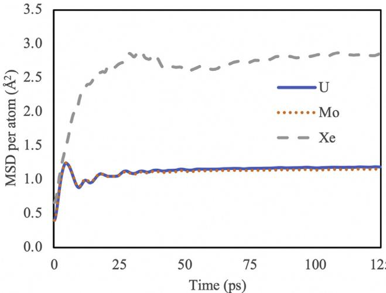
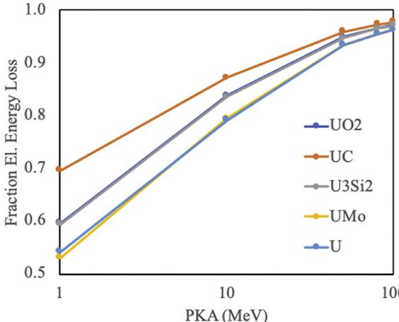
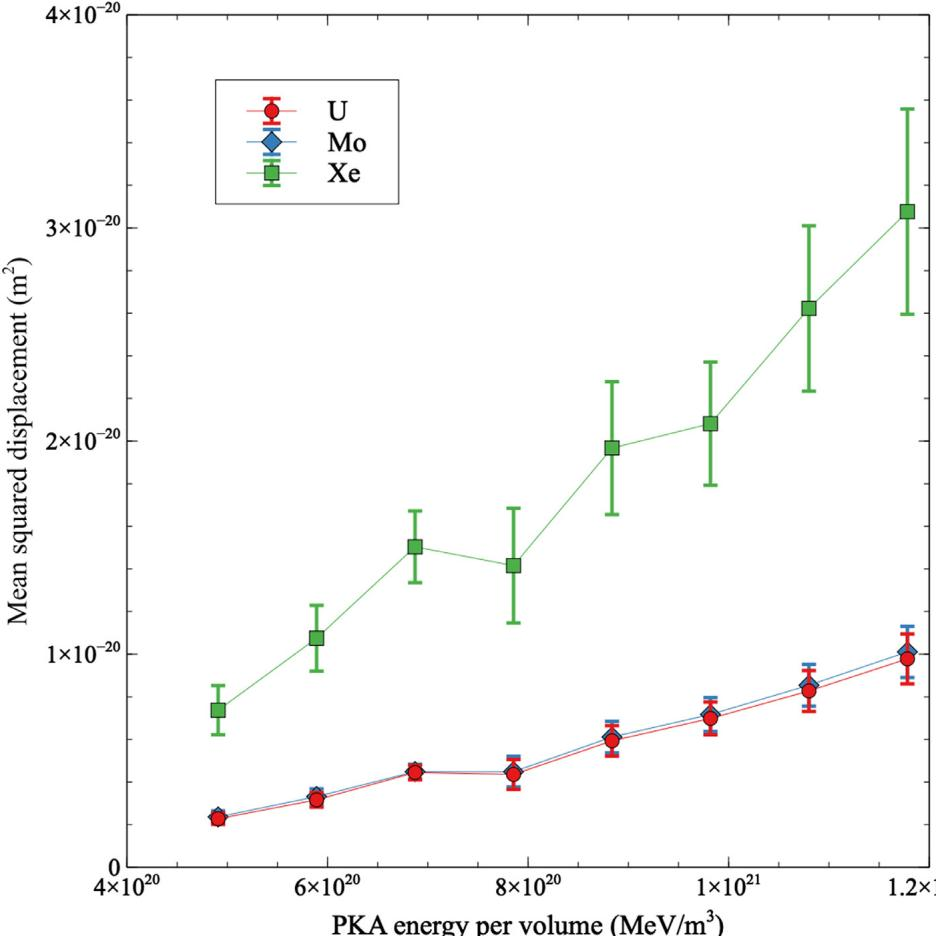
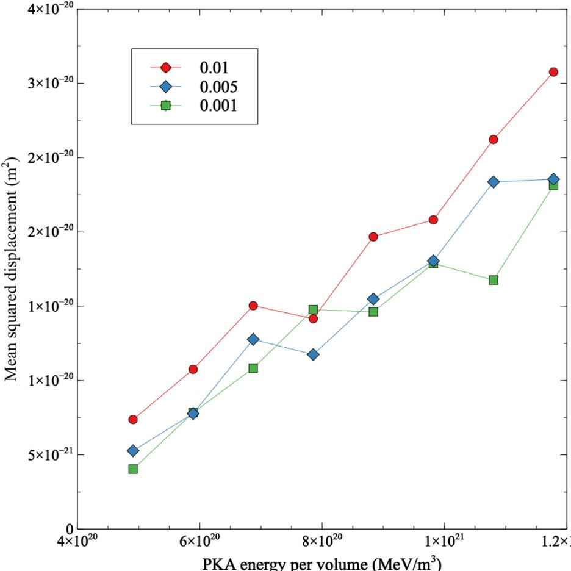
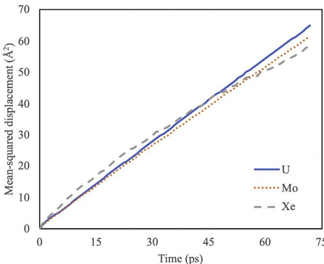
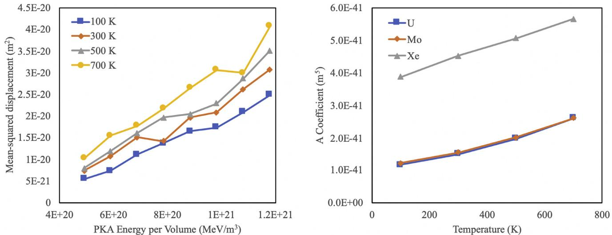
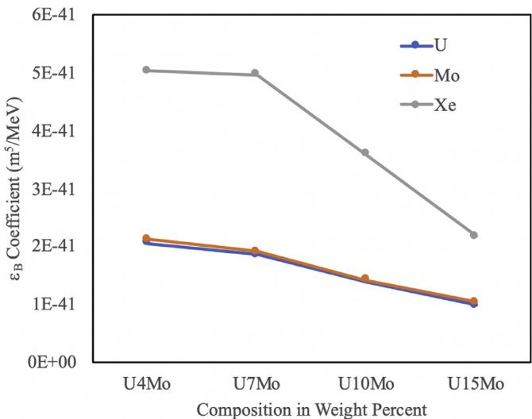
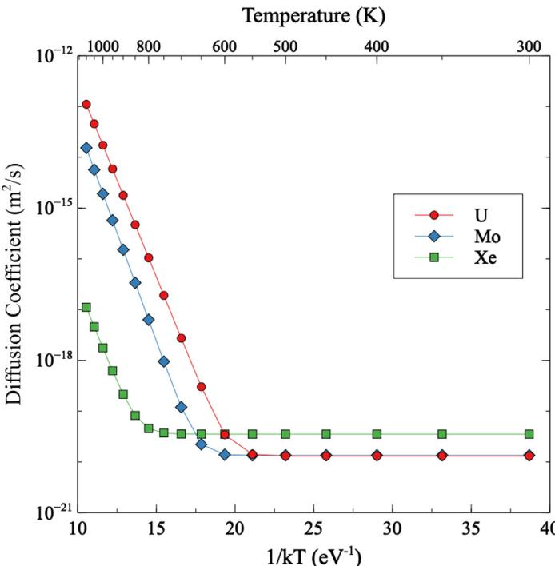

# Radiation driven diffusion in γ U-Mo

Benjamin Beeler a,b,∗ , Michael W.D. Cooper c , Zhi-Gang Mei d, Daniel Schwen b , Yongfeng Zhange,b

a North Carolina State University, Raleigh, NC 27695, United States b Idaho National Laboratory, Idaho Falls, ID 83415, United States c Los Alamos National Laboratory, Los Alamos, NM 87545, United States d Argonne National Laboratory, Lemont, IL 60439, United States e University of Wisconsin-Madison, Madison, WI 53715, United States

# a r t i c l e i n f o

# a b s t r a c t

Article history:   
Received 10 June 2020   
Revised 28 September 2020   
Accepted 29 September 2020   
Available online 2 October 2020

Keywords:   
Uranium-molybdenum   
Molecular dynamics   
Diffusion   
Research reactor   
Irradiation   
Fission gas

A monolithic fuel design based on a U-Mo alloy has been selected as the fuel type for conversion of the U. S. High-Performance Research Reactors. A critical phenomenon of interest regarding U-Mo monolithic fuel is the large amount of swelling that takes place during operation, particularly at high fission densities. The accurate prediction of fuel evolution under irradiation requires implementation of correct thermodynamic and kinetic properties into mesoscale and engineering fuel performance modeling codes. One such property where there exists incomplete data is the diffusion of relevant species under irradiation. Fuel performance swelling predictions rely on an accurate representation of diffusion in order to determine the rate of fission gas swelling and the local microstructural evolution. In this work, we present molecular dynamics simulations of the radiation driven diffusion of U, Mo, and Xe in U-Mo nuclear fuels. Diffusion coefficients for each species are determined over a range of temperatures and compositions. Updated diffusion coefficients are presented that are applicable under irradiation and incorporate both intrinsic and radiation driven diffusion.

$©$ 2020 Elsevier B.V. All rights reserved.

# 1. Introduction

High-power research reactors typically employ a highly enriched uranium (HEU) dispersion type fuel. The United States High-Performance Research Reactor (USHPRR) program targets replacing current HEU fuel in research reactors with low enriched uranium (LEU) fuel [1]. In order to achieve a reduced enrichment in these fuel types, there is the requirement for increased uranium density. The fuel design being pursued under the USHPRR program is a uranium-molybdenum (U-Mo) monolithic foil with a zirconium (Zr) diffusion barrier in aluminum (Al) cladding.

An issue with U-Mo monolithic fuel is the large amount of swelling that takes place during operation [2]. Such swelling needs to be stable and predictable up to high fission densities. Research reactor fuel types based on U-Mo are unique in their design to stably retain fission gases to high fission densities, leading to relatively high content of fission gas and of fission gas bubbles within the fuel matrix. The importance of swelling, in addition to the unique fuel environment, has led to a variety of experimental studies characterizing the swelling behavior in U-Mo fuels [3–6], which has led to the development of swelling correlations (from Argonne National Laboratory (ANL) [7] and Idaho National Laboratory (INL) [8]) as a function of fission density. A 2015 post-irradiation examination (PIE) report [9] from Williams et al. showed higher swelling in U-10Mo (alloy compositions are provided in weight percent unless otherwise noted) fuels at fission densities much lower than previously observed. This accelerated fuel swelling behavior could lead to early fuel failure and was not captured by the ANL correlation. Therefore, a more mechanistic fuel swelling model is needed in order to predict the swelling behavior of U-Mo fuels under typical operating conditions, transients, accident scenarios, and different reactor environments.

Recently, substantial effort has been made on mesoscale models to describe the swelling behavior of U-Mo fuels [10–17]. These models rely on phase-field and/or rate theory descriptions of material systems in order to model swelling on realistic timescales at a microstructural level. These simulation methodologies include a number of parameters that are either fit to limited experimental data, calculated via lower-length scale modeling methodologies, or assumed based on other material systems. One such assumption is the diffusion of species at low temperature. Research reactor fuels operate at relatively low temperatures, within a range of 150 to $3 5 0 ~ ^ { \circ } \mathsf C .$ Intrinsic thermal diffusion is relatively limited at these temperatures, and no such experimental data on diffusive behavior in this temperature range exist.

A number of high-temperature experimental studies have been conducted on interdiffusion, tracer diffusion, and self-diffusion in the U-Mo system. Adda et al. determined the interdiffusion coefficient of U-Mo from 1123 to $1 3 2 3 \mathrm { ~ K ~ }$ and subsequently determined the self-diffusion coefficient of uranium with 10 atomic percent Mo [18]. Lundberg determined interdiffusion coefficients from 1400 to $1 5 2 5 \mathrm { ~ K ~ }$ for a range of high Mo content systems (higher than U-10Mo) [19]. Huang et al. calculated interdiffusion and intrinsic diffusion of U-Mo alloys from 923 to 1273 K via diffusion couples [20]. All these experimental studies agree that, in U-rich U-Mo alloys, U diffuses more rapidly than Mo and that the interdiffusion coefficient is reduced with the addition of Mo. However, none of these studies investigated low-temperature systems, due to the difficulties in obtaining data due to reduced intrinsic diffusion of species at low temperatures. Thus, the diffusion data are often extrapolated from high-temperature systems and applied to low-temperature as a means of estimation. Additionally, there are no experimental studies of fission gas diffusion in U-Mo alloys.

For the study of self-diffusion and fission gas diffusion in $\mathrm { U O } _ { 2 }$ , the type of nuclear fuel typically utilized in commercial reactors in the U.S., the total diffusion coefficient is typically broken down into three component parts: (1) intrinsic diffusion $\left( \mathsf { D } _ { 1 } \right)$ , (2) radiation enhanced diffusion $\left( \mathsf { D } _ { 2 } \right)$ , and (3) radiation driven diffusion $\left( \mathsf { D } _ { 3 } \right)$ . Each of these constituent parts is dominant within a given temperature regime, as was initially discussed by Turnbull [21] and computationally investigated by Andersson et al. [22] Cooper et al. [23], and others [24–27]. Given the low operating temperatures of research reactors, it is expected that radiation driven diffusion will be a critical component of the total diffusion. No experimental or computational studies have been performed to investigate radiation driven diffusion in U-Mo or U-Mo-Xe systems.

In this work, molecular dynamics simulations are performed to determine the radiation driven diffusion of U, Mo, and Xe in U-Mo nuclear fuels. Diffusion coefficients for each species are determined over a range of temperatures and compositions. Updated diffusion coefficients are presented that are applicable under irradiation and incorporate both intrinsic and radiation driven diffusion.

# 2. Computational details

Molecular dynamics simulations are performed utilizing the LAMMPS [28] software package and a U-Mo-Xe embedded atom method (EAM) interatomic potential from Smirnova [29]. For short atomic distances, this interatomic potential was splined to a ZBL [30] via LAMMPS with spline cutoffs of $1 \mathring { \mathsf { A } }$ and $2 \ { \bar { \mathsf { A } } } .$ . The Smirnova U-Mo-Xe interatomic potential is the only potential capable of describing the U-Mo-Xe system of interest. There are multiple other interatomic potentials that describe the U-Mo binary alloy, but none include interactions for Xe [31,32]. This U-Mo-Xe potential was fit to ab initio data, tested on general properties of the U, Mo, Xe, UMo alloys and $\mathrm { U } _ { 2 } \mathrm { M } 0$ systems, and is able to reasonably reproduce elastic constants, thermal expansion, melting temperature, and point defect formation energies in $\gamma \mathrm { U } \mathrm { - } \mathrm { M } \mathrm { o }$ [29].

An $8 0 \times 8 0 \times 8 0$ supercell (1,024,000 atoms) is constructed with a U-Mo alloy of a given concentration in the body-centered cubic structure. Alloys of 10 atomic percent (U-4Mo), 15 atomic percent (U-7Mo), 22 atomic percent (U-10Mo), and 30 atomic percent (U-15Mo) are constructed by randomly changing a given percentage of U atoms to Mo atoms. Approximately $1 \%$ of all atoms are replaced with a Xe atom on a substitutional site, agnostic of whether that site is an existing U or Mo atom. The system is subsequently equilibrated in an NPT ensemble at zero pressure and a given temperature, of which four unique temperatures are included $1 0 0 ~ \mathrm { K } ,$

  
Fig. 1. The mean-squared displacement for U, Mo, and Xe, due to a $1 6 \ \mathrm { k e V }$ PKA as a function of time.

$3 0 0 \mathrm { ~ K } , 5 0 0 \mathrm { ~ K } , 7 0 0 \mathrm { ~ K } )$ . Relaxation is performed by relaxing each x, ${ \mathrm { y } } ,$ and z component individually, with a damping parameter of 0.1. A Langevin thermostat in the Gronbech-Jensen-Farago [33,34] formalism is utilized with the damping parameter set to 0.01 ps. The system is allowed to equilibrate for a total of $5 0 ~ { \mathfrak { p s } } .$ .

To simulate atomic mixing during the ballistic stopping of highenergy fission fragments, radiation damage cascade simulations are performed. Cascade simulations were conducted in an NVE ensemble using the equilibrated supercells. The cascades were initiated by randomly selecting a U atom and modifying its kinetic energy to a prescribed value in a randomly chosen direction. Primary knockon atoms (PKAs) from 10 to $2 4 ~ \mathrm { k e V }$ in increments of $2 \ \mathrm { k e V }$ are utilized. At each PKA energy, a total of 40 simulations are performed, each with a unique random PKA direction. The time step is controlled in three increments, in that for the first 30,000 time steps following the introduction of the cascade, the time step is set to 0.05 fs. Subsequently, the time step is increased to 0.1 fs for 30,000 time steps, then the time step is increased to 1 fs for 40,000 time steps, and finally the time step is increased to 2 fs for the final 40,000 time steps. This yields a total relaxation time after the introduction of the PKA of 124.5 ps. The mean squared displacement (msd) is tracked as a function of time. The msd at the end of the simulation is averaged for each species over the $4 0 \ s i \mathrm { { m } \mathrm { { - } } }$ ulations. An example msd as a function of time is shown in Fig. 1. The msd converges to a given value above approximately 75 ps, but the system is allowed to further equilibrate for another 50 ps. This is partially to ensure that atoms have reached a converged distance as a function of time, and also because it was observed that the energy of the system reached an equilibrated state after approximately 100 ps. The averaged msd as a function of the energy density (PKA energy per supercell volume) is determined for each species in each composition and temperature of interest.

The radiation driven diffusion coefficient is determined from the slope of the msd as a function of the energy density. In a fission event, two fission fragments are released with a total kinetic energy of approximately 170 MeV. Fission fragments deposit their energy both electronically and ballistically. In order to determine the amount of energy deposited ballistically, the amount of energy lost electronically needs to be determined. This is because electronic energy loss effects are not natively taken into account in molecular dynamics simulations. Therefore, we used the binary collision Monte Carlo (BCMC) code MyTRIM [35], a $C { + + }$ reimplementation of the SRIM algorithm for arbitrary sample geometries, to determine electronic energy loss. MyTRIM uses the binary collision approximation and implements the Brandt–Kitagawa electronic stopping formulation [36]. A representative heavy fission fragment (Xe) and a representative light fission fragment (Mo) were utilized to determine electronic energy loss. PKA energies from 1 MeV up to $1 0 0 \ \mathrm { M e V }$ were investigated in the U-Mo system of interest (10 weight percent), but also in $\mathrm { U O } _ { 2 }$ , UC, $\mathrm { U } _ { 3 } \mathrm { S i } _ { 2 }$ , and metallic U to develop a qualitative understanding of how electronic energy loss varies with the target material. The fraction of electronic energy loss for a Xe PKA is shown in Fig. 2. As the PKA energy increases, the fraction of the energy that is deposited electronically increases, as would be expected. For a typical heavy fission fragment with a kinetic energy of 70 MeV from a fission event in U-Mo, the expected fraction of electronic energy loss is $9 5 \%$ . Thus, only $5 \%$ of the energy is deposited ballistically. For a $1 0 0 \ \mathrm { M e V }$ light fission fragment in U-Mo, the expected fraction of electronic energy loss is also $9 5 \%$ . Thus, from a 170 MeV fission event, only $5 \%$ $\mathbf { \langle } 8 . 5 \mathrm { \ M e V \rangle }$ is deposited ballistically. This work assumes that displacements are only a result of ballistic energy deposition, due to the high thermal conductivity of the U-Mo system $( 2 3 \mathrm { ~ W / m } \mathrm { - K }$ at $5 0 0 ~ ^ { \circ } \mathrm { C } )$ [37] and the associated rapid dissipation of heat by electrons inhibiting atomic mixing, due to electronic energy deposition.

  
Fig. 2. The fraction of electronic energy loss of a Xe fission fragment in five different media as a function of PKA energy.

The radiation driven diffusion coefficient $\mathsf { D } _ { r a d }$ can then be defined as:

$$
D _ { r a d } = \frac { 0 . 0 5 \times \epsilon _ { B } } { 6 } \times E _ { F } \times \dot { F }
$$

where 0.05 denotes the fraction of energy deposited ballistically in UMo, $\epsilon _ { B }$ is the slope of the msd per energy deposited per unit volume, $\mathtt { E } _ { F }$ is the total fission fragment kinetic energy $( 1 7 0 ~ \mathrm { M e V } )$ of a single fission event, and $\dot { F }$ is the fission rate per unit volume. This formalism makes use of a modification of the Einstein equation $D$ $= { \mathrm { m s d } } / { \mathrm { 6 t } } )$ , utilizing the msd from ballistic mixing. Although the PKA energies investigated in this work are much lower than those anticipated from fission events, it is expected that the slope of the msd per energy deposited per unit volume is constant, as has been shown for higher energy PKAs in $\mathrm { U O } _ { 2 }$ [23]. In this work, $\epsilon _ { B }$ is determined over the entire range of PKA energies presented in this manuscript. Given a value of $\epsilon _ { B }$ for a given system and a given species of interest, this equation can be reduced to a single coefficient multiplied by the fission rate:

$$
D _ { i r r } = A \dot { F }
$$

The total diffusivity can then be taken as the summation of the intrinsic diffusion, $D _ { 1 }$ , and the radiation driven diffusion, $D _ { 3 }$ . Radiation enhanced diffusion, $D _ { 2 }$ , is not considered in this work, due to a lack of temperature-relevant diffusion data.

It should be emphasized that these simulations are considering only pure ballistic mixing, neglecting the diffusion of the fission fragment itself, and no electronic degrees of freedom are taken into account. Additionally, PKA energies in this manuscript are admittedly much lower than those anticipated from fission events. However, due to the stochastic nature of ballistic mixing, statistical significance was emphasized within this work over extending to higher PKA energies.

# 3. Results

# 3.1. Radiation driven diffusion of different elements

The msd as a function of PKA energy per unit volume is shown in Fig. 3 for U-10Mo at $3 0 0 ~ \mathrm { K } .$ A general linear relationship is observed for all three species. It can be observed that Xe atoms move significantly farther than either U or Mo, due to a PKA of a given energy, while U and Mo exhibit near identical msd versus energy density slope. Thus, Xe diffuses more rapidly than either U or Mo, due to ballistic mixing. This is not strictly a high energy trend, as an increased msd can still be observed for the lowest energy density (corresponding to a $1 0 \ \mathrm { k e V }$ PKA). Also, this is not a compositional concentration effect, as the Xe is randomly dispersed within the U-Mo alloy and forty unique configurations are investigated. This rapid diffusion of Xe in U-Mo is unlike the radiation driven diffusion behavior of Xe in $\mathrm { U O } _ { 2 }$ [23], where Xe displays a smaller msd per PKA energy than oxygen, although it does in fact display a higher msd per PKA energy than uranium.

This presents the question of what is different in this system compared to $\mathrm { U O } _ { 2 }$ , or what behaviors are potentially related to specific simulation parameters. Thus, a test of the effect of Xe content was undertaken. The initial simulation setup utilized $1 \%$ Xe, which is a very high fraction of Xe atoms compared to realistic systems. This was utilized for consistency with prior studies of radiation driven diffusion in nuclear fuels and additionally ensures appropriate sampling statistics for Xe diffusion. To verify the effect of Xe concentration, identical simulations are performed as in Fig. 3, but with $0 . 5 \%$ and $0 . 1 \%$ Xe content. The results are shown in Fig. 4. There is no statistically significant difference in the slope of the msd with variable Xe concentration, although the magnitude of the msd does increase slightly. As such, there does not exist a discernible trend with decreasing Xe concentration. Although it is not shown in Fig. 4, there are also no observable changes in the msd for U and Mo as a function of Xe concentration. Therefore it can be concluded that the amount of Xe in the system is not affecting the results of the simulations.

That Xe diffuses more rapidly than either U or Mo seems to point towards variable behavior in the cascade core. The cascade produces a thermal spike, which can potentially induce localized melting due to rapid energy deposition. It is supposed that Xe diffuses rapidly during the heating and partial melting inside the cascade core, which implies that Xe diffuses rapidly in liquid U-Mo. In order to verify this assumption, molecular dynamics simulations are performed to estimate Xe diffusion, compared to U and Mo diffusion, in a liquid U-10Mo alloy. A 128,000 atom supercell with a composition of U-10Mo is equilibrated at $5 0 0 0 ~ \mathrm { K } ,$ after which the system is quenched down to $1 6 0 0 ~ \mathrm { K }$ over 25 ps, which is still above the melting point of U-10Mo. Subsequently, $0 . 1 \%$ of the atoms in the supercell are replaced by Xe atoms, the system is equilibrated for $7 5 ~ { \mathsf p } { \mathsf s }$ , and the msd of each individual species is tracked as a function of time. The results are shown in Fig. 5 for msd as a function of time for U, Mo and Xe. It can be observed that initially, Xe diffuses faster than either U or Mo, with U diffusing slightly faster than Mo. However, after approximately 30 ps, the slope of the Xe msd curve as a function of time decreases, with Xe diffusion becoming slower than either U or Mo. Visual structure examination via Ovito [38] indicated that Xe atoms were diffusing and forming clusters very quickly in the U-Mo system, after which diffusion of Xe was reduced. This preliminary result on Xe diffusion in liquid U-Mo seems to confirm the results from Fig. 3, in that Xe does indeed diffuse faster than either U or Mo in liquid U-Mo alloys.

  
Fig. 3. Mean squared displacement of U, Mo and Xe as a function of PKA energy per volume in U-10Mo at $3 0 0 ~ \mathrm { K } .$

Table 1 The $\epsilon _ { B }$ coefficient from Eq. (1) for different U-Mo alloy compositions at $5 0 0 ~ \mathrm { K }$   

<table><tr><td>Element</td><td>U-4Mo</td><td>U-7Mo</td><td>U-10Mo</td><td>U-15Mo</td></tr><tr><td>U</td><td>2.05E-41</td><td>1.85E-41</td><td>1.39E-41</td><td>9.81E-42</td></tr><tr><td>Mo</td><td>2.12E-41</td><td>1.90E-41</td><td>1.42E-41</td><td>1.03E-41</td></tr><tr><td>Xe</td><td>5.03E-41</td><td>4.96E-41</td><td>3.58E-41</td><td>2.17E-41</td></tr></table>

# 3.2. Effect of temperature

Radiation driven diffusion is assumed to be an athermal phenomenon, with effectively zero variation as a function of temperature. To investigate the validity of this assumption for U-Mo, systems from $1 0 0 \mathrm { ~ K ~ }$ up to $7 0 0 ~ \mathrm { K }$ were studied, which fully encompasses the expected operating regimes for U-Mo fuel. The results are displayed in Fig. 6, showing both the msd as a function of energy deposition at four different temperatures for Xe in U-10Mo, and the A coefficient from Eq. (2) as a function of temperature for each species in U-10Mo. There exists a slight variation in the slope of the msd with increasing temperature, in that the slope increases with increasing temperature. This effect appears very minor, but can be more clearly illustrated when looking at the A coefficient, where there is a near linear increase with increasing temperature. A possible explanation of the observed temperature effect is that the cascade may last longer due to the smaller temperature difference relative to its surroundings and a longer cascade lifetime would yield more diffusion. However, over this $6 0 0 ~ \mathrm { K }$ temperature range, the diffusion increases by approximately a factor of 2 for U and Mo and a factor of 1.5 for Xe. Compared to intrinsic diffusion, which increases by 5 orders of magnitude over a $6 0 0 ~ \mathrm { K }$ temperature range [20], these variations are negligible and the radiation driven diffusion can be considered to be effectively athermal, similar to the study on $\mathrm { U O } _ { 2 }$ [23].

# 3.3. Effect of composition

In U-Mo monolithic fuel, there can exist compositional variation due to processing procedures and the thermodynamics of interfaces and second phases present in the fuel. Such compositional variation can have an effect on properties, including the melting point and defect formation energies. As such, it needs to be understood if compositional variation will affect radiation driven diffusion. Compositions of U-4Mo, U-7Mo, U-10Mo and U-15Mo are investigated (compositions in weight percent), with the results at $5 0 0 ~ \mathrm { K }$ summarized in Fig. 7 and Table 1. There exists a clear trend of increasing diffusion (linearly proportional to $\epsilon _ { B }$ from Eq. (1)) with decreasing Mo content. The most rapid radiation driven diffusion occurs for the U-4Mo system and the most sluggish diffusion is present for the U-15Mo system. This can largely be explained by the phenomenon of localized melting in the cascade core. For two similar systems and one system with a lower melting point, one would expect a greater extent of localized melting due to a cascade with a given PKA energy in the system with a lower melting point. The brief liquid-like behavior can accelerate diffusion due to ballistic mixing. From the phase diagram of U-Mo we see that alloying with Mo increases the melting point of the bcc phase of U [37], in that a lower Mo content yields a lower melting point. That the interatomic potential captured this behavior was verified via the evolution of a two-dimensional solid/liquid interface, which found the melting point varied from approximately $1 6 0 0 ~ \mathrm { K }$ for U-15Mo to $1 5 0 0 ~ \mathrm { K }$ for U-4Mo.

  
Fig. 4. Mean squared displacement of Xe as a function of PKA energy per volume in U-10Mo for three different Xe concentrations.

  
Fig. 5. The mean squared displacement as a function of time for U, Mo and Xe in a U-10Mo alloy with $0 . 1 \ \%$ Xe at $1 6 0 0 ~ \mathrm { K } .$ .

The extent of the differences in diffusion with respect to composition are more pronounced than the effects of temperature in Fig. 6, but are still less than one order of magnitude. Thus, although there is a distinguishable difference in diffusion as a function of composition, utilizing the diffusion for U-10Mo for all Mo compositions from 7 to 15 weight percent is a valid assumption. Granberg [39] also found compositional dependence on cascade mixing effects in FeCr alloys, seeing minor differences in Frenkel pair production with varying Cr content. However, Granberg also investigated cascade overlap, and showed that behavior of different compositions varied more dramatically for a large number of overlapping cascades. Cascade overlap was not taken into account in this work. Regarding the magnitude of $\epsilon _ { B }$ (the slope of the msd per energy deposited per unit volume), the values presented here are approximately an order of magnitude higher than those observed for $\mathrm { U O } _ { 2 }$ [23–27]. This may be due to the low defect formation energies [40] and rapid diffusion [31] in bcc U, or perhaps due to the strong electron-phonon interactions that take place in $\mathrm { U O } _ { 2 }$ [26]. Regardless, at low temperatures, the degree of atomic mixing, and thus atomic displacements, due to a given PKA is much larger in U-Mo than in $\mathrm { U O } _ { 2 }$ .

# 3.4. Updated diffusion coefficients

Given the data in Table 1 and assuming that values for U-10Mo at $5 0 0 ~ \mathrm { ~ K ~ }$ are representative for all U-Mo systems in this study, new diffusion coefficients that incorporate both intrinsic and radiation driven diffusion can be presented. Fitting to the intrinsic diffusion data from Huang [20] yields diffusion coefficients of $( 1 . 2 8 \ \times 1 0 ^ { - 5 } ) \times \mathrm { e x p } ( - 1 . 7 6 / \mathrm { k T } )$ for uranium and $( 1 . 6 2 \times 1 0 ^ { - 5 } ) \times \mathrm { e x p } ( - 1 . 9 7 / \mathrm { k T } )$ for molybdenum (units in $\mathrm { m } ^ { 2 } / s$ and eV for the prefactor and activation energy, respectively). The intrinsic diffusion coefficient for Xe in U-Mo is unknown, but is commonly assumed to be approximately four orders of magnitude lower than the intrinsic diffusion of uranium [17,41,42], and this assumption is utilized here. It should be emphasized that these experimental data were collected at high temperature, and the Arrhenius fits to the data are being extrapolated to low temperatures to generate approximate intrinsic diffusion at reactor-relevant temperatures. This information is incorporated into Eqs. (3)–(5), and assuming a fission rate of $5 \ \times \ 1 0 ^ { 2 0 } \ \mathrm { f i s s / m } ^ { 3 } { - } s$ [41,42], the total diffusion is shown in Fig. 8 for U, Mo and Xe as a function of temperature.

  
Fig. 6. The mean squared displacement as a function of energy deposition at four different temperatures for Xe in U-10Mo and the A coefficient from Eq. (2) as a function of temperature for each species in U-10Mo.

  
Fig. 7. The mean squared displacement as a function of energy deposition at four different compositions for U, Mo and Xe at $5 0 0 ~ \mathrm { K } .$

$$
\begin{array} { l } { { D _ { U } = ( 1 . 2 8 \times 1 0 ^ { - 5 } ) \times \exp ( - 1 . 7 6 / k T ) + 1 . 9 7 \times 1 0 ^ { - 4 1 } \times \dot { F } } } \\ { { \ } } \\ { { D _ { M o } = ( 1 . 6 2 \times 1 0 ^ { - 5 } ) \times \exp ( - 1 . 9 7 / k T ) + 2 . 0 1 \times 1 0 ^ { - 4 1 } \times \dot { F } } } \\ { { \ } } \\ { { D _ { X e } = ( 1 . 2 8 \times 1 0 ^ { - 9 } ) \times \exp ( - 1 . 7 6 / k T ) + 5 . 0 7 \times 1 0 ^ { - 4 1 } \times \dot { F } } } \end{array}
$$

  
Fig. 8. The diffusion of U, Mo and Xe in U-Mo alloys as a function of temperature, including effects of both intrinsic and radiation driven diffusion. This graph assumes a fission rate of $5 \ \times 1 0 ^ { 2 0 }$ fiss $I _ { \Pi ^ { 3 } - S }$

There exists a transition for each species from intrinsic to radiation driven diffusion at a given temperature. The temperature at which each transition occurs is dependent upon the individual diffusive properties of each species (and the fission rate), where in this case the transition for U occurs at $6 0 0 ~ \mathrm { K } ,$ Mo at $6 5 0 ~ \mathrm { K } ,$ and Xe at $8 0 0 ~ \mathrm { K } .$ This means that below these transition temperatures, radiation driven diffusion is dominant compared to intrinsic diffusion. It should be emphasized that relevant temperature range of interest for U-Mo monolithic fuel in research reactors is from approximately $4 0 0 { \mathrm { - } } 6 0 0 ~ \mathrm { K } .$ Thus, it is expected that intrinsic diffusion is not the dominant diffusion mechanism in this fuel in-reactor.

It should additionally be noted that radiated enhanced diffusion $\left( \mathsf { D } _ { 2 } \right)$ is not calculated in this work and is unknown. It is entirely possible that $\mathsf { D } _ { 2 }$ is the dominant diffusion mechanism over some or all of the temperature regime of interest. However, given that it is unknown, the most complete diffusion data for the U-Mo-Xe system is as described in Eqs. (3)–(5). Exclusion of ${ \sf D } _ { 3 }$ , and a reliance on only $\mathsf { D } _ { 1 }$ , would result in a very significant underestimate of diffusivity at reactor operating temperatures. In the future, this research will extend towards investigating radiation enhanced diffusion in order to obtain the full characterization of diffusive behavior in U-Mo fuels.

# 4. Conclusions

In this work, molecular dynamics simulations were performed to determine the radiation driven diffusion of U, Mo and Xe in U-Mo nuclear fuels. Diffusion coefficients for each species were determined and their variance as a function of composition and temperature was analyzed. Updated diffusion coefficients were presented that are applicable under irradiation that incorporate both intrinsic and radiation driven diffusion. This work demonstrates that at temperatures relevant to U-Mo research reactors, it is critical to account for radiation driven diffusion, as this is the dominant mode of diffusion when compared to intrinsic diffusion. The data generated in this manuscript can directly be incorporated into mesoscale and continuum fuel evolution and fuel performance models that describe fission gas and point defect behavior in U-Mo fuels. Finally, this work points to the possibility of an important role of radiation enhanced diffusion in U-Mo-Xe systems, and as such this will be the topic of future investigation.

# Declaration of Competing Interest

The authors declare that they have no known competing financial interests or personal relationships that could have appeared to influence the work reported in this paper.

# CRediT authorship contribution statement

Benjamin Beeler: Conceptualization, Methodology, Software, Validation, Formal analysis, Writing - original draft. Michael W.D. Cooper: Methodology, Conceptualization, Writing - review & editing. Zhi-Gang Mei: Writing - review & editing, Conceptualization, Methodology. Daniel Schwen: Software, Writing - review & editing, Conceptualization. Yongfeng Zhang: Supervision, Writing - review & editing, Conceptualization.

# Acknowledgments

This work was supported by the U.S. Department of Energy, Office of Material Management and Minimization, National Nuclear Security Administration, under DOE-NE Idaho Operations Office Contract DE-AC07-05ID14517. This work was also supported by the U.S. Department of Energy, Office of Nuclear Energy, Nuclear Energy Advanced Modeling and Simulation (NEAMS) Program. This manuscript has been authored by Battelle Energy Alliance, LLC with the U.S. Department of Energy. The publisher, by accepting the article for publication, acknowledges that the U.S. Government retains a nonexclusive, paid-up, irrevocable, worldwide license to publish or reproduce the published form of this manuscript, or allow others to do so, for U.S. Government purposes. Los Alamos National Laboratory, an affirmative action/equal opportunity employer, is operated by Los Alamos National Security, LLC, for the National Nuclear Security Administration of the U.S. Department of Energy under Contract No. DE-AC52-06NA25396. This research made use of the resources of the High Performance Computing Center at Idaho National Laboratory, which is supported by the Office of Nuclear Energy of the U.S. Department of Energy and the Nuclear Science User Facilities.

# References

[1] J. Snelgrove, G. Hofman, M. Meyer, C. Trybus, T. Weincek, Development of very-high density low enriched uranium fuels, Nucl. Eng. Design 178 (1997) 119.   
[2] G. Hofman, L. Walters, T. Bauer, Metallic fast reactor fuels, Prog. Nucl. Energy 31 (1997) 83.   
[3] J. Rest, G. Hofman, Y. Kim, Analysis of intergranular fission-gas bubble-size distributions in irradiated uranium-molybdenum alloy fuel, J. Nucl. Mater. 385 (2009) 563.   
[4] Y. Kim, G. Hofman, J. Rest, G. Shevlyakov, Characterization of intergranular fission gas bubbles in U-Mo fuel, Technical Report ANL-08/11, Argonne National Laboratory, 2008.   
[5] M. Meyer, G. Hofman, S. Hayes, C. Clark, T. Wiencek, J. Snelgrove, R. Strain, K. Kim, Low-temperature irradiation behavior of uranium-molybdenum alloy dispersion fuel, J. Nucl. Mater. 304 (2002) 221.   
[6] Y. Kim, G. Hofman, J. Cheon, A. Robinson, D. Wachs, Fission induced swelling and creep of U-Mo alloy fuel, J. Nucl. Mater. 437 (2013) 37.   
[7] Y. Kim, G. Hofman, Fission product induced swelling of U-Mo alloy fuel, J. Nucl. Mater. 419 (2011) 291.   
[8] M. Meyer, B. Rabin, J. Cole, I. Glagolenko, W. Jones, J.-F. Jue, J. D. Keiser, C. Miller, G. Moore, H. Ozaltun, F. Rice, A. Robinson, J. Smith, D. Wachs, W. Williams, N. Woolstenhulme, Preliminary Report on U-Mo Monolithic Fuel for Research Reactors, Technical Report INL/EXT-17-40975, Idaho National Laboratory, 2017.   
[9] W. Williams, F. Rice, A. Robinson, M. Meyer, B. Rabin, AFIP-6 MKII Post-irradiation examination summary report, Technical Report INL/LTD-15-34142, Idaho National Laboratory, 2015.   
[10] L. Liang, Y. Kim, Z.-G. Mei, L. Aagesen, A. Yacout, Fission gas bubbles and recrystallization-induced degradation of the effective thermal conductivity in U-7Mo fuels, J. Nucl. Mater. 511 (2018) 438.   
[11] L. Liang, Z.-G. Mei, Y. Kim, M. Anitescu, A. Yacout, Three-dimensional phase– field simulations of intragranular gas bubble evolution in irradiated U-Mo fuel, Comput. Mater. Sci. 145 (2018) 86.   
[12] L. Liang, Z.-G. Mei, A. Yacout, Fission-induced recrystallization effect on intergranular bubble-driven swelling in U-Mo fuel, Comput. Mater. Sci. 138 (2017) 16.   
[13] L. Liang, Z.-G. Mei, Y. Kim, B. Ye, G. Hofman, M. Anitescu, A. Yacout, Mesoscale model for fission-induced recrystallization in U-7Mo alloy, Comput. Mater. Sci. 124 (2016) 228.   
[14] B. Ye, G. Hofman, A. Leenaers, A. Bergeron, V. Kuzminov, S.V. den Berghe, Y. Kim, H. Wallin, A modelling study of the inter-diffusion layer formation in U-Mo/Al dispersion fuel plates at high power, J. Nucl. Mater. 499 (2018) 191.   
[15] S. Hu, V. Joshi, C. Lavender, A rate-theory–phase-field model of irradiation-induced recrystallization in U-Mo nuclear fuels, JOM 69 (2017) 2554.   
[16] S. Hu, D. Burkes, C. Lavender, V. Joshi, Effect of grain morphology on gas bubble swelling in U-Mo fuels – a 3D microstructure dependent booth model, J. Nucl. Mater. 480 (2016) 323.   
[17] S. Hu, D. Burkes, C. Lavender, D. Senor, W. Setyawan, Z. Xu, Formation mechanism of gas bubble superlattice in UMo metal fuels: Phase-field modeling investigation, J. Nucl. Mater. 479 (2016) 202.   
[18] Y. Adda, A. Kirianenko, Abaissement des coefficients d’autodiffusion de l’uranium en phase y par des additions de molybdene, de zirconium ou de niobium, J. Nucl. Mater. 6 (1962) 135.   
[19] L. Lundberg, High-temperature interdiffusion and phase equilibria in U-Mo, J. Nucl. Mater. 167 (1989) 64.   
[20] K. Huang, J. D. Keiser, Y. Sohn, Interdiffusion, intrinsic diffusion, atomic mobility, and vacancy wind effect in gamma(BCC) uranium-molybdenum alloy, Metall. Mat. Trans. A 44A (2013) 738.   
[21] J. Turnbull, C. Friskney, J. Findlay, F. Johnson, A. Walter, The diffusion coefficients of gaseous and volatile species during the irradiation of uranium dioxide, J. Nucl. Mater. 107 (1982) 168.   
[22] D. Andersson, P. Garcia, X.-Y. Liu, G. Pastore, M. Tonks, P. Millett, B. Dorado, D. Gaston, D. Andrs, R. Williamson, et al., Atomistic modeling of intrinsic and radiation-enhanced fission gas (Xe) diffusion in ${ \bf U } 0 2 \pm { \bf x } \mathrm { : }$ Implications for nuclear fuel performance modeling, J. Nucl. Mater. 451 (1) (2014) 225–242.   
[23] M. Cooper, C. Stanek, J. Turnbull, B. Uberuaga, D. Andersson, Simulation of radiation driven fission gas diffusion in UO2, ThO2 and PuO2, J. Nucl. Mater. 481 (2016) 125.   
[24] C. Matthews, R. Perriot, M.W.D. Cooper, C.R. Stanek, D.A. Andersson, Cluster dynamics simulation of uranium self-diffusion during irradiation in UO2, J. Nucl. Mater. 527 (2019) 151787.   
[25] R. Perriot, C. Matthews, M.W.D. Cooper, B.P. Uberuaga, C.R. Stanek, D.A. Andersson, Atomistic modeling of out-of-pile xenon diffusion by vacancy clusters in UO2, J. Nucl. Mater. 520 (2019) 96–109.   
[26] J. Wormald, A. Hawari, Examination of the impact of electron-phonon coupling on fission enhanced diffusion in uranium dioxide using classical molecular dynamics, J. Mater. Res. 30 (2015) 1485.   
[27] G. Martin, S. Maillard, L.V. Brutzel, P. Garcia, B. Dorado, C. Valot, A molecular dynamics study of radiation induced diffusion in uranium dioxide, J. Nucl. Mater. 385 (2009) 351.   
[28] S. Plimpton, Fast parallel algorithms for short-range molecular dynamics, J. Comput. Phys. 117 (1995) 1–19.   
[29] D. Smirnova, A. Kuksin, S. Starikov, V. Stegailov, Z. Insepov, J. Rest, A. Yacout, A ternary eam interatomic potential for U-Mo alloys with xenon, Model. Simul. Mater. Sci. Eng. 21 (2013) 035011.   
[30] J. Ziegler, J. Biersack, U. Littmark, Stopping and Ranges of Ions in Matter, Pergamon Press, 1985.   
[31] D. Smirnova, A. Kuksin, S. Starikov, V. Stegailov, Atomistic modeling of the selfdiffusion in gamma u and gamma U-Mo, Phys. Meter. Metall. 116 (2015) 445.   
[32] S. Starikov, L. Kolotova, A. Kuksin, D. Smirnova, V. Tseplyaev, Atomistic simulation of cubic and tetragonal phases of U-Mo alloy: structure and thermodynamic properties, J. Nucl. Mater. 499 (2018) 451.   
[33] N. Gronbech-Jensen, O. Farago, A simple and effective Verlet-type algorithm for simulating Langevin dynamics, Mol. Phys. 111 (2013) 983.   
[34] N. Gronbech-Jensen, N. Hayre, O. Farago, Application of the G-JF discrete-time thermostat for fast and accurate molecular simulations, Comput. Phys. Commun. 185 (2014) 524.   
[35] D. Schwen, M. Huang, P. Bellon, R. Averback, Molecular dynamics simulation of intragranular Xe bubble re-solution in $\mathrm { U O } _ { 2 }$ , J. Nucl. Mater. 392 (2009) 35.   
[36] W. Brandt, M. Kitigawa, Effective stopping-power charges of swift ions in condensed matter, Phys. Rev. B 25 (1982) 5631.   
[37] J. Rest, Y. Kim, G. Hofman, M. Meyer, S. Hayes, U-Mo Fuels Handbook, Technical Report ANL-09/31, Argonne National Laboratory, 2006.   
[38] A. Stukowski, Visualization and analysis of atomis simulation data with ovito - the open visulaization tool, Model. Simul. Mater. Sci. Eng. 18 (2010) 015012.   
[39] F. Granberg, J. Byggmastar, K. Nordlund, Defect accumulation and evolution during prolonged irradiation of Fe and FeCr alloys, J. Nucl. Mater. 528 (2020) 151843.   
[40] B. Beeler, B. Good, S. Rashkeev, C. Deo, M. Baskes, M. Okuniewski, First principles calculations for defects in U, J. Phys. 22 (2010) 505703.   
[41] S. Hu, V. Joshi, C. Lavendar, N. Lombardo, J. Wight, B. Ye, Z.-G. Mei, L. Liang, A. Yacout, G. Hofman, Y. Zhang, Y. Gao, B. Beeler, J. Cole, B. Rabin, Microstructural-Level Fuel Performance Modeling of U-Mo Monolithic Fuel, Technical Report INL/LTD-17-43489, Idaho National Laboratory, 2017.   
[42] B. Beeler, D. Burkes, J. Cole, Y. Gao, G. Hofman, S. Hu, V. Joshi, C. Lavendar, L. Liang, N. Lombardo, Z.-G. Mei, A. Oaks, J. Wight, A. Yacout, B. Ye, Y. Zhang, Microstructural-Level Fuel Performance Modeling of U–Mo Monolithic Fuel, Technical Report INL/LTD-18-51573, Idaho National Laboratory, 2018.