IRRADIATION SWELLING,

PHASE REVERSION,

AND

INTERGRANULAR CRACKING

OF

U - 10 wt % Mo FUEL ALLOY

AEC Research and Development Report

UNIVERSITY OF

ARIZONA LIBRARY

Documents Collection

MAR 9 1985

ATOMICS INTERNATIONAL

A DIVISION OF NORTH AMERICAN AVIATION, INC.

# LEGAL NOTICE

This report was prepared as an account of Government sponsored work. Neither the United States, nor the Commission, nor any person acting on behalf of the Commission:

A. Makes any warranty or representation, express or implied, with respect to the accuracy, completeness, or usefulness of the information contained in this report, or that the use of any information, apparatus, method, or process disclosed in this report may not infringe privately owned rights; or   
B. Assumes any liabilities with respect to the use of, or for damages resulting from the use of information, apparatus, method, or process disclosed in this report.

As used in the above, "person acting on behalf of the Commission" includes any employee or contractor of the Commission, or employee of such contractor, to the extent that such employee or contractor of the Commission, or employee of such contractor prepares, disseminates, or provides access to, any information pursuant to his employment or contract with the Commission, or his employment with such contractor.

IRRADIATION SWELLING,

PHASE REVERSION,

AND

INTERGRANULAR CRACKING

OF

U - 10 wt % Mo FUEL ALLOY

By:

R.M. WILLARD

A.R. SCHMITT

# ATOMICS INTERNATIONAL

A DIVISION OF NORTH AMERICAN AVIATION, INC.

P.O. BOX 309 CANOGA PARK, CALIFORNIA

CONTRACT: AT(11-1)-GEN-8

ISSUED:

FEB 1955

# DISTRIBUTION

This report has been distributed according to the category "Metals, Ceramics, and Materials" as given in "Standard Distribution Lists for Unclassified Scientific and Technical Reports" TID-4500 (29th Ed.), April 1, 1964. A total of 615 copies was printed.

# ACKNOWLEDGMENT

The authors are indebted to A. H. Willis, for his stimulating discussions during the examination of these specimens. The authors wish to acknowledge the work of D. D. McAfee and S. L. Englebert, in preparing the specimens for observation, and the work of J. L. Arnold, in preparing the final draft of the report.

# CONTENTS

# Page

Abstract 5

I. Introduction 7   
II. Experimental Procedure 10

A. Pre-irradiation Heat Treatment and Metallography 10   
B. Irradiation History 10   
C. Post-irradiation Examination 13

III. Results of Post-irradiation Examination 14

A. Swelling 14   
B. Microstructure 15   
C. Internal Void Structure 15

IV. Discussion of Results 25

A. Swelling 25   
B. Phase Reversion 26   
C. Intergranular Cracking 29

V. Conclusions 32

References 33

# TABLES

1. NAA 47 Series Original Design Conditions 6   
2. Hallam Nuclear Power Facility Design Conditions - Core I . . . . 9   
3. Post-irradiation Examination Data for Metallographic Specimens 12   
4. Calculated Critical Fission Rate, Using Equation 4 30

# FIGURES

1. Temperature vs Fission Rate Conditions for Hallam Core I 6   
2. Uranium-Molybdenum Phase Diagram 8   
3. Location of Metallographic Specimens 10

# FIGURES

Page

# 4. Typical Pre-irradiation Microstructure

a. As Cast 11   
b. Gammadized. 11   
c. Partially Transformed. 11

# 5. Diameter Change as a Function of Burnup 14

# 6. Typical Structure After Irradiation

a. Retained Gamma 16   
b. Transformed 16   
c. Spheroidized 16

# 7. Specimen 7-6B, Illustrating Wedge and Elliptical Voids 17

8. Specimen 6-4, Showing High Magnification of Wedge Voids and Lamellar Transformed Structure 17   
9. Specimen 4-9, From Center to Surface of Specimen 19

# 10. Specimen 7-6B, From Center to Surface of Specimen 23

11. Schematic Representation of Specimen 7-6 After Irradiation to 4600 Mwd/MTU (Bottom of specimen was bonded to Slug 7-7 during irradiation) 26   
12. Time-Temperature-Transformation Curve for Uranium-Molybdenum Alloys 27   
13. Correlation of Observed Microstructure with Theoretical Fission Rate Temperature Curve 30

# ABSTRACT

A fuel development program has been conducted, to investigate the behavior of U - 10 wt% Mo alloy at the fission rates and temperatures anticipated in Core I of the Hallam Nuclear Power Facility. Unrestrained samples, 0.5 in. in diameter by 2.0 in. long, were irradiated in the Materials Testing Reactor for periods up to three years, to achieve substantial burnup levels at the relatively low Core I burnup rates. The specimens were irradiated in the fission rate range from 2.5 to $8.0 \times 10^{12}$ fissions/cc-sec, at average central temperatures from 750 to $1085^{\circ}\mathrm{F}$ . Initially, the fuel specimen structures were as-cast (inhomogeneous $\gamma$ ), partially transformed ( $\alpha + \gamma' + \gamma$ ), or homogenized ( $\gamma$ ).

An almost linear relationship between swelling and burnup was obtained in the burnup range from 3000 to 12,000 Mwd/MTU. Deviations from this relationship are attributed to abnormal temperatures during irradiation and/or mechanical instability.

Eleven specimens from four irradiation capsules were examined metallographically. All specimens exhibited some degree of phase transformation, when compared to pre-irradiation structures. The observed structures are in good agreement with the theoretically predicted in-pile transformation of U - 10 Mo as a function of burnup rate and temperature. Five of the specimens exhibited grain boundary void formation and intergranular cracking. The remaining six specimens showed no evidence of void formation or cracking.

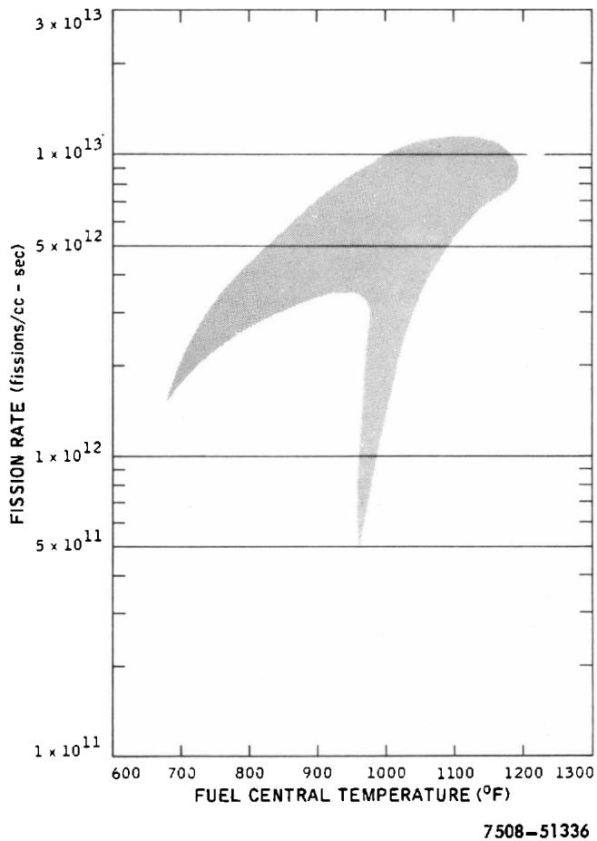  
Figure 1. Temperature vs Fission Rate Conditions for Hallam Core I

TABLE 1   
NAA 47 SERIES ORIGINAL DESIGN CONDITIONS   

<table><tr><td rowspan="2">Experiment NAA 47-</td><td colspan="2">Fuel Temperature (°F)</td><td rowspan="2">Fuel ΔT (°F)</td><td rowspan="2">Fission Rate (fissions/cc-sec) (x 10-13)</td><td rowspan="2">Power (kw/ft)</td></tr><tr><td>Surface</td><td>Center</td></tr><tr><td>1, 2, 9</td><td>1073</td><td>1300</td><td>227</td><td>1.39</td><td>14.8</td></tr><tr><td>3, 4, 10</td><td>1152</td><td>1300</td><td>148</td><td>1.04</td><td>9.9</td></tr><tr><td>5, 6, 11</td><td>1193</td><td>1300</td><td>107</td><td>0.69</td><td>7.4</td></tr><tr><td>7, 8</td><td>1230</td><td>1300</td><td>70</td><td>0.46</td><td>5.0</td></tr></table>

NOTE: NAA-47-9, -10, and -11 were replacement capsules for NAA-47-1, -3, and -5.

# I. INTRODUCTION

Under contract to the United States Atomic Energy Commission, Atomics International has designed and built the Hallam Nuclear Power Facility (HNPF), for operation by the Consumers Public Power District (CPPD). The reactor, located at the Sheldon Station, 21 miles from Lincoln, Nebraska, is a sodium-cooled, graphite-moderated system, designed to operate at 240 Mwt and 75 Mwe. For several years prior to and during construction of the plant, Atomics International conducted a development program, to establish and substantiate many design aspects of the nuclear plant. The HNPF Core I Uranium Alloy Fuel Evaluation project was an integral part of this development program.

After selection of U - 10 Mo as the Core I fuel, the HNPF Uranium Alloy Evaluation project was initiated, to provide specific information at the design conditions of Core I. Irradiation experiments, designated as the NAA 47 series, were planned as material proof tests to define the behavior of the alloy at the anticipated fission rates, temperatures, and burnup levels of HNPF. The fission rate and temperature ranges of Core I are shown in Figure 1, while the original design conditions for the NAA 47 experiments are presented in Table 1.

The U-Mo system (Figure 2) has a eutectoid reaction at $1065^{\circ}\mathrm{F}$ , at 10.5 wt% molybdenum. At this transformation point, the high-temperature $\gamma$ phase changes to the low-temperature $\alpha$ and $\gamma'$ phases upon cooling. This transformation is sluggish, requiring approximately 20 hr at $900^{\circ}\mathrm{F}$ to reach the nose of the time-temperature-transformation curve. An alloy fuel with this type of transformation, where the high-temperature phase is retained after cooling to room temperature, is prone to phase reversion under critical conditions of fission rate and temperature. Bleiberg1 and Shoudy et al.2 have discussed the effects of fission rate, time, and temperature on the stability of U-Mo alloys near the eutectoid composition. Since HNPF operating conditions necessitate operation of the U-Mo fuel material over a range of temperatures, fission rates, and burnups in this critical area, these material proof tests were expected to yield significant experimental data for the performance evaluation of HNPF Core I.

Although the experiments did not simulate actual fuel element design, the individual fuel specimens, which were 0.5-in. diameter cast slugs, approximated the 0.590-in. diameter HNPF slugs. The design specifications of the subject

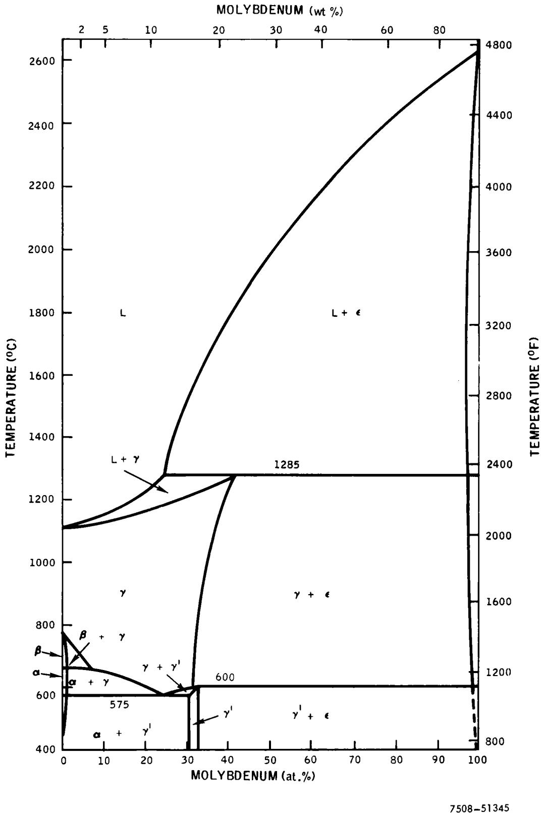  
Figure 2. Uranium-Molybdenum Phase Diagram

Core I element are given in Table 2. The purpose of this report is to discuss the microstructural changes occurring during irradiation and the effect of these changes on the observed dimensional change of the fuel slugs. The engineering aspects of the fuel irradiation program are reported elsewhere.4

TABLE 2   
HALLAM NUCLEAR POWER FACILITY DESIGN CONDITIONS - CORE I   

<table><tr><td>Nominal Full Power Rating</td><td>240 Mwt</td></tr><tr><td>Net Electrical Power</td><td>75 Mwe</td></tr><tr><td>Moderator</td><td>Graphite, SS clad</td></tr><tr><td>Coolant</td><td>Sodium</td></tr><tr><td>Inlet Temperature</td><td>610°F</td></tr><tr><td>Outlet Temperature</td><td>945°F</td></tr><tr><td>Fuel Elements</td><td>151 eighteen-rod clusters</td></tr><tr><td>Cladding</td><td>Type 304 SS</td></tr><tr><td>Length</td><td>180 in.</td></tr><tr><td>Inside Diameter</td><td>0.640 in.</td></tr><tr><td>Thickness</td><td>0.010 in.</td></tr><tr><td>Bond</td><td>Sodium</td></tr><tr><td>Thickness</td><td>0.025 in.</td></tr><tr><td>Fuel</td><td>3.6% enriched as-cast U - 10 Mo</td></tr><tr><td>Length</td><td>159 in. (3-1/2 in./slug)</td></tr><tr><td>Diameter</td><td>0.590 in.</td></tr><tr><td>Enrichment</td><td>3.6%</td></tr><tr><td>Cover Gas</td><td>Helium (~1 atm pressure)</td></tr></table>

# II. EXPERIMENTAL PROCEDURE

Eleven metallographic samples were selected from four of the seven NAA 47 test capsules. The samples were selected from 0.5-in. diameter by 2.0-in. long fuel specimens whose irradiation history was relatively well known. Figure 3 shows the location of the metallographic samples in the four capsules.

# A. PRE-IRRADIATION HEAT TREATMENT AND METALLOGRAPHY

The eutectoid transformation of U - 10 wt% Mo is sluggish, and the metastable $\gamma$ phase can be retained at room temperature. To determine the effect of pre-irradiation microstructure on swelling behavior during irradiation, the fuel specimens to be irradiated were given three heat treatments:

1) As-cast - Specimens received no pre-irradiation heat treatment. The structure (Figure 4a) is inhomogeneous, metastable $\gamma$ phase, throughout the specimen.   
2) Gammatized - As-cast specimens were heated for 24 hr at

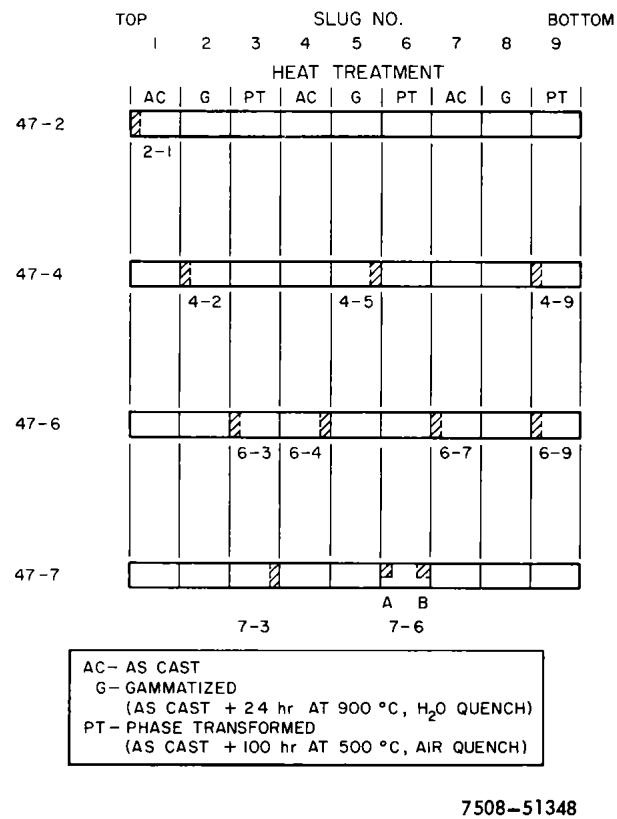  
Figure 3. Location of Metallographic Specimens

$1650^{\circ}\mathrm{F}$ , to homogenize the $\gamma$ phase, and water quenched. The structure, as shown in Figure 4b, is homogeneous, metastable $\gamma$ .   
3) Partially transformed - As-cast specimens were heated for 100 hr at $900^{\circ}\mathrm{F}$ , to transform a portion of the metastable $\gamma$ phase to the stable eutectoid transformation products of $a$ and $\gamma'$ . The structure (Figure 4c) is a combination of inhomogeneous $\gamma$ and pearlitic transformation products.

# B. IRRADIATION HISTORY

Nine fuel specimens were then loaded into each capsule. The specimens were alternately as-cast, gammadized, and partially transformed, so that each capsule contained three specimens of each heat treatment. Details of the capsule design are completely described elsewhere.3,4

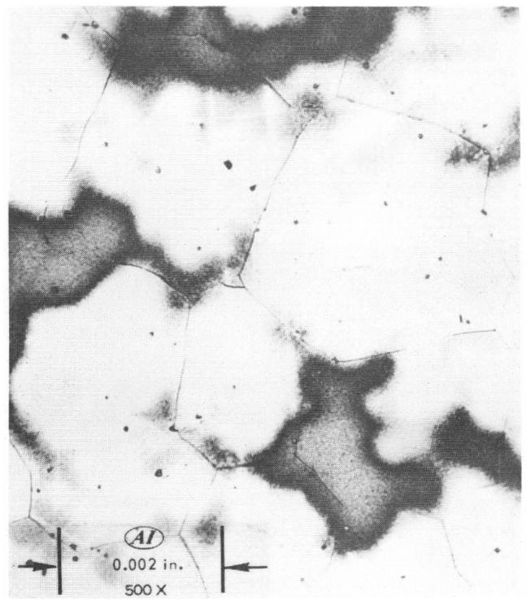  
a. As Cast

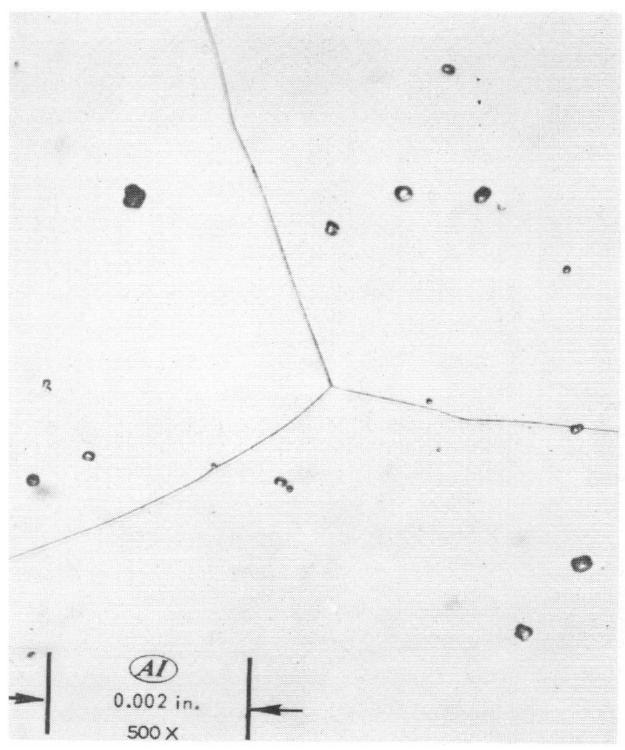

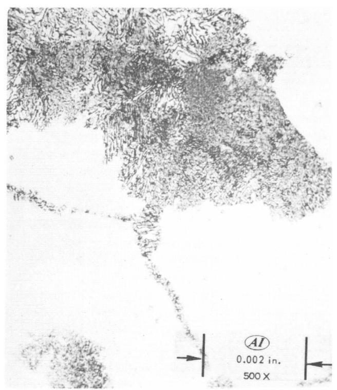  
Figure 4. Typical Pre-irradiation Microstructure

b. Gammatized

c. Partially Transformed

7508-51338

TABLE 3   
POST-IRRADIATION EXAMINATION DATA FOR METALLOGRAPHIC SPECIMENS   

<table><tr><td>Specimen NAA 47-</td><td>Fission Rate* (fission/cc-sec) (x 10-12)</td><td>Average Temperature* (°F)</td><td>Diameter Change (%)</td><td>Burnup (Mwd/MTU)</td><td>Pre-Irradiation Structure</td><td>Post-Irradiation Structure</td><td>Intergranular Cracking</td></tr><tr><td>2-1-S</td><td>7.9</td><td>625</td><td>1.0</td><td>11,000</td><td>AC</td><td>G</td><td>-</td></tr><tr><td>2-1-C</td><td>7.9</td><td>750</td><td>1.0</td><td></td><td>AC</td><td>G$</td><td>-</td></tr><tr><td>4-2-S</td><td>6.35</td><td>855</td><td>25.2</td><td>10,100</td><td>G</td><td>T</td><td>X</td></tr><tr><td>4-2-C</td><td>6.35</td><td>965</td><td>25.2</td><td></td><td>G</td><td>T&amp;S</td><td></td></tr><tr><td>4-5-S</td><td>7.1</td><td>960</td><td>23.1</td><td>11,800</td><td>G</td><td>T&amp;S</td><td>X</td></tr><tr><td>4-5-C</td><td>7.1</td><td>1085</td><td>23.1</td><td></td><td>G</td><td>T&amp;S</td><td></td></tr><tr><td>4-9-S</td><td>5.9</td><td>805</td><td>35.3</td><td>10,900</td><td>PT</td><td>G</td><td>X</td></tr><tr><td>4-9-C</td><td>5.9</td><td>910</td><td>35.3</td><td></td><td>PT</td><td>T</td><td></td></tr><tr><td>6-3-S</td><td>4.6</td><td>825</td><td>9.0</td><td>5,600</td><td>PT</td><td>T</td><td>-</td></tr><tr><td>6-3-C</td><td>4.6</td><td>905</td><td>9.0</td><td></td><td>PT</td><td>T</td><td>-</td></tr><tr><td>6-4-S</td><td>5.2</td><td>920</td><td>10.2</td><td>6,100</td><td>AC</td><td>T</td><td>X</td></tr><tr><td>6-4-C</td><td>5.2</td><td>990</td><td>10.2</td><td></td><td>AC</td><td>T</td><td></td></tr><tr><td>6-7-S</td><td>5.3</td><td>890</td><td>10.6</td><td>6,300</td><td>AC</td><td>T&amp;S</td><td>-</td></tr><tr><td>6-7-C</td><td>5.3</td><td>975</td><td>10.6</td><td></td><td>AC</td><td>T&amp;S</td><td>-</td></tr><tr><td>6-9-S</td><td>4.2</td><td>790</td><td>12.3</td><td>4,700</td><td>PT</td><td>T</td><td>-</td></tr><tr><td>6-9-C</td><td>4.2</td><td>810</td><td>12.3</td><td></td><td>PT</td><td>T</td><td>-</td></tr><tr><td>7-3-C</td><td>2.5†</td><td>725†</td><td>0.8</td><td>3,000</td><td>PT</td><td>G</td><td></td></tr><tr><td>7-6A-C</td><td>3.3†</td><td>1025†</td><td>5.4</td><td>4,600</td><td>PT</td><td>T&amp;S</td><td>-</td></tr><tr><td>7-6B-C</td><td>3.5†</td><td>1025†</td><td>15.7</td><td>4,600</td><td>PT</td><td>T&amp;S</td><td>X</td></tr></table>

*The fission rate and average temperature values shown in the table are for the final stages of irradiation, since it was assumed that this period had the greatest effect on the observed microstructure. The fission rate at the center of the specimens is not corrected for self-shielding absorption of neutrons by the fuel.   
†Average central temperature and fission rate for entire irradiation.   
Some inhomogeneity noted after irradiation.

S-Surface

C - Center

AC - As cast (segregated $\gamma$ )

X - Intergranular Cracking

PT.-PartiallyTransformed

G-Gammatized

T - Transformed

T&S - Transformed and Spheroidized

# C. POST-IRRADIATION EXAMINATION

The metallographic samples were selected from those capsules which had the most reliable temperature histories. The selected samples provide a broad range of fission rates, temperatures, burnups, and swelling values.

Table 3 lists these specimens with pertinent pre- and post-irradiation data. The samples were first examined in the as-polished condition, to study void density and formation. They were then etched (1 pt. $\mathsf{CrO}_3$ , 14 pts. $\mathsf{H}_2\mathsf{O}$ , 1 pt. $\mathsf{NH}_4\mathsf{F} \cdot \mathsf{HF}$ , 4 pts. $\mathsf{HNO}_3$ ), to reveal the degree of transformation.

# III. RESULTS OF POST-IRRADIATION EXAMINATION

# A. SWELLING

Schmitt et al. have discussed the swelling of the NAA 47 fuel extensively. Figure 5 is a plot, showing the relationship of diameter increase to burnup, of the eleven metallographic specimens. These data are also presented in Table 3. With the exception of Specimens 2-1, 6-9, 7-6B, and 4-9, a linear relationship of swelling and burnup is obtained over the burnup range of 3,000 to 12,000 Mwd/MTU. Specimen 2-1 demonstrates the irradiation stability of U - 10 Mo under conditions of low temperature, high fission rate, and high burnup. Although irradiated to a high level of burnup, this specimen had a low average central temperature $(750^{\circ}\mathbf{F})$ . Swelling resulting from excessive temperature during irradiation is illustrated by Specimens 4-2, 4-9, 4-5, and 7-6B. Specimens 4-2 and 4-9 were irradiated at average central temperatures of 910 and $965^{\circ}\mathbf{F}$ , respectively, while Specimens 4-5 and 7-6B were at 1085 and $1025^{\circ}\mathbf{F}$ , respectively. However, these mean temperatures do not properly emphasize temperature tran

sients to $1300^{\circ}\mathbf{F}$ in Capsule 4, and $1500^{\circ}\mathbf{F}$ in Sample 7-6B, near the end of the irradiation exposure.

Mechanical instability due to thermal stresses may also be a factor in the observed swelling behavior. Violent thermal shocks from reactor scams produced cooling rates of several hundred $^\circ \mathbf{F}$ per minute. During the irradiation period, it was not uncommon for a capsule to experience 300 thermal shocks to room temperature. Probable effects of the resultant stresses are reflected in the degree of structural degradation shown by several of the specimens. Specimens 7-6B, 4-2, and 4-9 all showed cracking which increased the apparent diameter change.

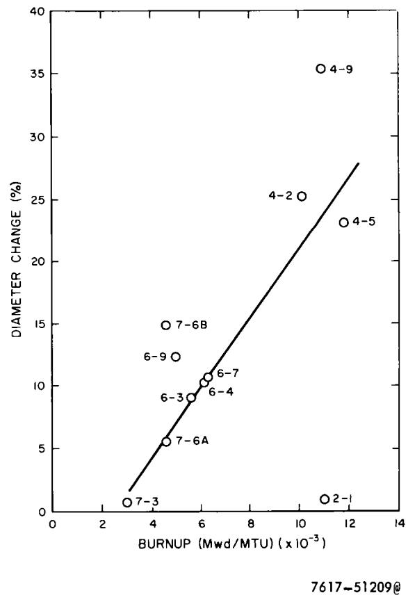  
Figure 5. Diameter Change as a Function of Burnup

Specimen 6-9 showed no mechanical degradation and no high-temperature operation, and yet it does not conform to the linear swelling curve. Capsule hardware constrained the expansion of the lower portion of the specimen.4 This constraint at the lower end of the specimen probably contributed to the larger than expected diameter change at the upper portion of the specimen.

# B. MICROSTRUCTURE

All of the 11 specimens examined showed some degree of transformation from the pre-irradiation structure. Table 3 lists the structures observed during the post-irradiation examination. For convenience in discussion, two general areas of each specimen have been considered: (1) areas at the center of the specimen, and (2) circumferential surface areas. Structures were observed to change, in three specimens, when passing from the center to the surface of the fuel specimen.

Specimens irradiated below $805^{\circ}\mathbf{F}$ (average central temperature) either maintained or transformed to a $\gamma$ structure, as shown in Figure 6a. Specimens irradiated above this temperature transformed to a two-phase, $a + \gamma'$ structure. For average irradiation temperatures from 800 to $910^{\circ}\mathbf{F}$ , the transformed structure was lamellar in appearance, as shown in Figure 6b. Above this temperature, the transformed structure was spheroidized, as shown in Figure 6c.

# C. INTERNAL VOID STRUCTURE

Five of the 11 specimens exhibited internal voids. In all cases observed, these voids were associated with grain boundaries, and were of two types: (1) wedge, and (2) elliptical. Both types of voids are illustrated in Figure 7. Figure 8 is a high-magnification illustration of a wedge-type crack from Specimen 6-4. The circular voids in this figure have the same appearance and location as casting voids in as-cast, unirradiated material. All of the specimens with internal voids experienced peak central temperatures $>1125^{\circ}\mathbf{F}$ , except Specimen 4-2, which had a peak central temperature of $1029^{\circ}\mathbf{F}$ (below the eutectoid transformation temperature of $1060^{\circ}\mathbf{F}$ ).

A composite view of Specimen 4-9, from the thermocouple hole to the surface of the slug, is shown in Figure 9. The internal void structure begins approximately one-third of the distance from the center of the slug. This composite shows the extension of these small intergranular cracks to larger cracks,

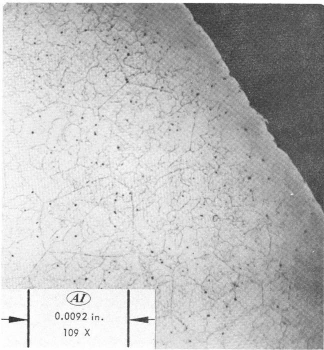  
M1120

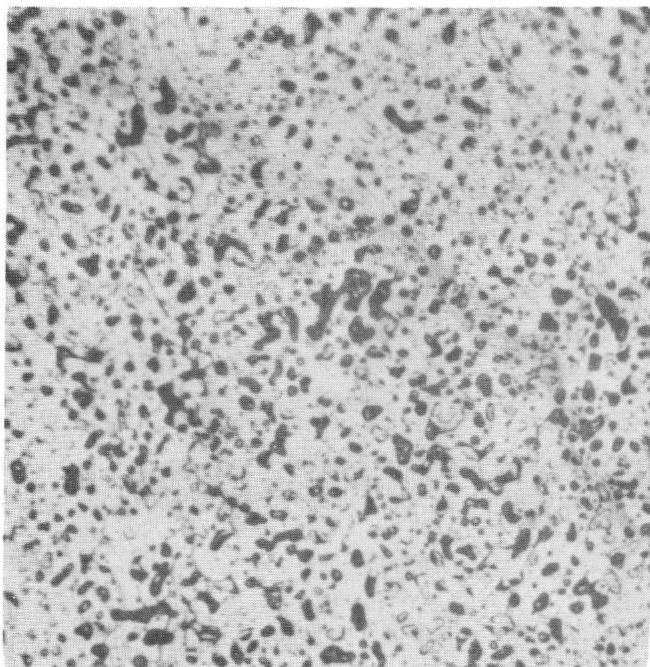  
7617-51205

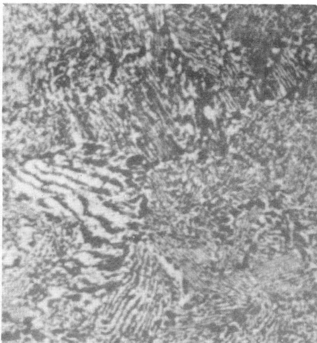  
a. Retained Gamma   
7617-51208   
b. Transformed (Photographed at 500X, Enlarged 2X)   
c. Spheroidized (Photographed at 109X, Enlarged 2X)   
Figure 6. Typical Structure After Irradiation

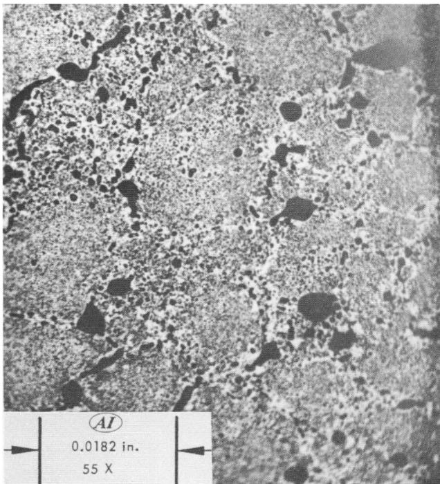  
M1125   
Figure 7. Specimen 7-6B, Illustrating Wedge and Elliptical Voids

Figure 8. Specimen 6-4, Showing High Magnification of Wedge Voids and Lamellar Transformed Structure   
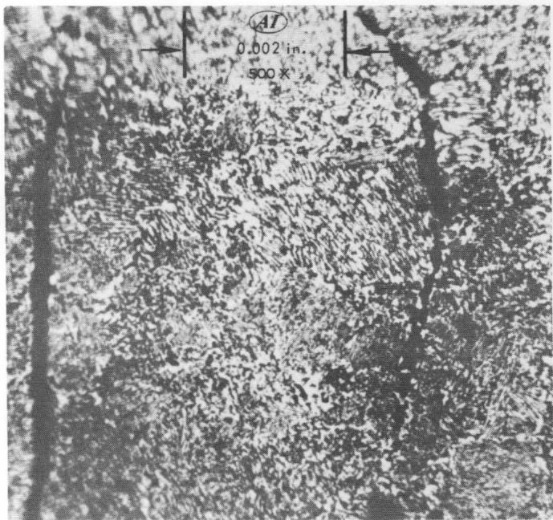  
M992-1

Figure 9. Specimen 4-9, From Center to Surface of Specimen   
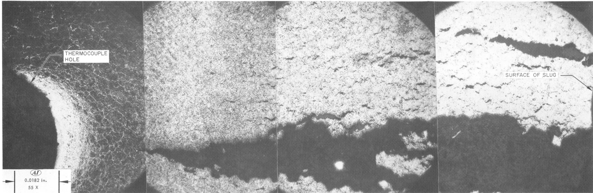  
M1126,M1127,M1128,M1129

__________

__________

__________

__________

__________

__________

__________

__________

__________

__________

extending from the surface of the slug to the thermocouple hole at the center. Many of these large macrocracks were observed on the surface of slugs irradiated in the NAA 47 capsule series. $^{4}$

A composite view of Specimen 7-6B is shown in Figure 10. This view extends from the center (no T/C hole) to the surface of the slug. This type of cracking was observed to begin approximately one-third of the distance from the center of the slug, in an apparent intermediate temperature region. The concentration of voids then diminishes toward the surface of the specimen.

These two specimens experienced extreme swelling. Specimen 4-9 was the most severely damaged specimen of the high-burnup slugs; it swelled more than 4-2 and 4-5, even though it was irradiated at lower temperature and at lower flux levels (see Table 3). Specimens 4-2 and 4-5 were also cracked, but to a lesser degree. Specimen 7-6B (bottom of Slug 7-6) swelled more than the other lower-burnup specimens. Specimen 7-6A (top of Slug 7-6) achieved approximately the same burnup and temperature history as Specimen 7-6B, and yet swelled significantly less. Specimen 7-6A exhibited a structure free from intergranular cracking.

Figure 10. Specimen 7-6B, From Center to Surface of Specimen   
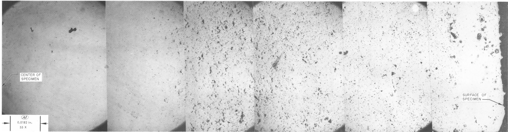  
M1105,M1106,M1107,M1108,M1109,M1110

__________

__________

__________

__________

__________

__________

__________

__________

__________

__________

__________

__________

__________

__________

__________

__________

__________

__________

__________

__________

__________

__________

__________

__________

__________

__________

__________

__________

__________

__________

__________

__________

__________

__________

__________

__________

__________

# IV. DISCUSSION OF RESULTS

Gross swelling, phase reversal phenomena, and intergranular cracking were observed over the broad spectrum of temperature and fission rate conditions investigated.

# A. SWELLING

The swelling observed in the metallographic specimens exhibits a linear relationship between percent diameter change and burnup above 3000 Mwd/MTU, as shown in Figure 5. Exceptions to this curve are Specimens 2-1, 6-9, 7-6B, and 4-9.

Specimens 2-1 and 7-6B illustrate the effect of temperature on the swelling behavior of U - 10 wt% Mo during irradiation. Specimen 2-1 was irradiated to a high burnup (11,000 Mwd/MTU) at relatively low temperatures, and remained dimensionally stable. Specimen 7-6B experienced brief temperature excursions in excess of $1300^{\circ}\mathrm{F}$ during the irradiation period. Relatively severe swelling at lower burnup ( $\sim 4,600$ Mwd/MTU) indicates that high temperature operation, even at intermediate burnup levels, has a profound effect on the dimensional stability of the fuel specimen.

Of all the fuel specimens examined in the NAA 47 capsule series, Slug 7-6 is the most interesting. Figure 11 is a schematic representation of this fuel slug, showing the location of the diameter measurements and the location of the metallographic specimens. The variation of diameter change, over the length of this slug, was among the largest observed for any slug examined in the series. Due to thermocouple failure, the temperature variation over the length of this slug is not known accurately. It is known, however, that steep temperature gradients did exist in the fuel in this capsule. Due to the swelling behavior observed, the critical values of the swelling parameters (temperature, fission rate, and burnup)4 probably occurred in this sample.

The microstructure of 7-6A was transformed and spheroidized after irradiation. This structure was free of intergranular voids. The microstructure of 7-6B was also transformed and spheroidized, but contained many circumferential cracks and voids. Thus, the difference in diameter change is directly linked to the void structure observed in the metallographic specimen from 7-6B (for further discussion of this sample, see Section IV-C).

No reason for the relatively high swelling in the area of the metallographic specimen from Slug 6-9 was apparent. The temperature of the slug, in the vicinity of the metallographic specimen, never exceeded $925^{\circ}\mathrm{F}$ . It operated cooler than other specimens from this capsule, and yet swelled more in the area selected for metallographic examination. The total volume change of the slug was less than in slugs irradiated to higher burnups at higher temperatures, such as Specimens 6-3 and 6-4. Schmitt et al. have indicated that the swelling behavior of the bottom slugs, such as 6-9, in the capsules is complicated by the restraint created by capsule hardware and by different thermal transfer conditions introduced by this hardware. Thus, the behavior of Slug 6-9 was not as predictable as that of the other specimens.

# B. PHASE REVERSION

The retention of $\gamma$ U - 10 Mo in an irradiation environment is dependent on temperature and fission rate. $^{1,2}$ These result in competing mechanisms, discussed below, which cause changes between the metastable $\gamma$ phase and the stable eutectoid transformation products of $a$ and $\gamma'$ , as irradiation conditions vary (Figure 2).

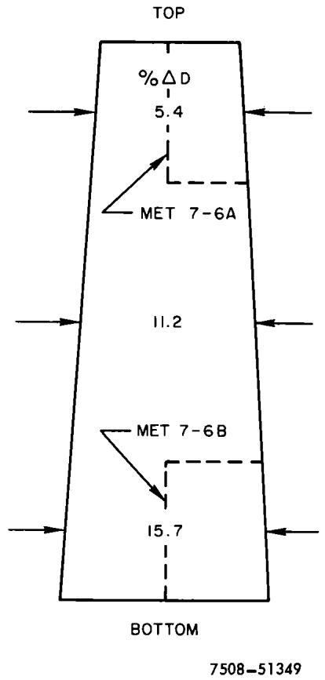  
Figure 11. Schematic Representation of Specimen 7-6 After Irradiation to 4600 Mwd/MTU (Bottom of specimen was bonded to Slug 7-7 during irradiation)

At temperatures below the eutectoid transformation temperature of $1065^{\circ}\mathbf{F}$ , the retained $\gamma$ phase will transform to the stable $\alpha$ and $\gamma'$ phases, according to the time-temperature relationship shown in Figure 12. At temperatures below the nose of this curve, the rate of transformation is mostly dependent on the diffusion of atoms to nucleation sites. This diffusion may be expressed by the classical equation:

$$
D _ {T} = D _ {o} \exp \left(- \frac {Q}{R T}\right), \tag {1}
$$

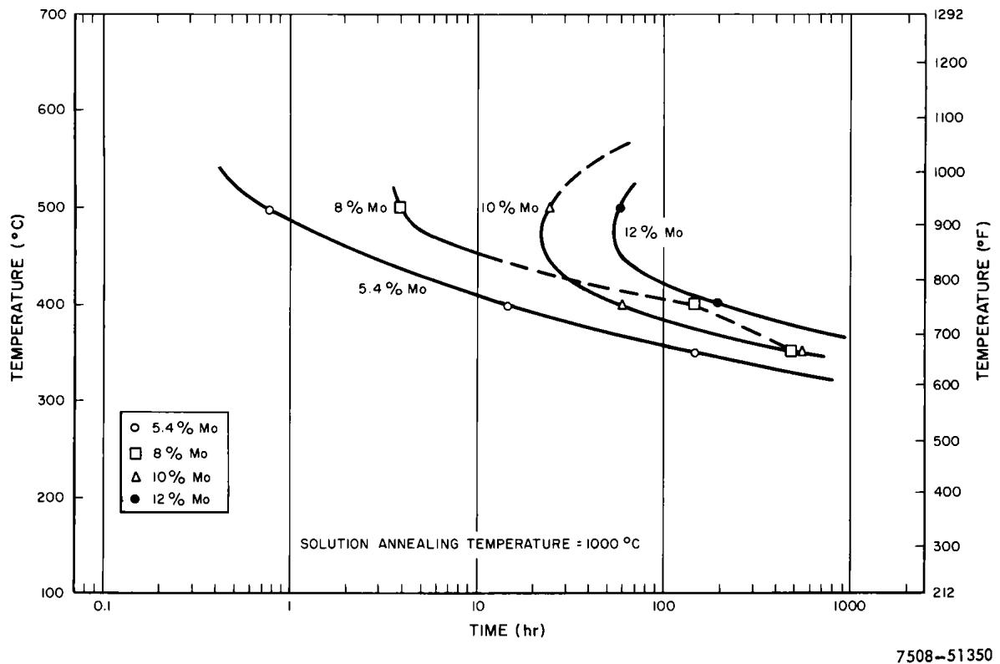  
Figure 12. Time-Temperature-Transformation Curve for Uranium-Molybdenum Alloys

where

$\mathbf{D}_{\mathbf{T}} =$ thermal diffusion coefficient

$\mathbf{D}_{\mathbf{o}} =$ diffusion constant

$\mathbf{Q} =$ activation energy

$\mathbf{R} = \mathbf{gas}$ constant

T = absolute temperature

Thus, during irradiation, thermal diffusion (which is, of course, temperature dependent), tends to transform the $\gamma$ phase to $\alpha$ and $\gamma'$ . The fission phenomenon is responsible for another type of diffusion, caused by the displacement spike formed by the energetic particles after a fission event. Bleiberg1 has shown a proportionality between the radiation diffusion coefficient and the fission rate. The coefficient is expressed by the equation:

$$
D _ {R} = \frac {\left(D _ {R}\right) _ {1}}{\left(B u\right) _ {1}} \times B u, \tag {2}
$$

where

$\mathbf{D}_{\mathbf{R}} =$ radiation-induced diffusion coefficient

$$
\left(\mathrm {D} _ {\mathrm {R}}\right) _ {1} = 1. 4 \times 1 0 ^ {- 1 8} \pm 0. 6 \times 1 0 ^ {- 1 8} \mathrm {c m} ^ {2} / \sec (\text {R e f .} 1)
$$

$\mathbf{Bu} =$ critical fission rate

$$
\left(\mathrm {B u}\right) _ {1} = 5. 2 5 \times 1 0 ^ {1 2} \text {f i s s i o n s / c c - s e c (R e f . l)}
$$

Thus

$$
\begin{array}{l} D _ {R} = \frac {1 . 4 \times 1 0 ^ {- 1 8} \left(\mathrm {c m} ^ {2} / \mathrm {s e c}\right)}{5 . 2 5 \times 1 0 ^ {1 2} (\text {f i s s i o n s} / \mathrm {c c} - \mathrm {s e c})} \times \mathrm {B u} (\text {f i s s i o n s} / \mathrm {c c} - \mathrm {s e c}) \\ = 2. 6 7 \times 1 0 ^ {- 3 1} \mathrm {x B u} \left(\mathrm {c m} ^ {2} / \mathrm {s e c}\right) \\ \end{array}
$$

When $\mathrm{D}_{\mathrm{T}} > \mathrm{D}_{\mathrm{R}}$ , the thermal transformation phenomenon predominates, and the metastable structure (in this case, $\gamma$ ) will follow the expected decomposition to the thermally stable phases (in this case, $\alpha + \gamma'$ ). However, the rate of transformation will decrease from that given on the time-temperature- transformation curve (Figure 12), by an amount which depends on the relative values of $\mathrm{D}_{\mathrm{T}}$ and $\mathrm{D}_{\mathrm{R}}$ . If $\mathrm{D}_{\mathrm{R}} > \mathrm{D}_{\mathrm{T}}$ , then the radiation effect predominates, and the metastable phase will either be formed or retained, depending on the initial structure. Thus, the competing nature of these processes can result in either terminal structure $(\gamma$ , or $\alpha + \gamma'$ ), depending on the relative values of $\mathrm{D}_{\mathrm{R}}$ and $\mathrm{D}_{\mathrm{T}}$ . An equilibrium condition exists between the two methods of transformation when:

$$
\mathrm {D} _ {\mathrm {T}} = \mathrm {D} _ {\mathrm {R}}. \quad \dots . (3)
$$

Physically, this means that, for any temperature (T), there is a fission rate (Bu - called the critical fission rate) at which no transformation should occur. From Equations 1, 2, and 3, this rate is:

$$
\mathrm {B u} = \frac {\mathrm {D} _ {\mathrm {o}} \exp \left(- \frac {\mathrm {Q}}{\mathrm {R T}}\right)}{2 . 6 7 \times 1 0 ^ {- 3 1}} (\text {f i s s i o n s / c c - s e c})
$$

Raiklen has shown that Q/R for the U - 10 wt% Mo system is 24,600 (°K⁻¹), for a value D₀ = 10⁻² (cm²/sec) and D_T = 2 x 10⁻¹⁴ (cm²/sec) at T = 640 (°C).

$$
\mathrm {N A A - S R - 8 9 5 6}
$$

# Therefore

$$
\begin{array}{l} \mathrm {B u} = \frac {1 0 ^ {- 2} \exp \left(- \frac {2 4 , 6 0 0}{T}\right)}{2 . 6 7 \times 1 0 ^ {- 3 1}} \\ = 3. 7 5 \exp \left(- \frac {2 4 , 6 0 0}{T}\right) \times 1 0 ^ {2 8} (\text {f i s s i o n s / c c - s e c}) \tag {4} \\ \end{array}
$$

Table 4 lists the critical fission rates associated with temperatures between 700 and $775^{\circ}\mathrm{F}$ , using Equation 4. A curve representing these data is presented in Figure 13. Several specimens from Table 3 have been plotted in Figure 13. The observed metallographic structures are in good agreement with the theoretical curve.

Specimen 4-9-S is the only deviation. This specimen exhibited severe intergranular cracking, as shown in Figure 9. Methods of calculating specimen temperatures do not take into account the changes in size, shape, or characteristics of the material used. Thus, the surface temperature of 4-9-S was probably cooler than was observed from the thermocouple data, due to the severe cracking and penetration of these cracks by the NaK. This would explain its deviation from the theoretical curve.

# C. INTERGRANULAR CRACKING

Conrad, in summarizing the work of many authors, has shown that intergranular cracking may occur at high temperatures, due to the formation and agglomeration of cavities along the grain boundaries. These cavities are generally one of two shapes: (1) wedge, or (2) elliptical. The cavities are formed as a result of stress concentrations due to sliding in the grain boundaries. McLean has shown that the shape of the cavity is dependent on the magnitude of

# TABLE 4

CALCULATED CRITICAL FISSION RATE, USING EQUATION 4   

<table><tr><td>Temperature (°F)</td><td>Critical Fission Rate (fissions/cc-sec)</td></tr><tr><td>700</td><td>8.8 x 1011</td></tr><tr><td>725</td><td>2.2 x 1012</td></tr><tr><td>750</td><td>4.8 x 1012</td></tr><tr><td>775</td><td>9.2 x 1012</td></tr></table>

the stress in the boundary. Generally, wedge-shape cavities occur at higher stresses than elliptical. The growth of the cavities occurs by tip advancement due to increased stresses causing additional grain boundary sliding, or by vacancy condensation, or both. Generally, wedge-shape cracks grow by tip advancement and vacancy condensation, while elliptical cavities grow by vacancy condensation only.

Due to thermal gradients, thermal cycles, and phase transformation, temperature and stress conditions were favorable for the formation of voids in several of the fuel slugs examined. The growth of these voids could be enhanced by vacancy production and mobility due to lattice disturbance by the fission process. Both wedge and elliptical voids are shown in Figure 7. Figure 8

illustrates a wedge-shaped void in Specimen 6-4 at high magnification. The extension of these voids to macrocracks is evident in Figure 9. The events leading to this macro cracking are surmized to be the following:

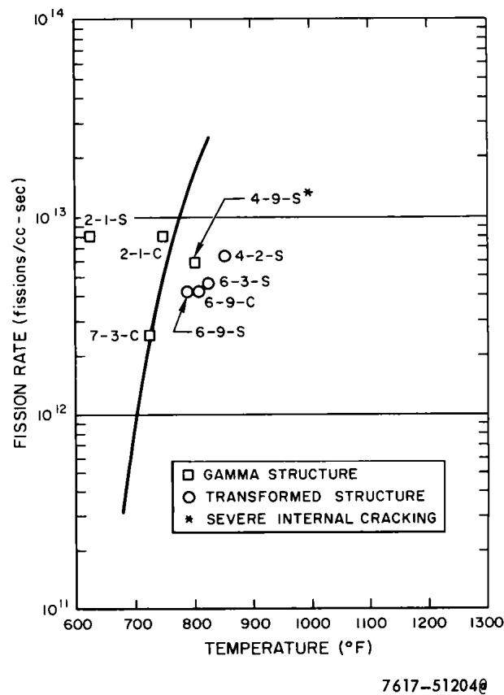  
Figure 13. Correlation of Observed Microstructure with Theoretical Fission Rate Temperature Curve

1) Voids are produced at grain junctions and along grain boundaries   
2) These voids grow by vacancy condensation and void tip advancement due to continued grain sliding   
3) The voids coalesce when they reach a critical size and distribution   
4) Cracks from the grain boundary join with cracks from another grain boundary.

Figures 7 and 9 illustrate the nature of cracking in the most severely damaged specimens examined. These represent, respectively, Specimens 4-9 and 7-6B. The cracking and the void structure in both of these specimens are observed to begin about one-third of the distance from the center of the slug to the surface, and extend to the surface. The maximum density of the cracking and the void structure occurs about halfway from the center of the slug to the surface.

Both of these specimens attained peak central temperatures above the eutectoid transformation temperature $(1065^{\circ}\mathbf{F})$ . The surface temperatures remained below this temperature. Thus, at times during irradiation, the structure of the slugs was $\gamma$ in the center with a small area of $\alpha + \gamma$ surrounding it. At the surface of the slug, the structure was transformed $\alpha$ and $\gamma'$ . The differential expansion due to these structures and temperature gradients created complex stress systems in the fuel slugs. The presence of the void structure and subsequent growth of cracks is directly attributable to these stresses.

# V. CONCLUSIONS

The metastable $\gamma$ phase structure can be retained at temperatures below $800^{\circ}\mathbf{F}$ for a fission rate range of $10^{12}$ to $10^{13}$ fissions/cc-sec. Above this temperature, the structure transforms to thermally stable $\pmb{\alpha}$ and $\gamma'$ . The $\pmb{\alpha}$ and $\gamma'$ phases will revert to $\gamma$ if the irradiation temperature is lowered to a value less than $800^{\circ}\mathbf{F}$ at the prescribed fission rate.

The observed metallographic structures show that critical fission rates derived from the theory are valid in predicting whether or not $\gamma$ transforms under irradiation. It is predicted that, at rates greater than critical (i.e., $D_{\mathbf{R}} > D_{\mathbf{T}}$ ), $\gamma$ will be formed or retained; and at lower rates (i.e., $D_{\mathbf{R}} < D_{\mathbf{T}}$ ), the $\gamma$ structure will transform to the thermally stable $\alpha + \gamma'$ . Observations (Figure 13) are in agreement with these predictions.

Intergranular cracking and operation at excessively high central temperatures, 1300 to $1500^{\circ}\mathrm{F}$ , are responsible for deviations from the linear relationship of swelling to burnup in the range of 3000 to 12,000 Mwd/MTU.

# REFERENCES

1. M. L. Bleiberg, "Effect of Fission Rate and Lamella Spacing Upon the Irradiation-Induced Phase Transformation of U-9 w/o Mo Alloy," J. Nuc. Mat. 2 (1959) p 182-190   
2. A. A. Shoudy et al., "The Effect of Irradiation Temperature and Fission Rate on the Radiation Stability of Uranium - 10 w/o Molybdenum Alloy," Symposium on Radiation Damage in Solids and Reactor Materials, Venice, May 7-11, 1962   
3. R. E. Rauhut and D. G. Harrington, "Capsule Irradiations of Uranium-10 Molybdenum for Hallam Nuclear Power Facility", NAA-SR-Memo-4017 (June 1959)   
4. A. R. Schmitt, R. M. Willard, and D. K. Magnus, "The NAA 47 U-10 Mo Fuel Irradiation Program for HNPF Core I," NAA-SR-8955 (to be published)   
5. H. I. Raiklen, Unpublished information, Atomics International, Canoga Park, Calif. (1959)   
6. J. E. Dorn (ed.), Mechanical Behavior of Materials at Elevated Temperatures (McGraw-Hill Book Company, Inc., New York, 1961)

