# Phase transformation mechanism in irradiationinduced superlattice formation

# DISCLAIMER

This information was prepared as an account of work sponsored by an agency of the U.S. Government. Neither the U.S. Government nor any agency thereof, nor any of their employees, makes any warranty, expressed or implied, or assumes any legal liability or responsibility for the accuracy, completeness, or usefulness, of any information, apparatus, product, or process disclosed, or represents that its use would not infringe privately owned rights. References herein to any specific commercial product, process, or service by trade name, trade mark, manufacturer, or otherwise, does not necessarily constitute or imply its endorsement, recommendation, or favoring by the U.S. Government or any agency thereof. The views and opinions of authors expressed herein do not necessarily state or reflect those of the U.S. Government or any agency thereof.

# Phase transformation mechanism in irradiationinduced superlattice formation

Larry Kenneth Aagesen Jr, Jian Gan, Chao Jiang, Yongfeng Zhang

January 2025

Idaho National Laboratory Idaho Falls, Idaho 83415

http://www.inl.gov

# Phase transformation mechanism in irradiation-induced superlattice formation

Larry K. Aagesen $^ { \mathrm { a } , \ast }$ , Yongfeng Zhang $^ \mathrm { b }$ , Chao Jiang $^ \mathrm { a }$ , Jian Gan $\mathbf { c }$

$^ a$ Computational Mechanics and Materials Department, Idaho National Laboratory, P.O. Box 1625, Idaho Falls, ID 83415 $^ { b }$ Department of Nuclear Engineering and Engineering Physics, University of Wisconsin, Madison, WI 53706 cAdvanced Characterization Department, Idaho National Laboratory, P.O. Box 1625, Idaho Falls, ID 83415

# Abstract

Atomic kinetic Monte Carlo simulations were used to model void superlattice formation under irradiation in molybdenum, driven by anisotropic diffusion of self-interstitial atoms. A change in the phase transformation mechanism from nucleation and growth to spinodal decomposition occurred with increasing dose rate, with both mechanisms leading to superlattice formation. Analysis of a ratetheory based analytical model showed that an observed change in the kinetics of vacancy accumulation, the appearance of a region of positive second derivative in the plot of average vacancy concentration versus time, was caused by the onset of spinodal instability. The analytical model showed that for molybdenum and several other metals where void superlattice formation is commonly observed, the phase transformation likely occurs by nucleation and growth. However, nickel may offer the possibility of experimental observation of the transition between phase transformation mechanisms.

Keywords: void gas bubble superlattice kinetic Monte Carlo nucleation spinodal radiation

# 1. Introduction

Ordered arrays of voids or gas bubbles form in a variety of materials during irradiation. These ordered arrays are often referred to as superlattices. Void superlattice formation has been observed under irradiation by energetic ions [1–4], fission neutrons [5–7], and electrons [8]. Void superlattices have been observed most frequently in metals with the body-centered cubic (BCC) [1, 2, 5] or face-centered cubic (FCC) crystal structure [2, 9]. In materials with these crystal structures, the symmetry of the superlattice is the same as that as the material’s underlying crystal structure. The related phenomenon of gas bubble superlattice (GBS) formation can occur when materials are irradiated by energetic noble gas ions [10–16], and can also occur in nuclear fuels such as U-Mo when gases are produced internally by fission-induced transmutation [17, 18]. In most cases, the GBS has the same symmetry as the underlying material’s crystal structure, which has been observed for FCC [10–13], BCC [14–16], and hexagonally close-packed (HCP) [19–21] materials. However, a lone exception has been observed for U-Mo nuclear fuel, which has a BCC structure, but sees the formation of a FCC GBS composed of the Xe and Kr fission product gases during reactor operation [18].

The self-organizing formation mechanism of void and gas bubble superlattices is of fundamental scientific interest, and may have important practical applications as well. The formation of gas bubbles in structural materials for nuclear reactors causes degradation of their mechanical properties; the ordering conferred by GBS may mitigate this degradation of mechanical properties as compared to randomly arranged bubbles [22]. Ordering of fission gas bubbles in nuclear fuels may help delay the onset of fission gas release from the fuel, an important performance consideration for nuclear fuel elements. Finally, periodic nanostructuring of materials can modify their electronic, optical, and magnetic properties in potentially useful ways, providing a route to produce novel functional materials. An improved scientific understanding of the causes of radiation-induced superlattice formation is key to unlocking the potential applications enabled by nanostructuring.

Several mechanisms have been hypothesized as potential causes of superlattice formation, including anisotropy in material elastic constants [23–27], anisotropy of self-interstitial atom (SIA) diffusion in 1D [26, 28–33] and 2D [14, 34], dislocation-cavity interactions [22, 35, 36], and Turing instabilities [37]. Of the hypothesized mechanisms, elastic constant anisotropy and anisotropic SIA diffusion have attracted the most study because they best explain that fact that in most cases, the superlattice symmetry matches the symmetry of the material’s crystal structure. GBS formation has been observed in Fe [38], which has SIAs that diffuse isotropically; however, 1D diffusion of small interstitial clusters in pure Fe [39] and Fe-based alloys [40] has been observed, suggesting that 1D diffusion of SIA or clusters can lead to superlattice formation. Other factors suggest that elastic constant anisotropy on its own is likely not a necessary condition for superlattice formation. Superlattices have been observed in W [5, 14], which has nearly isotropic elastic constants. Additionally, phase-field simulations of superlattice formation driven by elastic constant anisotropy alone resulted in superlattice symmetries that were not the same as the underlying material’s crystal structure symmetry [27], which is inconsistent with experimental observations. These facts suggest that anisotropic diffusion of SIAs or SIA clusters plays the most significant role in superlattice formation.

The type of phase transformation leading to the formation of voids and bubbles has also been studied in the context of superlattice formation; phase transformation by spinodal decomposition or nucleation and growth have been considered. An analytical theory to predict void superlattice formation by spinodal decomposition was developed, which showed that the critical concentration of vacancies required for spinodal decomposition to occur was changed from the non-irradiated condition due to the presence of defect production and vacancy-interstitial recombination terms [41]. This change requires a higher concentration of vacancies for spinodal decomposition to occur during irradiation compared with the non-irradiated criterion. This analysis was extended to show that anisotropic SIA diffusion leads to symmetry breaking during spinodal decomposition-driven perturbation growth, which can explain the relationship between the direction of 1D SIA motion and superlattice symmetry [42].

Phase-field simulations have shown that superlattice formation can occur when voids/bubbles form by either nucleation and growth or spinodal decomposition with 1D diffusion of SIAs [43, 44]. For voids, when phase transformation occurs by spinodal decomposition, a high density of voids develops at the onset of spinodal decomposition [43]. In some cases, superlattice ordering occurs concurrently with void formation, whereas in other cases, ordering develops during coarsening and coalescence [43]. Void superlattices could also form by nucleation and growth, in which case isolated voids initially form with random positions, and superlattice formation occurs through a gradual process of alignment of existing voids and nucleation of new voids aligned with the existing voids [43, 44]. Simulations of GBS formation by nucleation and growth showed a similar process [44]. However, phase-field models do not inherently include nucleation, and including nucleation requires modifying the governing equations based on an assumed nucleation rate. Experimentally, it is difficult to observe the very early stages of superlattice formation to distinguish between spinodal decomposition and nucleation and growth as the phase transformation mechanism. However, observations of void superlattice formation at varying levels of fluence have shown randomly ordered voids at low fluence, followed by formation of ordered rows of 3-5 voids, finally followed by complete superlattice formation [3, 4, 45]. These observations are more consistent with nucleation and growth as the phase transformation mechanism [43]. Similar observations of random initial positions followed by alignment have been made for GBS formation [16], including in-situ transmission electron microscopy (TEM) observation that allowed monitoring of the movement of individual voids as they aligned [12].

In this manuscript, we explore the transition between nucleation and growth and spinodal decomposition as the phase transformation mechanism that leads to void superlattice formation under irradiation, assuming the underlying cause of superlattice formation is 1D anisotropic diffusion of SIAs. We employ atomic kinetic Monte Carlo (AKMC) simulations of BCC-structured Mo under irradiation, which handles nucleation in an inherent and physical way compared to phase-field modeling. Using the AKMC model, we show that a BCC superlattice of voids can form by either nucleation and growth or spinodal decomposition depending on the conditions of the system. We also show that a rate-theory based analytical model [41, 42] can explain important features of the AKMC simulations and is consistent with experimental observations. Finally, we use the analytical model to investigate the possibility of experimental observation of the transition from nucleation and growth to spinodal decomposition in a variety of different materials.

# 2. Model Formulation

We employ the atomic kinetic Monte Carlo (AKMC) model for BCC metals under irradiation with 1D diffusion anisotropy described by Gao et al. [41], implemented in the Stochastic Parallel PARticle Kinetic Simulator (SPPARKS) code [46] and parameterized for Mo. The BCC lattice sites can be occupied by Mo atoms or vacancies, and 4 types of SIA are defined, which diffuse in 1D along each of the 4 possible ⟨111⟩ directions. The SIAs are crowdion-type defects that are assumed to share a lattice site with another Mo atom. In this study, we do not consider transformations of one type of SIA to another.

The kinetics of system evolution are determined by the diffusive motion of defects, defect production by irradiation, vacancy-interstitial recombination, and defect absorption at sinks. Diffusive motion of defects is controlled by the residence time algorithm [46]; at each AKMC step, a list of possible diffusion events and their probability of occurrence is built based on the propensity of each type of event $j$ , $k _ { j } = \nu _ { 0 } \exp ( - E _ { a } ^ { j } / k _ { B } T )$ , where $\nu _ { 0 }$ is the attempt frequency, $E _ { a } ^ { j }$ is the activation energy for event $j$ , $k _ { B }$ is the Boltzmann constant, and $T$ is the absolute temperature. For each AKMC step, a random number is selected to choose which of the possible events occurs, the system configuration is updated based on the chosen event, and the system time is advanced by $\Delta t = 1 / \sum _ { j } k _ { j }$ . The activation energies for each possible transition are calculated as follows.

For each of the interstitial species, it is assumed their concentrations are so dilute that the initial and final states are energetically equivalent, so $E _ { a } ^ { i } = E _ { 0 } ^ { i }$ , where $E _ { 0 } ^ { i }$ is a constant activation energy barrier. For vacancies, whose concentration is larger, the initial and final states may be significantly different in energy, so $E _ { a } ^ { v } = E _ { 0 } ^ { v } + ( E _ { f } - E _ { i } ) / 2$ , where $E _ { 0 } ^ { v }$ is the diffusion barrier and $\left( E _ { f } - E _ { i } \right)$ is the difference in energy between the initial and final states. The initial and final system energies are calculated using a pairwise bond energy model that considers first nearest neighbor (1NN) and second nearest neighbor (2NN) interactions between Mo atoms ( $m$ ) and vacancies $( v )$ :

$$
E = \frac { 1 } { 2 } \sum _ { \alpha = 1 } ^ { 2 } \sum _ { j = 1 } ^ { N } \sum _ { k = 1 } ^ { N _ { \alpha } } \epsilon _ { \alpha } ^ { j k }
$$

where $\alpha = 1$ or $2$ is the NN shell, $N$ is the number of lattice sites, $N _ { \alpha }$ is the number of NN sites for the $\alpha$ shell, and $\epsilon _ { \alpha } ^ { j k }$ is the bond energy between the species at site $j$ and $k$ for NN shell $\alpha$ . Here we consider only the bond energies between Mo and vacancy sites, which are represented by non-zero energies $\epsilon _ { 1 } ^ { m v }$ for the 1NN shell and $\epsilon _ { 2 } ^ { m v }$ for the 2NN shell. All other bond energies are zero.

Defect production is incorporated in the model by inserting one Frenkel pair per time interval $t _ { f p }$ , corresponding to a defect production rate $P = ( t _ { f p } N )$ . $P$ is controlled by adjusting $t _ { f p }$ to obtain the desired dose rate in dpa/s. The Frenkel pairs are introduced by randomly selecting two lattice atoms and transforming one to a vacancy and one to an interstitial, with the interstitial’s 1D diffusion direction selected randomly among the 4 possible directions. This approach is representative of electron irradiation. To account for recombination, it is assumed that whenever a vacancy and an interstitial come within recombination distance $R _ { i v }$ of each other, recombination occurs and both the vacancy and interstitial are changed to lattice atoms. $R _ { i v }$ is set to the third nearest neighbor (3NN) distance, $R _ { i v } = \sqrt { 2 } a _ { 0 }$ , where $a _ { 0 }$ is the lattice constant of Mo. Sink absorption is assumed to occur at unbiased sinks that are not explicitly included in the model. This is included by removing a defect from the simulation (by changing it back to a lattice atom) after it has completed $N _ { s }$ diffusional jumps. This corresponds to a sink strength $\begin{array} { r } { k _ { s } = \frac { 2 d i m } { N _ { s } d _ { j } ^ { 2 } } } \end{array}$ , where $d i m = 3$ is the dimensionality of the simulation and $d _ { j } = \sqrt { 3 } a _ { 0 } / 2$ is the jump distance for 1NN in the BCC lattice.

Table 1: Parameters used for AKMC model.   

<table><tr><td rowspan=1 colspan=1>Parameter</td><td rowspan=1 colspan=1>Value</td></tr><tr><td rowspan=1 colspan=1>Emix</td><td rowspan=1 colspan=1>3.0 eV</td></tr><tr><td rowspan=1 colspan=1>K</td><td rowspan=1 colspan=1>2.41 eV/nm</td></tr><tr><td rowspan=1 colspan=1>mv</td><td rowspan=1 colspan=1>0.36047 eV</td></tr><tr><td rowspan=1 colspan=1>emv</td><td rowspan=1 colspan=1>0.01938 eV</td></tr><tr><td rowspan=1 colspan=1>a</td><td rowspan=1 colspan=1>0.315 nm</td></tr><tr><td rowspan=1 colspan=1>Ei</td><td rowspan=1 colspan=1>0.05 eV</td></tr><tr><td rowspan=1 colspan=1>Ev</td><td rowspan=1 colspan=1>1.495 eV</td></tr><tr><td rowspan=1 colspan=1>ν0</td><td rowspan=1 colspan=1>1012 s−1</td></tr><tr><td rowspan=1 colspan=1>Riv</td><td rowspan=1 colspan=1>0.445 nm</td></tr><tr><td rowspan=1 colspan=1>N\s}$</td><td rowspan=1 colspan=1>1000</td></tr></table>

The physical parameters used in the model are shown in Table 1. As in [41], the bond energies were parameterized by matching as closely as possible the free energy description of a Cahn-Hilliard model including a regular solution free energy and gradient energy term:

$$
E _ { m i x } = 8 \epsilon _ { 1 } ^ { m v } + 6 \epsilon _ { 2 } ^ { m v }
$$

$$
\kappa = { \frac { \epsilon _ { 1 } ^ { m v } + \epsilon _ { 2 } ^ { m v } } { a _ { 0 } } }
$$

where $E _ { m i x }$ is the enthalpy of mixing (units of eV/atom) and $\kappa$ is the gradient energy coefficient (units eV/nm). The simulation domain size was $8 0 a _ { 0 } \times$ $8 0 a _ { 0 } \times 8 0 a _ { 0 }$ , which results in $N = 1 , 0 2 4 , 0 0 0$ since there are 2 lattice sites per unit cell. Periodic boundary conditions were used in all directions. Simulation temperatures are given in Section 3.

# 3. Results

# 3.1. Superlattice formation at 773 $K$

The formation of void superlattices under irradiation was first simulated at $T = 7 7 3 \mathrm { K }$ at a range of dose rates $P$ from $1 0 ^ { - 2 }$ dpa/s to 10 dpa/s. The evolution of the average non-dimensionalized vacancy concentration, $c _ { v }$ , versus time for these simulations is shown in Figure 1. $c _ { v }$ is calculated as $\bar { c } _ { v } = N _ { v } / N$ , where $N _ { v }$ is the total number of vacancies. The simulations were run for varying lengths of time so that superlattice formation could be observed for each dose rate; the longest simulation time was 200 s for $P = 1 0 ^ { - 2 } \ \mathrm { d p a / s }$ , as seen in Figure 1a. The concentration of interstitials (not shown) was orders of magnitude smaller, typically less than $1 0 ^ { - 5 }$ (summing the four different diffusion directions). The net concentration of vacancies increases with time due to the presence of sinks as described in Section 2; even though the sinks are unbiased, because the interstitial species diffuse much more rapidly than vacancies, they complete the $N _ { s }$ jumps required for sink absorption much more rapidly.

The plot of $c _ { v }$ versus time is shown for a narrower range of time in Figure 1b. At the lower dose rates of $1 0 ^ { - 2 }$ and $1 0 ^ { - 1 } \ \mathrm { d p a / s }$ , the plots are concave down (negative second derivative, $\begin{array} { r } { \frac { \partial ^ { 2 } \bar { c } _ { v } } { \partial t ^ { 2 } } < 0 } \end{array}$ ) throughout the entire simulation time. At the higher dose rates of 1, 5, and 10 dpa/s, although $\frac { \partial ^ { 2 } \bar { c } _ { v } } { \partial t ^ { 2 } } < 0$ at the early and late stages of the simulation, for intermediate times a region of the plot is concave up, or $\frac { \partial ^ { 2 } \bar { c } _ { v } } { \partial t ^ { 2 } } > 0$ . This can be seen most clearly in Figure 1b. The development of this region where $\begin{array} { r } { \frac { \partial ^ { 2 } \bar { c } _ { v } } { \partial t ^ { 2 } } > 0 } \end{array}$ is associated with the onset of superlattice formation by spinodal decomposition, as will be discussed later in this section.

The development of the void superlattices at the lower dose rates of $1 0 ^ { - 2 }$ and $1 0 ^ { - 1 } \mathrm { d p a / s }$ , on the other hand, appears to proceed by a process of nucleation and growth. The evolution of the microstructure at a dose rate of $P = 1 0 ^ { - 2 }$ dpa/s is shown in Figure 2. At the early stages, small vacancy clusters are formed at random locations without ordering, as seen in Figure 2a. Some of these small vacancy clusters are subsequently eliminated by dissociation and/or recombination with interstitials. However, other vacancy clusters grow into stable voids, and begin to align with other voids, as shown in Figure 2b. As irradiation proceeds, ordering occurs over longer and longer distances, as seen in Figure 2c, finally resulting in an ordered void superlattice as shown in Figure 2d. This gradual process of ordering is consistent with phase-field simulations [43, 44] of superlattice formation by nucleation and growth and with and experimental observations [3, 4, 12] of superlattice formation.

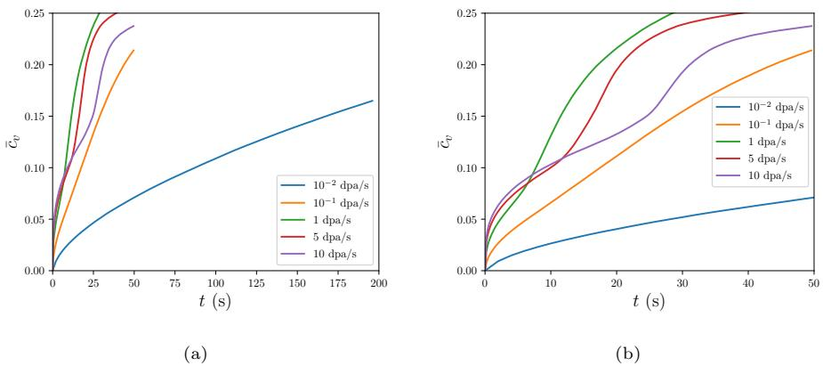  
Figure 1: Vacancy concentration versus time for simulations of void superlattice formation at $T ^ { \prime } = 7 7 3 \textrm { K }$ .

To better quantify the progress and quality of superlattices throughout their evolution, the radial distribution function $( \mathrm { R D F } )$ , $g ( r )$ , was calculated for each microstructure using the OVITO visualization software [47]. $g ( r )$ measures the probability of finding a particle at distance $r$ from a given reference particle at $r ~ = ~ 0$ . The evolution of $g ( r )$ with time for varying dose rates is shown in Figure 3, up to total damage of 2 dpa for each case. At the lower dose rates of $1 0 ^ { - 2 }$ and $1 0 ^ { - 1 } \ \mathrm { d p a / s }$ , peaks in the RDF appear early and grow in height with increasing time, as seen in Figures 3a and 3b. These peaks are indicative of the ordering of voids into superlattices, with the first peak in Figure 3a corresponding to spacing between nearest-neighbor voids, and peaks at higher distances corresponding to spacing between further separated voids. The increased magnitude of the peaks with increasing damage corresponds to improved ordering. The microstructures for the lower dose rates are shown at 2 dpa in Figures 4a and 4b, with superlattices observed, consistent with the RDFs.

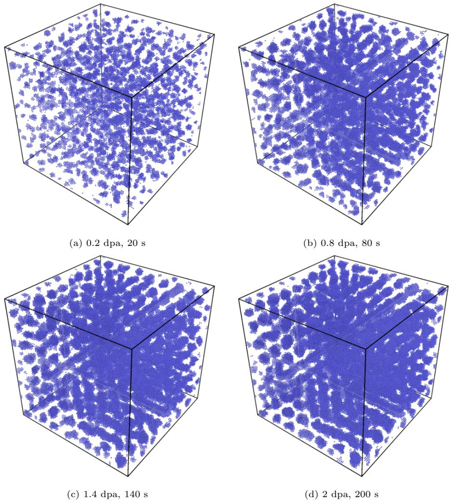  
Figure 2: Evolution of microstructure with time for $1 0 ^ { - 2 }$ dpa/s. Each individual vacancy is visualized as a blue sphere, while lattice site atoms are transparent. The random initial void positions followed by gradual alignment is consistent with the nucleation and growth phase transformation mechanism.

In contrast, at higher dose rates, peak formation is not evident up to 2 dpa, as seen for 1 dpa/s and 10 dpa/s in Figures 3c and 3d, respectively. The microstructures at 2 dpa, Figures 4c and 4d, show randomly arranged vacancy clusters, with larger average cluster size for 1 dpa/s than for 10 dpa/s. The fact that superlattice formation has not yet occurred for these higher dose rates is consistent with the understanding of superlattice formation as a diffusion-driven phenomenon; since much less time is needed for the higher dose rates to obtain a damage of 2 dpa, there has not been sufficient time for diffusion to anisotropic diffusion to act to form the superlattice.

At higher dose rates, superlattice formation does eventually occur, and it appears that there is a transition in the mechanism of formation. Figure 5 shows the plots of $c _ { v }$ versus time together with $g ( r )$ and microstructures for higher dose rates. In the early stages of time, $\frac { \partial ^ { 2 } { \bar { c } } _ { v } } { \partial t ^ { 2 } } < 0$ for dose rates of 1, 5, and 10 dpa/s in Figure 5a, consistent with lower dose rates. At these early stages, the concentration of vacancies is too low for spinodal decomposition to occur. At intermediate times, there is a region where $\frac { \partial ^ { 2 } \bar { c } _ { v } } { \partial t ^ { 2 } } > 0$ for dose rates of 1, 5, and 10 dpa/s. During this time, there is a significant increase in the peaks in the RDF, corresponding to increased ordering of the microstructure. For example, in Figure 5b, the first and second peaks in $g ( r )$ increase significantly between 50 dpa (10 s) and 70 dpa (14 s), concurrent with the start of the region where ∂2c¯v∂t2 > 0 at approximately 10 s. During the same time frame, new peaks in g(r) also appear at $r = 6$ nm and above, which is a strong indicator of increased long-range ordering. Following this sudden increase between 50 and 70 dpa, the peaks in the RDF do not increase further. Although some degree of local ordering may be present prior to 50 dpa, as seen in Figure 5d, the long-range ordering is significantly improved following the onset of $\frac { \partial ^ { 2 } { \bar { c } } _ { v } } { \partial t ^ { 2 } } > 0$ , as seen in Figure 5e and the RDF. The sudden improvement in ordering was also visually evident in a movie of microstructural evolution, available in the Supplementary

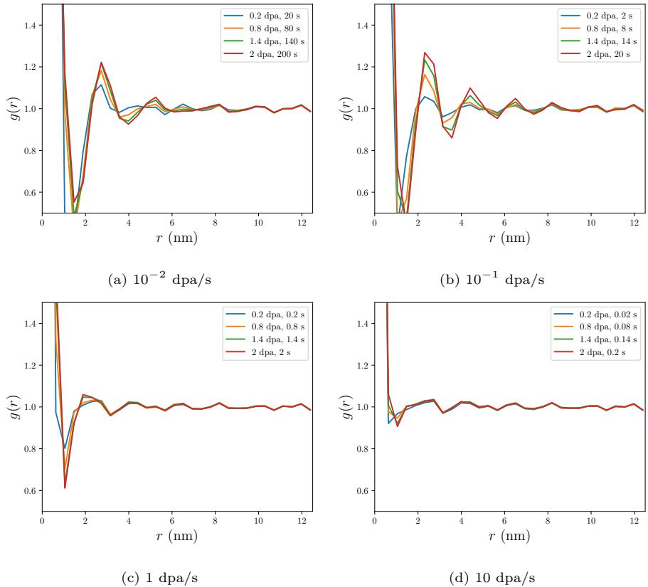  
Figure 3: Radial distribution functions $g ( r )$ for the microstructures as a function of dose rate. At the lower dose rates in (a) and (b), the formation of peaks in $g ( r )$ and gradual increase with time is indicative of superlattice formation. At the higher dose rates in (c) and (d), superlattice formation has not yet occured up to 2 dpa.

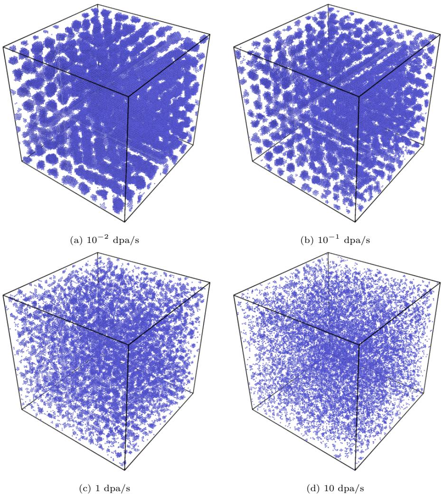  
Figure 4: Microstructure at 2 dpa for varying dose rates.

Material. For the dose rate of $1 0 \ \mathrm { d p a / s }$ , a significant increase in ordering also occurred corresponding to the region where $\begin{array} { r } { \frac { \partial ^ { 2 } \bar { c } _ { v } } { \partial t ^ { 2 } } > 0 } \end{array}$ , as seen in Figure 5c, f, and g. These sudden increases in ordering are associated with the onset and growth of the spinodal instability; as will be shown in Section 4.1, $\frac { \partial ^ { 2 } { { \bar { c } } _ { v } } } { \partial t ^ { 2 } } > 0$ results from the growth of the spinodal instability. For the dose rate of $1 \mathrm { d p a } / \mathrm { s }$ , ordering also occurred concurrently with $\frac { \partial ^ { 2 } { { \bar { c } } _ { v } } } { \partial t ^ { 2 } } > 0$ , but since this occurred early in the simulation time, a sudden increase was not as clearly distinguishable. Once the void superlattice is well-established, the perturbation growth driving phase separation gradually stops, and the plot of $\frac { \partial ^ { 2 } { } \bar { c } _ { v } } { \partial t ^ { 2 } }$ returns to concave down at the late stages of the simulation.

# 3.2. Superlattice formation at 873 $K$

The effect of temperature on the transition from nucleation and growth to spinodal decomposition was investigated by simulating void superlattice formation at the same range of dose rates as in Section 3.1 but at a temperature of $T = 8 7 3$ K. Plots of $c _ { v }$ versus time are shown in Figure 6. At this higher temperature, $c _ { v }$ increased more rapidly with respect to time compared to 773 K. This is because the increased temperature allows the interstitials to complete the $N _ { s }$ steps required for sink absorption more rapidly than at 773 K, causing the imbalance between the number of vacancies and the number of interstitials to increase sooner.

At dose rates 5 dpa/s and $1 0 \mathrm { d p a / s }$ , a region with $\frac { \partial ^ { 2 } { \bar { c } } _ { v } } { \partial t ^ { 2 } } > 0$ is observed, as was the case at 773 K. However, in contrast with 773 K, at the higher temperature of 873 K, no region with $\frac { \partial ^ { 2 } { { \bar { c } } _ { v } } } { \partial t ^ { 2 } } > 0$ was observed for 1 dpa/s. Thus, the increased temperature pushes the onset of spinodal decomposition to a higher dose rate.

To confirm this, the RDFs for 1 dpa/s at 773 K and 873 K are compared in Figure 7. (Because $c _ { v }$ increased at different rates for 773 K and 873 K, the RDFs were plotted over a range of times, with the final time chosen based on having the concentration of vacancies approximately the same between the two temperatures. For 773 K, the final time was 10 s, at which $\bar { c } _ { v } = 0 . 1 3 1$ , and for 873 K, the final time was 2 s, at which $\bar { c } _ { v } = 0 . 1 2 4$ .) At 773 K, as seen in Figure

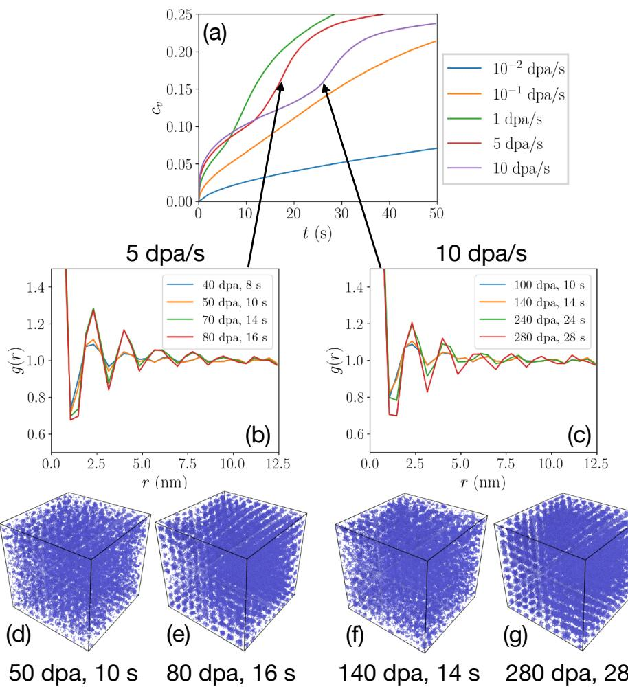  
Figure 5: (a) $c _ { v }$ versus time for varying dose rate at $T = 7 7 3 \mathrm { ~ K ~ }$ . (b) RDFs during microstructural evolution for $P = 5 \ \mathrm { d p a } / \mathrm { s }$ . (c) RDFs during microstructural evolution for $P = 1 0$ dpa/s. (d), (e) microstructure for $5 \ \mathrm { d p a / s }$ before and after onset of spinodal instability. (f), (g) microstructure for $1 0 \mathrm { \ d p a / s }$ before and after onset of spinodal instability.

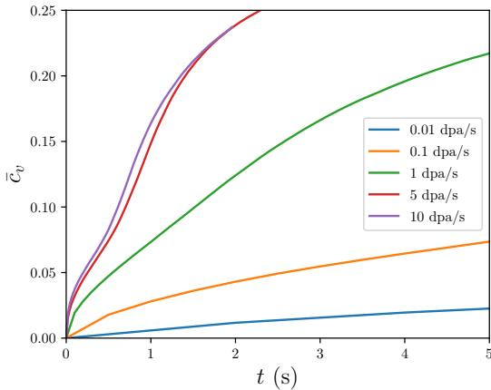  
Figure 6: Average vacancy concentration versus time for simulations of void superlattice formation at $T ^ { \prime } = 8 7 3 \textrm { K }$ .

7a, the peaks corresponding to superlattice spacing increase rapidly after 4 s, during which time $\frac { \partial ^ { 2 } { { \bar { c } } _ { v } } } { \partial t ^ { 2 } } > 0$ , and then do not increase further following 8 s. This behavior is consistent with spinodal instability-driven superlattice formation, as was also observed at 5 dpa/s and 10 dpa/s at 773 K in Figure 5. In contrast, Figure 7b shows that at 873 K, the peaks associated with the void superlattice increase more gradually, do not stop increasing, and do not reach as high of a value, consistent with nucleation as growth, as observed for lower dose rates in Figure 3a and 3b. Thus, the higher temperature of 873 K has pushed the onset of spinodal instability-driven superlattice formation above 1 dpa/s.

# 3.3. Superlattice spacing as a function of temperature

To facilitate comparison with experimental observations, simulations were   
run at a range of temperatures with constant dose rate $1 0 ^ { - 2 }$ dpa/s. The phase   
transformation mechanism was nucleation and growth at each temperature. The   
superlattice spacing λ was determined by counting the number of voids in the   
⟨100⟩ directions, and dividing the domain size, $8 0 a _ { 0 }$ , by that number of voids. The superlattice spacings for each temperature are shown in Table 2. The   
spacing increases with temperature, consistent with previous experimental [5]   
and simulation [48] results at constant dose rates. The only exception to the

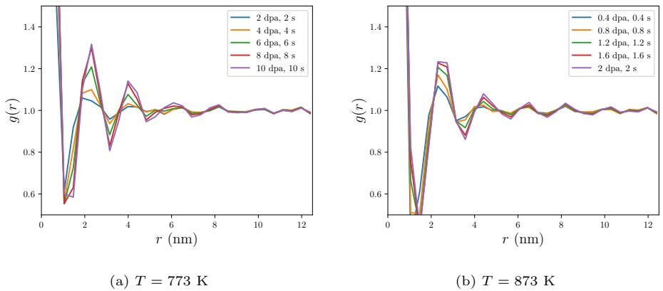  
Figure 7: RDFs as a function of time for $P = 1$ dpa/s for (a) $T = 7 7 3 \mathrm { ~ K ~ }$ and (b) $T ^ { \prime } = 8 7 3 \textrm { K }$ . The rapid increase in (a) coincides with the region where $\frac { \partial ^ { 2 } { { \bar { c } } _ { v } } } { \partial t ^ { 2 } } > 0$ seen in Figure 1, and is indicative of spinodal instability. In (b), no region where $\frac { \partial ^ { 2 } { \bar { c } } _ { v } } { \partial t ^ { 2 } } > 0$ was observed in Figure 6, and the evolution of the RDF is consistent with the nucleation and growth.

increase in λ with temperature was that it was 4.2 nm for both 873 K and 923 K. This is due to the use of a finite size simulation domain with periodic boundary conditions, which allows only integer changes in the number of voids in a row in the ⟨100⟩ directions. Superlattice formation was not observed at 1073 K or higher. At these higher temperatures, a low concentration of isolated vacancies and small vacancy clusters were formed. For example, the total vacancy concentration was approximately $2 \times 1 0 ^ { - 3 }$ at 1073 K, and was even smaller at higher temperatures. This is due to sink absorption of the vacancies; as the temperature increases, the vacancies complete the $N _ { s }$ steps required for sink absorption more rapidly, until sink absorption dominates over defect production. The spacing results are further compared with experiments in Section

# 4.3.

# 4. Discussion

In this section, we compare the AKMC simulation results, analytical models of thermodynamics and defect kinetics, and experimental observations. From the standpoint of classical thermodynamics, for a system with local free energy density $f ( c _ { v } )$ , the criterion for spinodal decomposition to begin (in the absence of irradiation) is $\frac { \partial ^ { 2 } f } { \partial c _ { v } ^ { 2 } } < 0$ [49]. With irradiation, the criteria for spinodal decomposition to begin is modified to $\begin{array} { r } { \frac { \partial ^ { 2 } f } { \partial c _ { v } ^ { 2 } } < - \sqrt { \frac { 4 \kappa Q } { M _ { v } } } . } \end{array}$ , where $Q = k _ { i v } c _ { i } + k _ { s } D _ { v } + P$ [41]. After spinodal decomposition begins, phase separation proceeds, and the average vacancy concentration continues to increase. In Section 4.1, we show that the kinetics of average vacancy concentration versus time change such that $\frac { \partial ^ { 2 } { { \bar { c } } _ { v } } } { \partial t ^ { 2 } } > 0$ holds during spinodal decomposition; this kinetic behavior is a consequence of spinodal decomposition. In Section 4.2, we compare the results from our work with the phase transformation mechanisms observed previously using similar kinetic Monte Carlo models. In Section 4.3, we compare the predictions of the criterion for onset of spinodal decomposition, based on $\begin{array} { r } { \frac { \partial ^ { 2 } f } { \partial c _ { v } ^ { 2 } } < - \sqrt { \frac { 4 \kappa Q } { M _ { v } } } , } \end{array}$ with the simulation results and experimental observations, as well as comparing the superlattice spacings from Table 2 to experiment.

Table 2: Superlattice spacing λ as a function of temperature.   

<table><tr><td rowspan=1 colspan=1>T (K)</td><td rowspan=1 colspan=1>λ(nm)</td></tr><tr><td rowspan=1 colspan=1>773</td><td rowspan=1 colspan=1>3.15</td></tr><tr><td rowspan=1 colspan=1>823</td><td rowspan=1 colspan=1>3.6</td></tr><tr><td rowspan=1 colspan=1>873</td><td rowspan=1 colspan=1>4.2</td></tr><tr><td rowspan=1 colspan=1>923</td><td rowspan=1 colspan=1>4.2</td></tr><tr><td rowspan=1 colspan=1>973</td><td rowspan=1 colspan=1>5.04</td></tr><tr><td rowspan=1 colspan=1>1023</td><td rowspan=1 colspan=1>6.3</td></tr></table>

# 4.1. Correlation of concave up region with spinodal instability

As seen in Section 3.1, regions where the plot of vacancy concentration versus time became concave up, or $\frac { \partial ^ { 2 } { { \bar { c } } _ { v } } } { \partial t ^ { 2 } } > 0$ , were associated with the onset of spinodal instability. In this Section, we show through analysis of a rate theory-based analytical model why the concave up regions occur at the onset of the spinodal instability. These concave up regions occurred at intermediate times; at early times, the vacancy concentration is too low for spinodal decomposition to occur (as discussed further in Section 4.3), whereas at later times the process of phase separation is completed, leading to concave down curvatures at early and late times.

Combining the classical rate theory-based approach for defect evolution with the Cahn-Hilliard theory for phase separation, the evolution equations for local vacancy and interstitial concentrations are [41, 42]:

$$
\frac { \partial c _ { v } } { \partial t } = \nabla \cdot M _ { v } \nabla \left( \frac { \delta F } { \delta c _ { v } } \right) + P - k _ { s } D _ { v } c _ { v } - k _ { i v } c _ { v } c _ { i }
$$

$$
\frac { \partial c _ { i } } { \partial t } = \nabla \cdot D _ { i } \nabla c _ { i } + P - k _ { s } D _ { i } c _ { i } - k _ { i v } c _ { v } c _ { i }
$$

where $M _ { v }$ is the vacancy mobility given by $M _ { v } ~ = ~ D _ { v } / ( k _ { B } T )$ , $F$ is the free energy functional as a function of vacancy concentration, $\frac { \delta F } { \delta c _ { v } }$ is the variational derivative of $F$ with respect to $c _ { v }$ (which, physically, is the local chemical potential of vacancies [49]), $k _ { s }$ is the sink strength as defined in Section 2, and $k _ { i v } = 4 \pi R _ { i v } ( D _ { i } + D _ { v } ) / V _ { a }$ is the recombination rate, with $V _ { a }$ the atomic volume. For $F ^ { \prime }$ , previously a combination of regular solution free energy and gradient energy contributions has been used to approximate the 2NN-interactions used in the AKMC model [41]; however, the exact form is not important for the analysis in this section.

To analyze the concavity of the plots of average vacancy concentration versus time in Section 3, the derivative of Equation 4 with respect to time is taken, resulting in:

$$
\frac { \partial ^ { 2 } c _ { v } } { \partial t ^ { 2 } } = \frac { \partial } { \partial t } \left[ \boldsymbol { \nabla } \cdot \boldsymbol { M } _ { v } \boldsymbol { \nabla } \left( \frac { \delta F } { \delta c _ { v } } \right) \right] - \frac { \partial } { \partial t } \left[ k _ { s } \boldsymbol { D } _ { v } c _ { v } \right] - \frac { \partial } { \partial t } \left[ k _ { i v } c _ { v } c _ { i } \right]
$$

since $\begin{array} { r } { \frac { \partial P } { \partial t } = 0 } \end{array}$ for constant $P$ . Since we are interested in the volume-averaged vacancy concentration, we integrate both sides of Equation 6 over the simulation domain volume $V$ and divide by $V$ to find the average:

$$
{ \begin{array} { l } { { \frac { \partial ^ { 2 } { \bar { c } } _ { v } } { \partial { t } ^ { 2 } } } = { \frac { 1 } { V } } \int _ { V } { \frac { \partial ^ { 2 } c _ { v } } { \partial { t } ^ { 2 } } } d V = { \frac { 1 } { V } } \int _ { V } { \frac { \partial } { \partial { t } } } \left[ \nabla \cdot M _ { v } \nabla \left( { \frac { \delta F } { \delta c _ { v } } } \right) \right] d V } \\ { \qquad \quad - \ { \frac { 1 } { V } } \int _ { V } { \frac { \partial } { \partial { t } } } \left[ k _ { s } D _ { v } c _ { v } \right] d V - { \frac { 1 } { V } } \int _ { V } { \frac { \partial } { \partial { t } } } \left[ k _ { i v } c _ { v } c _ { i } \right] d V } \end{array} }
$$

Next, the integrals with respect to volume are moved inside the time derivatives, and the divergence theorem is applied to the first term on the right hand side. The divergence theorem states that the integral over a volume $V$ of the divergence of vector field $A$ is equal to the surface integral of $A$ over the surface $S$ that bounds that volume $\begin{array} { r } { V \colon \int _ { V } \left[ \nabla \cdot A \right] d V = \int _ { S } \left[ A \cdot \hat { n } \right] d S , } \end{array}$ where $\hat { n }$ is the outwardpointing normal vector from the enclosing surface $S$ . Using $\begin{array} { r } { \boldsymbol { A } = M _ { v } \nabla \left( \frac { \delta \boldsymbol { F } } { \delta \boldsymbol { c } _ { v } } \right) } \end{array}$ results in

$$
\begin{array} { c } { \displaystyle \frac { \partial ^ { 2 } \bar { c } _ { v } } { \partial t ^ { 2 } } = \frac { \partial } { \partial t } \frac { 1 } { V } \int _ { S } \left[ M _ { v } \nabla \left( \frac { \delta F } { \delta c _ { v } } \right) \cdot \hat { n } \right] d S } \\ { \displaystyle - \frac { \partial } { \partial t } \frac { 1 } { V } \int _ { V } k _ { s } D _ { v } c _ { v } d V - \frac { \partial } { \partial t } \frac { 1 } { V } \int _ { V } k _ { i v } c _ { v } c _ { i } d V } \end{array}
$$

where $S$ is the boundary of the simulation domain volume. Because $\frac { \delta F } { \delta c _ { v } }$ is the chemical potential of vacancies and $M _ { v }$ is their mobility, the vacancy flux is given by $\begin{array} { r } { \vec { J } _ { v } = M _ { v } \nabla \left( \frac { \delta F } { \delta c _ { v } } \right) } \end{array}$ . Thus, the integrand $\begin{array} { r } { M _ { v } \nabla \left( \frac { \delta F } { \delta c _ { v } } \right) } \end{array}$ · $\hat { n } = \vec { J } _ { v } \cdot \hat { n }$ represents the flux of vacancies evaluated at the simulation domain boundaries. Since the AKMC simulations employ periodic boundary conditions, fluxes on each domain boundary are equal and opposite to that of the corresponding periodic boundary, meaning that the integral over all surfaces is zero. This is merely a consequence of conservation of mass of the diffusional term, as expected physically, and the time derivative of this term is also zero, resulting in

$$
\frac { \partial ^ { 2 } \bar { c } _ { v } } { \partial t ^ { 2 } } = - \frac { \partial } { \partial t } \frac { 1 } { V } \int _ { V } k _ { s } D _ { v } c _ { v } d V - \frac { \partial } { \partial t } \frac { 1 } { V } \int _ { V } k _ { i v } c _ { v } c _ { i } d V
$$

The first term on the right hand side (which results from sink absorption) can be simplified by moving the factor $k _ { s } D _ { v }$ outside the integral and using the definition of $\begin{array} { r } { { \bar { c } } _ { v } = \frac { 1 } { V } \int _ { V } c _ { v } d V } \end{array}$ , which gives

$$
\frac { \partial ^ { 2 } \bar { c } _ { v } } { \partial t ^ { 2 } } = - k _ { s } D _ { v } \frac { \partial \bar { c } _ { v } } { \partial t } - \frac { \partial } { \partial t } \frac { 1 } { V } \int _ { V } k _ { i v } c _ { v } c _ { i } d V
$$

Inspecting the plots in Section 3, it can be seen that $\begin{array} { r } { \frac { \partial \bar { c } _ { v } } { \partial t } > 0 } \end{array}$ for all cases. Because of the negative sign in front of the first (sink) term, it is always negative, and thus cannot contribute to $\frac { \partial ^ { 2 } { \bar { c } } _ { v } } { \partial t ^ { 2 } } > 0$ . Thus, the only way that $\frac { \partial ^ { 2 } { { \bar { c } } _ { v } } } { \partial t ^ { 2 } }$ can be greater than zero is if the second term on the right hand side of Equation 10, $\begin{array} { r } { - \frac { \partial } { \partial t } \frac { 1 } { V } \int _ { V } k _ { i v } c _ { v } c _ { i } d V } \end{array}$ , is greater than zero.

We next analyze the term $\begin{array} { r } { - \frac { \partial } { \partial t } \frac { 1 } { V } \int _ { V } k _ { i v } c _ { v } c _ { i } d V } \end{array}$ , which results from recombination. If the defect concentrations are spatially uniform with values $c _ { v } ^ { 0 }$ and $c _ { i } ^ { 0 }$ , the integrand of the recombination term has the form

$$
k _ { i v } c _ { v } c _ { i } = k _ { i v } c _ { v } ^ { 0 } c _ { i } ^ { 0 }
$$

At the early stages of time before vacancy concentration becomes high enough to allow spinodal decomposition to occur, all terms in the integrand are positive, and the second term on the right hand side of Equation 10 is negative, leading to $\frac { \partial ^ { 2 } \bar { c } _ { v } } { \partial t ^ { 2 } } < 0$ at the early stages. However, if a perturbation appears in the vacancy concentration field, the recombination term is changed from the spatially uniform case. Phase separation by spinodal decomposition begins with growth of an unstable perturbation; the unstable perturbation with the highest rate of growth sets the length scale of the initial microstructure in spinodal decomposition [49], which may be changed under irradiation [41]. Outside of the spinodal regime, all perturbations are stable and will decay rather than growing, and the system will return to its initially uniform state.

Consider an unstable perturbation of the form $\tilde { c } _ { v } = \delta _ { v } \exp ( i { \bf k } \cdot { \bf r } )$ on top of the uniform vacancy concentration field $c _ { v } ^ { 0 }$ , where $\delta _ { v }$ is the magnitude of the perturbation, $\mathbf { k }$ is the wave vector of the perturbation, and $\mathbf { r }$ is the position vector. Driven by spinodal instability, the perturbation in the vacancy concentration will grow. Appearance of this perturbation in the vacancy field will result in a simultaneous anti-phase perturbation in the interstitial concentration, superimposed on $c _ { i } ^ { 0 }$ , denoted as $\tilde { c } _ { i } = - \delta _ { i } \exp ( i \mathbf { k } \cdot \mathbf { r } )$ [42]. In the presence of these perturbations, the local recombination rate is changed, and can be expressed as [42]

$$
k _ { i v } c _ { v } c _ { i } = k _ { i v } c _ { v } ^ { 0 } c _ { i } ^ { 0 } + \frac { 1 } { 2 } k _ { i v } \delta _ { v } \delta _ { i } \sigma _ { k \lambda }
$$

where $\sigma _ { k \lambda }$ represents the reduction in recombination rate caused by perturbations. It is calculated as [42]

$$
\sigma _ { k \lambda } = - \sum _ { m = 1 } ^ { l _ { i } } q _ { 0 } ^ { m - 1 } \langle \exp { ( i k \cdot \lambda _ { m } ) } \rangle _ { \lambda _ { m } } / \sum _ { m = 1 } ^ { l _ { i } } q _ { 0 } ^ { m - 1 }
$$

where $l _ { i }$ is the SIA mean free life (the average number of hops before an SIA is recombined), $q _ { 0 }$ is the averaged probability that an SIA is not recombined after a hop, and $\lambda _ { m }$ is the current SIA position after $m$ hops relative to its original position. $\sigma _ { k \lambda }$ has been calculated for different crystal structures [42], and is always less than or equal to zero consistent with its definition in Equation 13. Substituting Equation 12 into Equation 10 and simplifying,

$$
\frac { \partial ^ { 2 } \bar { c } _ { v } } { \partial t ^ { 2 } } = - k _ { s } D _ { v } \frac { \partial \bar { c } _ { v } } { \partial t } - k _ { i v } \frac { \partial ( c _ { v } ^ { 0 } c _ { i } ^ { 0 } ) } { \partial t } - \frac { \partial } { \partial t } \frac { 1 } { V } \int _ { V } \frac { 1 } { 2 } k _ { i v } \delta _ { v } \delta _ { i } \sigma _ { k \lambda } d V
$$

The second term on the right hand side of Equation 14, associated with the contribution from spatially uniform recombination, is always negative because of the negative sign preceding it and the fact that both $c _ { v } ^ { 0 }$ and $c _ { i } ^ { 0 }$ are positive and increasing; thus this term cannot contribute to $\frac { \partial ^ { 2 } { { \bar { c } } _ { v } } } { \partial t ^ { 2 } } > 0$ . However, the final term on the right hand side of Equation 14, associated with the growth of an unstable perturbation due to spinodal instability, is always greater than or equal to zero, because $k _ { i v } , \delta _ { v } , \delta _ { i } > 0$ , while $\sigma _ { k \lambda } \le 0$ , and a negative sign precedes the term. Thus, the occurrence of a growing perturbation associated with spinodal instability is the only possible cause for $\frac { \partial ^ { 2 } { { \bar { c } } _ { v } } } { \partial t ^ { 2 } } > 0$ during intermediate times (this term’s magnitude must be greater than the magnitude of the sum of the first and second terms). As phase separation is completed, the perturbation growth gradually stops, the local recombination rate is again governed by Equation 11, and $\frac { \partial ^ { 2 } { \bar { c } } _ { v } } { \partial t ^ { 2 } } < 0$ in the later stages of evolution. This analysis is consistent with the microstructural observations and RDFs in Section 3.

4.2. Comparison to phase transformation mechanisms observed in other kinetic Monte Carlo studies

In this section, the results of the simulations in the present work are compared to the results of similar modeling efforts. In [50], an object kinetic Monte Carlo (OKMC) model was used to simulate void superlattice formation in tungsten during irradiation by fission neutrons. 1D SIA diffusion was assumed, as in the present model. However, in Ref. [50], the binding energies of clusters of various sizes were calculated using density functional theory, as opposed to the pairwise bond energy model used here, and the defect production accounted for the collision cascades produced by neutron irradiation, rather than assuming production of Frenkel pairs in our model. The dose rate was $1 . 5 \times 1 0 ^ { - 7 }$ dpa/s, much smaller than those considered here, and the temperature was 1025 K. Void superlattice formation occurred by a process of nucleation and growth, consistent with the results for lower dose rates in Section 3. The void lattice spacing was found to be 20.3 nm, consistent with experimental observations.

In Ref. [48], a similar AKMC model to the present one was used to simulate void superlattice formation in molybdenum, and the effects of temperature and dose rate on lattice constant, lattice ordering, and critical dose for superlattice formation were determined. A detailed comparison of phase transformation mechanism is possible with a simulation from Ref. [48] conducted at 800 K and $1 0 ^ { - 2 }$ dpa/s. There, it appears the phase transformation occurs by spinodal decomposition, as evidenced by a region of concave up curvature in a plot of vacancy concentration versus dose. That region coincided with a decrease in the recombination rate, which is consistent with explanation in Section 4.1 of the concave up region as being caused by a decrease in recombination rate during the spinodal instability. In Ref. [48], the dose rate of $1 0 ^ { - 2 }$ dpa/s at which spinodal decomposition occurred was lower than the dose rates where it occurred here. This is likely due to the use of a smaller recombination radius used in Ref. [48] (2NN distance versus the 3NN distance here), which causes a higher concentration of defects for a given dose rate, pushing the defect concentrations higher into the spinodal regime in Ref. [48].

# 4.3. Comparison of simulation results to spatially uniform rate theory model and experimental observations

To improve understanding of the simulation results and provide a basis for comparison with experiments, in this section a spatially uniform rate theorybased approach is used to predict the transition from nucleation and growth to spinodal decomposition. This is done by comparing the threshold for the onset of spinodal decomposition to the steady-state concentration of vacancies predicted by the rate theory model. In the absence of irradiation, spinodal decomposition occurs when the second derivative of the local free energy density with respect to composition becomes negative: ${ \frac { \partial ^ { 2 } f } { \partial c _ { v } ^ { 2 } } } ~ < ~ 0$ [49]. As previously mentioned, although the energetics of the AKMC model used in this work do not exactly match a regular solution model, the AKMC model parameters were chosen to approximate a regular solution model. For a regular solution model, the local free energy density is given by

$$
f = \frac { \omega } { V _ { a } } c _ { v } ( 1 - c _ { v } ) + \frac { k _ { B } T } { V _ { a } } \left[ c _ { v } \ln c _ { v } + ( 1 - c _ { v } ) \ln ( 1 - c _ { v } ) \right]
$$

where $\omega$ is the regular solution parameter. The criterion for spinodal decomposition to occur in the absence of irradiation is

$$
\frac { \partial ^ { 2 } f } { \partial c _ { v } ^ { 2 } } = - \frac { 2 \omega } { V _ { a } } + \frac { k _ { b } T } { V _ { a } } \frac { 1 } { c _ { v } ( 1 - c _ { v } ) } < 0
$$

Equation 16 defines a critical vacancy concentration, $c _ { v } ^ { c r { \imath } t }$ , above which spinodal decomposition will occur; this is the threshold for the onset of spinodal decomposition. $c _ { v } ^ { c r { \imath } t }$ is given by

$$
2 \omega = \frac { k _ { B } T } { c _ { v } ^ { c r i t } ( 1 - c _ { v } ^ { c r i t } ) }
$$

In the presence of irradiation, the above conditions are modified [41]. The onset of spinodal decomposition is delayed until $\begin{array} { r } { \frac { \partial ^ { 2 } f } { \partial c _ { v } ^ { 2 } } < - \sqrt { \frac { 4 \kappa Q } { M _ { v } } } } \end{array}$ , where $Q =$ $k _ { i v } c _ { i } + k _ { s } D _ { v } + P$ [41]. This defines a new critical concentratio n ccritv , which the vacancy concentration must be greater than for spinodal decomposition to occur under irradiation:

$$
\frac { 2 \omega } { V _ { a } } - \frac { k _ { B } T } { V _ { a } } \frac { 1 } { c _ { v } ^ { c r i t } ( 1 - c _ { v } ^ { c r i t } ) } = \sqrt { \frac { 4 \kappa Q } { M _ { v } } }
$$

The rate theory approach is used to determine the steady-state concentration of vacancies under irradiation, $c _ { v } ^ { s s }$ , for comparison to $c _ { v } ^ { c r i t }$ . The rate theory equations are simplified versions of Equations 4 and 5 without the spatial dependence:

$$
\frac { \partial c _ { v } } { \partial t } = P - k _ { s } D _ { v } c _ { v } - k _ { i v } c _ { v } c _ { i }
$$

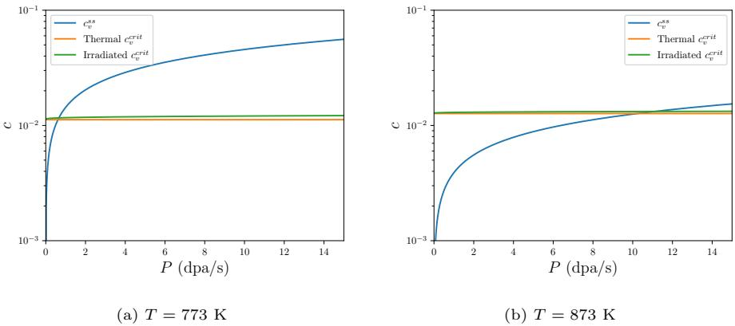  
Figure 8: Rate theory-based prediction for transition from nucleation and growth to spinodal decomposition. (a) $T ^ { \prime } = 7 7 3 \textrm { K }$ , (b), $T ^ { \prime } = 8 7 3 \textrm { K }$ . In the rate theory approach, phase transformation by spinodal decomposition will occur when $c _ { v } ^ { s s } > c _ { v } ^ { c r i t }$ . An increase in temperature causes the onset of spinodal decomposition to be pushed to higher dose rates, consistent with observations from AKMC simulations.

$$
\frac { \partial c _ { i } } { \partial t } = P - k _ { s } D _ { i } c _ { i } - k _ { i v } c _ { v } c _ { i }
$$

When steady-state is reached, $\begin{array} { r } { \frac { \partial c _ { v } } { \partial t } = \frac { \partial c _ { v } } { \partial t } = 0 } \end{array}$ and Equations 19 and 20 can be solved simultaneously to obtain

$$
c _ { v } ^ { s s } = \frac { - k _ { s } D _ { i } D _ { v } + \sqrt { ( k _ { s } D _ { i } D _ { v } ) ^ { 2 } + 4 k _ { i v } P D _ { i } D _ { v } } } { 2 k _ { i v } D _ { v } }
$$

Thus, the onset of spinodal decomposition can be found when $c _ { v } ^ { s s } > c _ { v } ^ { c r } { } ^ { t }$ using Equations 21 and 18. This is shown graphically for Mo as a function of dose rate in Figure 8 for 773 K and 873 K, where the values of $c _ { v } ^ { c r { \imath } t }$ in both non-irradiated (thermal) and irradiated conditions are shown. The parameters used in the analytical expressions of Equations 21 and 18 were chosen to match the AKMC model parameters shown in Table 1. Diffusivities are $D _ { i } = D _ { i } ^ { 0 } \exp ( - E _ { 0 } ^ { i } / k _ { B } T )$ and $D _ { v } = D _ { v } ^ { 0 } \exp ( - E _ { 0 } ^ { i } / k _ { B } T )$ , with $\begin{array} { r } { D _ { i } ^ { 0 } = D _ { v } ^ { 0 } = \frac { 3 a _ { 0 } ^ { 2 } } { 4 } \nu _ { 0 } = 7 . 4 4 \times 1 0 ^ { - 8 } \mathrm { { m ^ { 2 } / s } } } \end{array}$ , and $E _ { 0 } ^ { i }$ and $E _ { 0 } ^ { v }$ given in Table 1. We assume $\omega = E _ { m i x } = E _ { f } ^ { v }$ [41], where $E _ { f } ^ { v }$ is the formation energy of a vacancy. Sink strength is calculated as $\begin{array} { r } { k _ { s } = \frac { 2 d i m } { N _ { s } d _ { j } ^ { 2 } } = } \end{array}$ $8 . 0 6 \times 1 0 ^ { 1 6 } ~ \mathrm { { m ^ { - 2 } } }$ . $k _ { i v }$ and $P$ were calculated for different temperatures using the previously given expressions in this Section.

At 773 K, as seen in Figure 8a, $c _ { v } ^ { s s } > c _ { v } ^ { c r i t }$ for dose rates greater than approximately 0.6 dpa/s; thus, superlattice formation would be expected to occur by nucleation and growth for $P < 0 . 6 \mathrm { d p a / s }$ , while superlattice formation would be expected to occur by spinodal decomposition for $P > 0 . 6 \mathrm { d p a } / \mathrm { s }$ . The shift in $c _ { v } ^ { c r { \imath } t }$ caused by change from thermal to irradiation conditions is relatively small for this system. In comparing these results to the simulations of Section 3, we do not necessarily expect fully quantitative agreement with the AKMC model due to the different energy descriptions used, and the fact that the rate theory model assumes uniform defect concentration and does not include the effect of vacancy clustering, whereas in the AKMC model vacancies form clusters due to the 1NN and 2NN interactions. However, from Figure 5, the AKMC model predicts that at $0 . 1 \mathrm { d p a / s }$ , phase transformation occurs by nucleation and growth, while at 1 dpa/s, AKMC predicts that phase transformation occurs by spinodal decomposition, which is consistent with the rate theory model prediction of a transition at $P = 0 . 6 ~ \mathrm { d p a / s }$ . Thus, the analytical model can provide an order of magnitude estimate of the transition between the phase transformation mechanisms, as well as qualitative understanding of the factors affecting the transition.

Another example of this understanding is seen in Figure 8b, showing the transition between phase transformation mechanisms at 873 K. At this higher temperature, $c _ { v } ^ { c r { \imath } t }$ increases slightly, while $c _ { v } ^ { s s }$ decreases more significantly across the range of $P$ due to the higher temperatures. The transition from nucleation and growth to spinodal decomposition is shifted to a higher dose rate of approximately 11 dpa/s. This is in qualitative agreement with observations from the AKMC model from Figure 6, which also showed that the increased temperature of 873 K caused an increase in the dose rate at which the transition occurred. However, in the AKMC simulations, the transition occurred between 1 dpa/s and 5 dpa/s. Thus, although the agreement between the rate theory model and AKMC simulations is not fully quantitative for the reasons discussed in the previous paragraph, important physical insights and an order of magnitude estimate of the transition conditions can be gained from the simpler rate theory

model.

As an example of the insight that can be gained from the combination of AKMC simulations and the analytical model, we compare its predictions to the experimental observations of Brimhall and Simonen [3]. There, they irradiated single-crystal Mo with 7.5 MeV Ta ${ + } { + } { + }$ ions at a temperature of 1173 K to a variety of total doses ranging from 1 to 150 dpa. They observed initially random ordering of voids, followed by short aligned rows of voids at approximately 3 dpa, and establishment of a full superlattice at 10 dpa. This gradual alignment is consistent with the nucleation and growth mechanism. Although the dose rate is not specified for each experiment in Ref. [3], the range of dose rates can be estimated from the range of ion beam currents given, resulting in $1 . 3 \times 1 0 ^ { - 3 }$ $\mathrm { d p a / s } < P < 8 . 7 { \times } 1 0 ^ { - 3 } \mathrm { d p a / s }$ . The threshold in $P$ for transition from nucleation and growth to spinodal decomposition for this experiment can be calculated by comparing $c _ { v } ^ { s s }$ to $c _ { v } ^ { c r { \imath } t }$ , as shown in Figure 9. A significantly higher dose rate of approximately $3 4 0 0 \mathrm { d p a / s }$ would be needed for spinodal decomposition to occur. Since the estimated dose rates in the experiment are significantly below this, phase transformation would be expected to occur by nucleation and growth, which is consistent with the experimental observations.

The AKMC simulation results are further compared with the experimental results of [3] and other irradiations of Mo in Figure 10, where the superlattice spacing λ is plotted as a function of temperature. The phase transformation mechanism for all the experiments is believed to be nucleation and growth, based on the temperatures and dose rates, as well as the direct observations in Ref. [3] mentioned in the previous paragraph. Similarly, the phase transformation mechanism for the simulations was nucleation and growth at all temperatures.

The AKMC simulations predict superlattice spacing significantly less than fission neutron experiments in the same temperature range [5]. This is at least partially due to the effect of dose rate. Smaller dose rates produce larger superlattice spacings [48], and fission neutron irradiation produces dose rates $\sim$ 10−6 dpa/s, much smaller than the dose rate of $1 0 ^ { - 2 }$ dpa/s used in Section 3.3.

The ion irradiation experiments used dose rates $\sim 1 0 ^ { - 3 }$ dpa/s, which would be more directly comparable to the AKMC simulations. However, direct comparison not possible because superlattice formation was not observed in the AKMC model at the higher temperatures where the ion irradiation experiments were conducted. The lack of superlattice formation at high temperatures is due to sink absorption of vacancies in the AKMC model. The information needed to compare defect sink strength in the experiment (such as dislocation density in the samples) with the AKMC model was not available, so it is difficult to draw conclusions on the effect of sink strength on the superlattice formation window. However, it does appear that based on the trend in superlattice spacing with temperature in the simulations, the model would likely under-predict λ compared to ion irradiation experiments. This could be due to several factors. The dose rate in simulations is likely somewhat greater than used in experiments, although this is much less of a factor than with the fission neutron experiments. The effect of the sink strength on λ is unknown. The introduction of defect damage as Frenkel pairs could also cause under-prediction of λ. In Ref. [50], introducing a more realistic picture of larger defect clusters following cascades

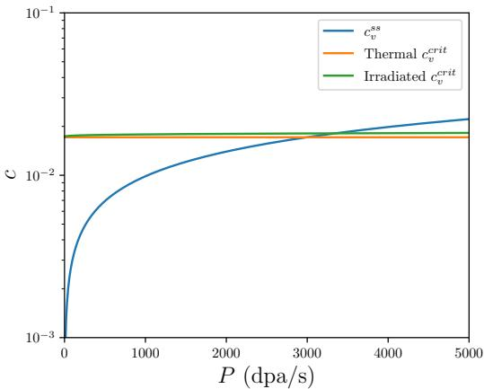  
Figure 9: Rate theory-based prediction for transition from nucleation and growth to spinodal decomposition in Mo at 1173 K. In the rate theory approach, phase transformation by spinodal decomposition will occur when $c _ { v } ^ { s s } > c _ { v } ^ { c r i t }$ ; thus, nucleation and growth occurs for $P < 3 4 0 0$ dpa/s, while spinodal decomposition occurs for $P > 3 4 0 0 ~ \mathrm { d p a / s }$ .

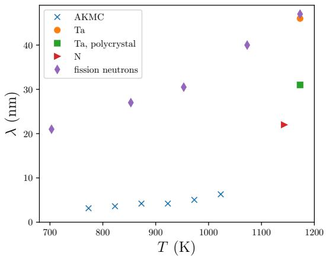  
Figure 10: Comparison of superlattice spacing λ predicted from AKMC simulations with experiments in single crystal Mo irradiated by Ta ions [3], polycrystal Mo irradiated by Ta ions [9], single crystal Mo irradiated by N ions [1] and fission neutrons [5].

# had an important effect on superlattice formation; incorporating this effect could also change λ.

Finally, the transition from nucleation and growth to spinodal decomposition is investigated for some common metals where superlattice formation has been observed: Mo, Cr, Ni, and Cu. The goal is to understand under what conditions a transition from nucleation and growth to spinodal decomposition could be observed experimentally. With this in mind, we assume a constant dose rate of $1 0 ^ { - 2 } \mathrm { { \ d p a / s } }$ , on the high end of the range typical of ion irradiation conditions, and determine where the transition occurs as a function of temperature. The analytical approach is used, with Mo parameters as previously given, and parameters for other metals given in Table 3. We again assume $\begin{array} { r } { D _ { i } ^ { 0 } = D _ { v } ^ { 0 } = \frac { 3 a _ { 0 } ^ { 2 } } { 4 } \nu _ { 0 } } \end{array}$ , and $k _ { s }$ , $k _ { i v }$ , $M _ { v }$ and $Q$ are calculated using the expressions previously given.

Another consideration in determining whether void superlattice formation will occur is the observed temperature formation window of void superlattices, generally ranging $0 . 2 5 T _ { m } < T < 0 . 5 0 T _ { m }$ [51]. Although this window is only approximate and differs from material to material, it is a useful guideline to identify under what conditions superlattice formation may occur.

Table 3: Parameters used for analytical model for Figure 11.   

<table><tr><td rowspan=1 colspan=1>Material</td><td rowspan=1 colspan=1>Cr</td><td rowspan=1 colspan=1>Ni</td><td rowspan=1 colspan=1>Cu</td></tr><tr><td rowspan=1 colspan=1>a(nm)</td><td rowspan=1 colspan=1>0.291</td><td rowspan=1 colspan=1>0.353</td><td rowspan=1 colspan=1>0.362</td></tr><tr><td rowspan=1 colspan=1>E0 (eV)</td><td rowspan=1 colspan=1>0.075</td><td rowspan=1 colspan=1>0.14</td><td rowspan=1 colspan=1>0.12</td></tr><tr><td rowspan=1 colspan=1>Ev(eV)</td><td rowspan=1 colspan=1>0.9</td><td rowspan=1 colspan=1>1.2</td><td rowspan=1 colspan=1>0.71</td></tr><tr><td rowspan=1 colspan=1>ks (m−2)</td><td rowspan=1 colspan=1>9.45 × 1016</td><td rowspan=1 colspan=1>6.42 × 1016</td><td rowspan=1 colspan=1>6.12 × 1016</td></tr><tr><td rowspan=1 colspan=1>κ (eV/nm)</td><td rowspan=1 colspan=1>1.08</td><td rowspan=1 colspan=1>1.97</td><td rowspan=1 colspan=1>1.54</td></tr><tr><td rowspan=1 colspan=1>ω (eV)</td><td rowspan=1 colspan=1>2.64</td><td rowspan=1 colspan=1>1.39</td><td rowspan=1 colspan=1>1.07</td></tr></table>

The results of the analytical calculation for these metals are shown in Figure 11. In contrast to Figure 8 and 9, spinodal decomposition may occur at the left edges of the plots (lower temperatures), since that is where $c _ { v } ^ { s s }$ may be larger than $c _ { v } ^ { c r { \imath } t }$ . The lower and upper bounds for each plot are set to $0 . 2 5 T _ { m }$ and $0 . 5 T _ { m }$ for each material, respectively. The only material in which $c _ { v } ^ { s s }$ becomes larger than $c _ { v } ^ { c r { \imath } t }$ in the temperature formation window is Ni; thus, under conditions typically available in ion irradiation facilities, Ni offers the most likely possibility of experimental observation of a transition in phase transformation mechanism from nucleation and growth to spinodal decomposition.

# 5. Conclusions

Using a combination of AKMC simulations and rate theory-based analytical modeling, we have demonstrated that void superlattices can form in irradiated materials by either nucleation and growth or spinodal decomposition, depending on irradiation conditions. Increasing the dose rate triggered a transition from nucleation and growth to spinodal decomposition. Indications of this transition were a sudden increase in long-range ordering, quantified by rapid increases in peaks of the RDF of vacancies, particularly at longer distances that indicate long-range ordering, and an increase in the rate of net vacancy accumulation, quantified by a region of positive second derivative of the average vacancy concentration versus time, $\frac { \partial ^ { 2 } { \bar { c } } _ { v } } { \partial t ^ { 2 } } > 0$ . Analysis of a spatially-dependent rate theory model showed that this positive second derivative region was caused by the onset of instability associated with spinodal decomposition.

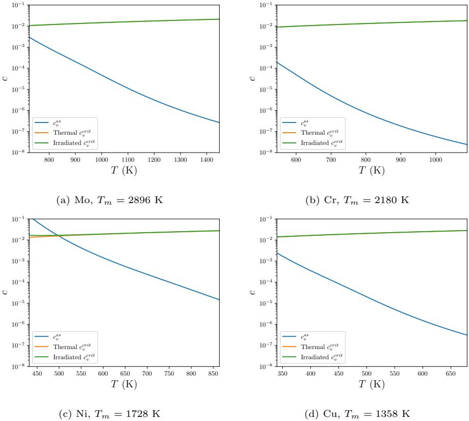  
Figure 11: Transition from nucleation and growth $\ C _ { v } ^ { s s } \ < \ c _ { v } ^ { c r i t }$ ) to spinodal decomposition $( c _ { v } ^ { s s } > c _ { v } ^ { c r i t }$ ) as phase transformation mechanism in (a) Mo, (b) Cr, (c) Ni, (d) Cu at dose rate $1 0 ^ { - 2 } \ \mathrm { d p a / s }$ . The range of the temperature axis is set to $0 . 2 5 T _ { m } < T < 0 . 5 0 T _ { m }$ for each material since void superlattice formation is only expected within that temperature window. Based on this analysis, Ni is the only metal where the transition from nucleation and growth to spinodal decomposition might be observed experimentally.

A simplified, spatially uniform version of the rate-theory based analytical model was also used to predict the transition from nucleation and growth to spinodal decomposition as the phase transformation mechanism. Although this analytical model does not represent the full energetics of the AKMC model and does not include vacancy clustering effects, it predicts trends with temperature and dose rate in agreement with the AKMC simulations, and provides estimates of the dose rate at which the transition occurs that are the same order of magnitude as observed in the AKMC simulations. The predictions of the analytical model were compared to experimental observations of void superlattice formation in Mo [3]. The analytical model predicted that for the conditions of the experiment, the phase transformation would occur by nucleation and growth, which was in agreement with the experimental observations. The superlattice spacing $\lambda$ increased with temperature, as has been observed experimentally, but predictions of λ from the model were smaller than experiment.

The possibility of experimentally observing an irradiation-driven change in the phase transformation mechanism is of fundamental scientific interest, which motivated using the analytical model to explore how such a transition might be observed. The model showed that nucleation and growth is the likely phase transformation mechanism in several metals where void superlattice formation is commonly observed. Irradiation of Ni may offer the possibility of observing the transition experimentally using typical ion irradiation sources, although only at the very low end of the typical temperature range of superlattice formation. Another factor affecting the possible observation of the transition is the fact that ion irradiation may produce vacancy clusters directly during the damage cascade, whereas neither the AKMC or rate theory model used in this study account for the direct production of vacancy clusters. Direct formation of vacancy clusters may favor the nucleation and growth mechanism. In any case, future availability of higher-dose rate facilities with in-situ microscopy capabilities would expand the possibility of making an experimental observation of the transition in phase transformation mechanism.

# Acknowledgments

This work was fully sponsored by the U.S. Department of Energy Office of Science, Basic Energy Sciences (BES), Materials Sciences and Engineering Division under FWP #C000-14-003 at Idaho National Laboratory, operated by Battelle Energy Alliance (BEA) under DOE-NE Idaho Operations Office Contract DE-AC07-05ID14517.

The United States Government retains and the publisher, by accepting the article for publication, acknowledges that the United States Government retains a nonexclusive, paid-up, irrevocable, world-wide license to publish or reproduce the published form of this manuscript, or allow others to do so, for United States Government purposes.

# Data Availability

The raw/processed data required to reproduce these findings cannot be shared at this time due to legal reasons.

# References

[1] J. H. Evans. Observations of a regular void array in high purity molybdenum irradiated with 2 MeV nitrogen ions. Nature, 229(5284):403–404, 1971.   
[2] G. L. Kulcinski, J. L. Brimhall, and H. E. Kissinger. Production of voids in pure metals by high-energy heavy-ion bombardment. In J. W. Corbett and L. C. Iannello, editors, Proceedings of the International Conference on Radiation-Induced Voids in Metals, volume CONF-710601, pages 449–478, Albany, NY, 1971. National Technical Information Service.   
[3] J. L. Brimhall and E. P. Simonen. Microstructure of ion bombarded single crystal molybdenum. In R. J. Arsenault, editor, Proceedings of the 1973 International Conference on Defects and Defect Clusters in BCC Metals and Their Alloys, page 321. National Bureau of Standards, 1973.   
[4] B. A. Loomis, S. B. Gerber, and A. Taylor. Void ordering in ion-irradiated Nb and Nb-1-percent Zr. Journal of Nuclear Materials, 68(1):19–31, 1977.   
[5] J. Moteff, V. K. Sikka, and H. Jang. The influence of neutron irradiation temperature on the void characteristics of BCC metals and alloys. In R. S. Nelson, editor, Consultant symposium on the physics of irradiation produced voids, volume AERE-R7934, pages 181–187. AERE Harwell, 1975.   
[6] B. L. Eyre and A. F. Bartlett. The damage structure formed in molybdenum by irradiation in a fast-reactor at 650 degrees C. Journal of Nuclear Materials, 47(2):143–154, 1973.   
[7] F. W. Wiffen. The effect of alloying and purity on the formation and ordering of voids in bcc metals. In J. W. Corbett and L. C. Iannello, editors, Proceedings of the International Conference on Radiation-Induced Voids in Metals, volume CONF-710601, pages 386–395, Albany, NY, 1971. National Technical Information Service.   
[8] E. Johnson and L. T. Chadderton. Anion voidage and the void superlattice in electron-irradiated CaF $^ 2$ . Radiation Effects and Defects in Solids, 79(1- 4):183–233, 1983.   
[9] G. L. Kulcinski and J. L. Brimhall. Ordered defect structures in irradiated materials. In J. Moteff, editor, Effects of Radiation on Substructure and Mechanical Properties of Metals and Alloys, volume ASTM STP 529, pages 258–271. ASTM, 1973.   
[10] P. B. Johnson and D. J. Mazey. The gas-bubble super-lattice and the development of surface-structure in $\mathrm { H e ^ { + } }$ and H $^ +$ irradiated metals at 300- K. Journal of Nuclear Materials, 93-4:721–727, 1980.   
[11] W. Jager and J. Roth. Microstructure of Ni and stainless-steel after multiple energy He and D implantation. Journal of Nuclear Materials, 93-4:756– 766, 1980.   
[12] S. E. Donnelly, G. Greaves, J. A. Hinks, C. J. Pawley, M.-F. Beaufort, J.-F. Barbot, E. Oliviero, and R. P. Webb. In-situ TEM studies of ion-irradiation induced bubble development and mechanical deformation in model nuclear materials. In MRS Online Proceedings Library, volume 1645, page 1001. Materials Research Society, 2014.   
[13] A. M. Robinson, P. D. Edmondson, C. English, S. Lozano-Perez, G. Greaves, J. A. Hinks, S. E. Donnelly, and C. R. M. Grovenor. The effect of temperature on bubble lattice formation in copper under in situ He ion irradiation. Scripta Materialia, 131:108–111, 2017.   
[14] R. W. Harrison, G. Greaves, J. A. Hinks, and S. E. Donnelly. Engineering self-organising helium bubble lattices in tungsten. Scientific Reports, 7, 2017.   
[15] D. J. Sprouster, C. Sun, Y. Zhang, S. N. Chodankar, J. Gan, and L. E. Ecker. Irradiation-dependent helium gas bubble superlattice in tungsten. Scientific Reports, 9, 2019.   
[16] C. Sun, D. J. Sprouster, Y. F. Zhang, D. Chen, Y. Q. Wang, L. E. Ecker, and J. Gan. Formation window of gas bubble superlattice in molybdenum under ion implantation. Physical Review Materials, 3(10), 2019.   
[17] S. Van den Berghe, W. Van Renterghem, and A. Leenaers. Transmission electron microscopy investigation of irradiated U-7 wt%Mo dispersion fuel. Journal of Nuclear Materials, 375(3):340–346, 2008.   
[18] J. Gan, D. D. Keiser, D. M. Wachs, A. B. Robinson, B. D. Miller, and T. R. Allen. Transmission electron microscopy characterization of irradiated U-7Mo/Al-2Si dispersion fuel. Journal of Nuclear Materials, 396(2-3):234– 239, 2010.   
[19] J. H. Evans, A. J. E. Foreman, and R. J. Mcelroy. Anisotropic diffusion of self-interstitials in zirconium. Journal of Nuclear Materials, 168(3):340– 342, 1989.   
[20] D. J. Mazey and J. H. Evans. Bubble lattice formation in titanium injected with krypton ions. Journal of Nuclear Materials, 138(1):16–18, 1986.   
[21] S. M. Liu, S. H. Li, and W. Z. Han. Effect of ordered helium bubbles on deformation and fracture behavior of alpha-Zr. Journal of Materials Science & Technology, 35(7):1466–1472, 2019.   
[22] V. I. Dubinko, V. V. Slezov, A. V. Tur, and V. V. Yanovsky. The theory of gas bubble lattice. Radiation Effects and Defects in Solids, 100(1-2):85–104, 1986.   
[23] K. Malen and R. Bullough. In International Conference on Voids Formed by Irradiation of Reactor Materials, page 109. British Nuclear Energy Society, 1970.   
[24] J. R. Willis. Interaction of gas-bubbles in an anisotropic elastic solid. Journal of the Mechanics and Physics of Solids, 23(2):129–138, 1975.   
[25] A. M. Stoneham. Theory of regular arrays of defects - void lattice. Journal of Physics $F$ -Metal Physics, 1(6):778–784, 1971.   
[26] H. C. Yu and W. Lu. Dynamics of the self-assembly of nanovoids and nanobubbles in solids. Acta Materialia, 53(6):1799–1807, 2005.   
[27] Y. P. Gao, A. M. Jokisaari, L. Aagesen, Y. F. Zhang, M. M. Jin, C. Jiang, S. Biswas, C. Sun, and J. Gan. The effect of elastic anisotropy on the symmetry selection of irradiation-induced void superlattices in cubic metals. Computational Materials Science, 206, 2022.   
[28] A. J. E. Foreman. Report AERE-R-7135, AERE Harwell, UK, 1972.   
[29] C. H. Woo and W. Frank. A theory of void-lattice formation. Journal of Nuclear Materials, 137(1):7–21, 1985.   
[30] D. Walgraef, J. Lauzeral, and N. M. Ghoniem. Theory and numerical simulations of defect ordering in irradiated materials. Physical Review B, 53(22):14782–14794, 1996.   
[31] J. H. Evans. Simulations of the effects of 1-D interstitial diffusion on void lattice formation during irradiation. Philosophical Magazine, 85(11):1177– 1190, 2005.   
[32] H. L. Heinisch and B. N. Singh. Kinetic Monte Carlo simulations of void lattice formation during irradiation. Philosophical Magazine, 83(31-34):3661– 3676, 2003.   
[33] S. Y. Hu, D. E. Burkes, C. A. Lavender, D. J. Senor, W. Setyawan, and Z. J. Xu. Formation mechanism of gas bubble superlattice in UMo metal fuels: Phase-field modeling investigation. Journal of Nuclear Materials, 479:202–215, 2016.   
[34] J. H. Evans. Simulations of the effects of 2-D interstitial diffusion on void lattice formation during irradiation. Philosophical Magazine, 86(2):173– 188, 2006.   
[35] V. I. Dubinko, A. V. Tur, A. A. Turkin, and V. V. Yanovskij. A mechanism of formation and properties of the void lattice in metals under irradiation. Journal of Nuclear Materials, 161(1):57–71, 1989.   
[36] V. I. Dubinko and A. A. Turkin. Self-organization of cavities under irradiation. Applied Physics A-Materials Science & Processing, 58(1):21–34, 1994.   
[37] M. W. Noble, M. R. Tonks, and S. P. Fitzgerald. Turing instability in the solid state: Void lattices in irradiated metals. Physical Review Letters, 124(16), 2020.   
[38] P. B. Johnson and D. J. Mazey. Gas-bubble superlattice formation in bcc metals. Journal of Nuclear Materials, 218(3):273–288, 1995.   
[39] K. Arakawa, K. Ono, M. Isshiki, K. Mimura, M. Uchikoshi, and H. Mori. Observation of the one-dimensional diffusion of nanometer-sized dislocation loops. Science, 318(5852):956–959, 2007.   
[40] T. Hamaoka, Y. Satoh, and H. Matsui. One-dimensional motion of interstitial clusters in iron-based binary alloys observed using a high-voltage electron microscope. Journal of Nuclear Materials, 433(1-3):180–187, 2013.   
[41] Y. P. Gao, Y. F. Zhang, D. Schwen, C. Jiang, C. Sun, J. Gan, and X. M. Bai. Theoretical prediction and atomic kinetic Monte Carlo simulations of void superlattice self-organization under irradiation. Scientific Reports, 8:6629, 2018.   
[42] Y. F. Zhang, Y. Gao, C. Sun, D. Schwen, C. Jiang, and J. Gan. Symmetry breaking during defect self-organization under irradiation. Materials Theory, 4:4, 2020.   
[43] Y. P. Gao, Y. F. Zhang, D. Schwen, C. Jiang, C. Sun, and J. Gan. Formation and self-organization of void superlattices under irradiation: A phase field study. Materialia, 1:78–88, 2018.   
[44] L. K. Aagesen, A. Jokisaari, D. Schwen, C. Jiang, A. Schneider, Y. F. Zhang, C. Sun, and J. Gan. A phase-field model for void and gas bubble superlattice formation in irradiated solids. Computational Materials Science, 215:111772, 2022.   
[45] N. M. Ghoniem, D. Walgraef, and S. J. Zinkle. Theory and experiment of nanostructure self-organization in irradiated materials. Journal of Computer-Aided Materials Design, 8(1):1–38, 2002.   
[46] J. A. Mitchell, F. Abdeljawad, C. Battaile, C. Garcia-Cardona, E. A. Holm, E. R. Homer, J. Madison, T. M. Rodgers, A. P. Thompson, V. Tikare, E. Webb, and S. J. Plimpton. Parallel simulation via SPPARKS of onlattice kinetic and Metropolis Monte Carlo models for materials processing. Modelling and Simulation in Materials Science and Engineering, 31(5), 2023.   
[47] OVITO web page. http://www.ovito.org.   
[48] A. Schneider, Y. F. Zhang, C. Jiang, and J. Gan. The effects of temperature and dose rate on the properties of irradiation induced void superlattices. Materialia, 22, 2022.   
[49] R. W. Balluffi, S. M. Allen, and W. C. Carter. Kinetics of Materials. Wiley, Hoboken, New Jersey, 1st edition, 2005.   
[50] Z.-Z. Li, Y.-H. Li, D. Terentyev, N. Castin, A. Bakaev, G. Bonny, Z. Yang, L. Liang, H.-B. Zhou, F. Gao, and G.-H. Lu. Investigating the formation mechanism of void lattice in tungsten under neutron irradiation: from collision cascades to ordered nanovoids. Acta Materialia, 219:117239, 2021.   
[51] C. Sun. A short review of defect superlattice formation in metals and alloys under irradiation. Journal of Nuclear Materials, 559:153479, 2022.