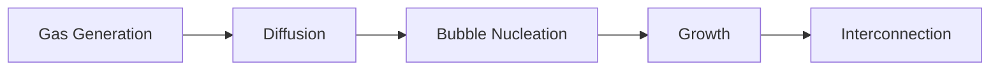

# Article Guide — Writing Good Wiki Pages

## Length

- **Target**: 400–1200 words per page
- **Maximum**: 1500 words (split required above this)
- **Summaries**: 200–400 words

## Structure

Every wiki page should have:

```markdown
# Title

> One-sentence definition or summary.

## Key Points
- Point 1
- Point 2

## Details
<Main content>

## Relationships
- Related to [[EntityA]]
- See also [[ConceptB]]

## References
- [[summaries/SourceSlug]] — one-line citation
```

## Wikilinks

- Use `[[PageName]]` for internal links
- Use `[[path/to/Page|display text]]` for alias links
- Link on **first mention** of each concept per page
- Don't overlink — common terms don't need links every time

## Mermaid Diagrams

Use for any flow, sequence, hierarchy, or state diagram:

````markdown

````

## KaTeX Formulas

Use for any mathematical expression:

- Inline: `$D_v = D_0 \exp(-E_m / k_BT)$`
- Block:
```markdown
$$
\frac{dr}{dt} = \frac{\Omega}{r} \left[ D_v C_v - D_i C_i \right]
$$
```

## Parameter Tables

When listing parameters:

```markdown
| Symbol | Value | Unit | Conditions | Source |
|--------|-------|------|------------|--------|
| $D_{v0}$ | $1.38 \times 10^{-8}$ | m²/s | U-10Mo, γ-phase | [[summaries/Source]] |
```

## Divide and Conquer

When a page exceeds 1200 words:

1. Create folder: `wiki/concepts/<Topic>/`
2. Write index: `wiki/concepts/<Topic>/index.md` (200-400 words overview)
3. Split aspects into separate files
4. Link from parent index

Example:
```
wiki/concepts/VoidSwelling/
├── index.md                    ← Overview + links
├── CavitationalMechanism.md    ← Rest 1992 model
├── TemperatureDependence.md    ← T-effects
└── ModelCalibration.md         ← JSRT calibration
```
